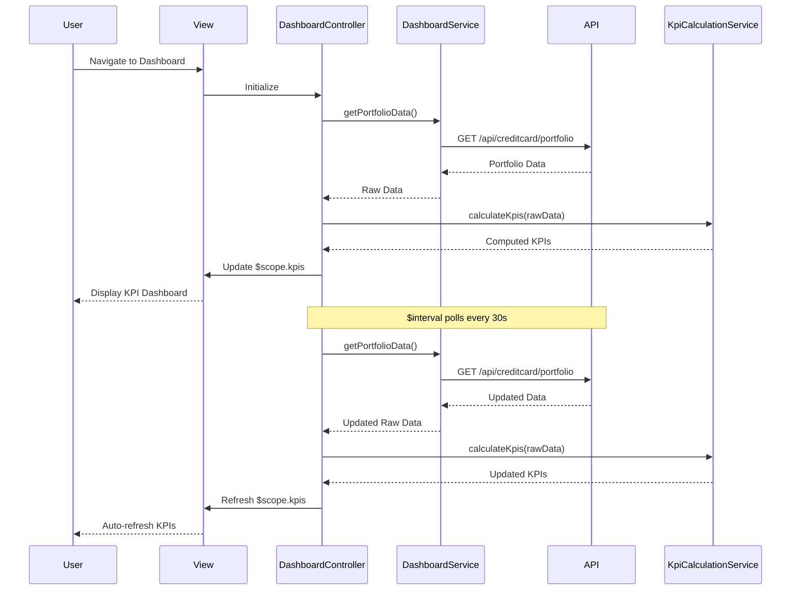

# Low-Level Design: Credit Card Analysis Dashboard

**Epic ID:** QE-5545

---

## a. Architecture Mapping

**HLD Component → AngularJS Artifact:**
- Dashboard UI Screen → `DashboardController` + `views/dashboard.html`
- Dashboard Service → `DashboardService` (Factory)
- KPI Calculation Engine → `KpiCalculationService` (Service)
- Data Aggregation Service → `DataAggregationService` (Service)
- Real-time data refresh → `$interval` service in Controller

**Recommended Folder Structure:**
```
app/
  dashboard/
    dashboard.module.js
    dashboard.controller.js
    dashboard.service.js
    kpi-calculation.service.js
    data-aggregation.service.js
    dashboard.routes.js
    views/dashboard.html
  shared/
    services/
    directives/
    interceptors/
```

---

## b. Component Specifications

| Name | Artifact Type | Responsibility | Key Dependencies |
|------|---------------|----------------|------------------|
| DashboardController | Controller | Orchestrates KPI display, handles user interactions, manages real-time refresh | DashboardService, KpiCalculationService, $interval, $scope |
| DashboardService | Factory | Fetches credit card portfolio data from REST API | $http, $q |
| KpiCalculationService | Service | Calculates monthly spend, available credit, outstanding amount from raw data | None |
| DataAggregationService | Service | Aggregates data from multiple credit card sources via REST API | $http, $q |
| appKpiCard | Directive | Reusable UI component for displaying individual KPI metrics | None |
| dashboard.html | View | Renders responsive dashboard layout with KPI cards using Bootstrap grid | Bootstrap CSS |

---

## c. Data Model

```js
CreditCardPortfolio = {
  userId: String,
  cards: Array<CreditCard>,
  totalCreditLimit: Number,
  totalOutstanding: Number,
  totalAvailableCredit: Number,
  monthlySpend: Number,
  lastUpdated: Date
}

CreditCard = {
  cardId: String,
  cardNumber: String,
  bankName: String,
  creditLimit: Number,
  outstandingAmount: Number,
  availableCredit: Number
}

KpiMetric = {
  label: String,
  value: Number,
  unit: String,
  icon: String,
  trend: String
}
```

---

## d. Data Flow

User navigates to the dashboard view, triggering `DashboardController` initialization. The controller calls `DashboardService.getPortfolioData()` which invokes the REST API endpoint `/api/creditcard/portfolio` to fetch raw credit card data. Upon receiving the response, `KpiCalculationService` processes the data to compute monthly spend, total credit limit, available credit (Total Credit Limit - Outstanding Amount), and outstanding amount. The calculated KPIs are bound to `$scope.kpis` and rendered in the view via `appKpiCard` directives within a responsive Bootstrap grid. An `$interval` service polls the API every 30 seconds to refresh KPI data in near real-time, updating the UI automatically through Angular's two-way data binding.

---

## e. Primary Sequence Diagram



---

## f. Implementation Notes

- Use constructor injection with `$inject` array annotation for all controllers and services to ensure minification safety
- Centralize all REST API calls in `DashboardService` and `DataAggregationService`; controllers never call `$http` directly
- Leverage ES6 arrow functions, `const`/`let`, and template literals throughout; assume Babel transpilation
- Use `$q` promises for async operations; chain `.then()` handlers to avoid callback nesting
- Implement `appKpiCard` directive with isolated scope for reusability across different KPI metrics

---

## g. Error Handling

HTTP interceptor captures API failures; user-facing error notifications displayed via Bootstrap alerts with retry option.

---

## h. Security Notes

Requires token-based authentication via existing SSO; all API calls include Authorization header with JWT token.