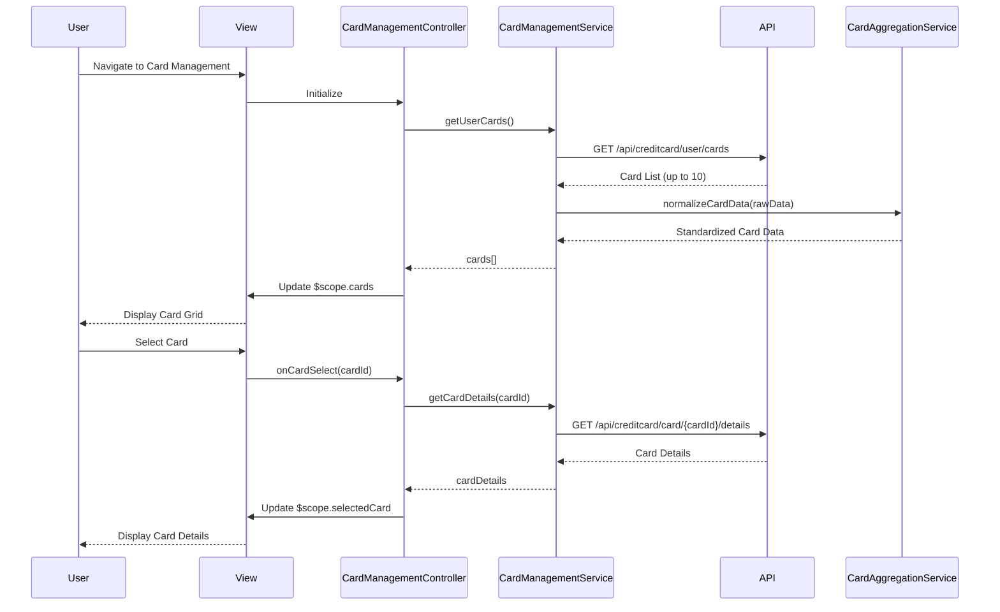

# Low-Level Design: Multi-Card Management Interface

**Epic ID:** QE-5546

---

## a. Architecture Mapping

**HLD Component → AngularJS Artifact:**
- Multi-Card Management UI Screen → `CardManagementController` + `views/card-management.html`
- Multi-Card Management Service → `CardManagementService` (Factory)
- Credit Card Data Aggregation Service → `CardAggregationService` (Service)
- User Authentication Service → `AuthService` (Factory) + HTTP Interceptor
- Card selection/filtering → `appCardFilter` (Directive)

**Recommended Folder Structure:**
```
app/
  card-management/
    card-management.module.js
    card-management.controller.js
    card-management.service.js
    card-aggregation.service.js
    card-management.routes.js
    views/card-management.html
    directives/card-filter.directive.js
  shared/
    services/auth.service.js
    interceptors/auth.interceptor.js
```

---

## b. Component Specifications

| Name | Artifact Type | Responsibility | Key Dependencies |
|------|---------------|----------------|------------------|
| CardManagementController | Controller | Manages display of multiple cards, handles card selection and filtering | CardManagementService, CardAggregationService, $scope, $filter |
| CardManagementService | Factory | Fetches user's credit card list and card-specific details from REST API | $http, $q, AuthService |
| CardAggregationService | Service | Aggregates data from multiple card sources into standardized format | $http, $q |
| AuthService | Factory | Provides authentication token and user session management | $http, $window |
| appCardFilter | Directive | Provides UI controls for filtering and selecting cards | None |
| appCardTile | Directive | Reusable card display component showing card summary information | None |
| card-management.html | View | Renders responsive grid of card tiles with filter controls using Bootstrap | Bootstrap CSS |

---

## c. Data Model

```js
UserCardPortfolio = {
  userId: String,
  cards: Array<CreditCardSummary>,
  totalCards: Number,
  lastSynced: Date
}

CreditCardSummary = {
  cardId: String,
  cardNumber: String,
  maskedNumber: String,
  bankName: String,
  cardType: String,
  creditLimit: Number,
  outstandingAmount: Number,
  availableCredit: Number,
  monthlySpend: Number,
  status: String,
  expiryDate: String
}

CardDetails = {
  cardId: String,
  cardSummary: CreditCardSummary,
  transactions: Array<Transaction>,
  spendAnalysis: SpendAnalysis,
  performance: CardPerformance
}

SpendAnalysis = {
  totalSpend: Number,
  categoryBreakdown: Object,
  monthlyTrend: Array<Number>
}

CardPerformance = {
  utilizationRate: Number,
  paymentHistory: Array<Payment>,
  rewardsEarned: Number
}
```

---

## d. Data Flow

User navigates to the card management view, triggering `CardManagementController` initialization. The controller calls `CardManagementService.getUserCards()` which invokes the REST API endpoint `/api/creditcard/user/cards` to fetch the list of up to 10 credit cards associated with the user. `CardAggregationService` normalizes data from multiple card sources into a standardized format. The card list is bound to `$scope.cards` and rendered as a responsive grid of `appCardTile` directives. When a user selects a specific card, the controller calls `CardManagementService.getCardDetails(cardId)` to fetch detailed information via `/api/creditcard/card/{cardId}/details`, which includes spend analysis and performance metrics. The detailed view updates the UI, displaying card-specific information. The `appCardFilter` directive allows users to filter cards by bank, type, or status, updating the displayed cards through Angular's `$filter` service.

---

## e. Primary Sequence Diagram



---

## f. Implementation Notes

- Use constructor injection with `$inject` array annotation for minification safety across all components
- All REST API calls centralized in `CardManagementService` and `CardAggregationService`; no direct `$http` usage in controllers
- Leverage ES6 features: arrow functions, `const`/`let`, template literals, destructuring; Babel transpilation assumed
- Use `$q.all()` to parallelize multiple card data requests when loading initial card list for performance
- Implement `appCardTile` and `appCardFilter` directives with isolated scope and two-way binding for reusability

---

## g. Error Handling

HTTP interceptor-based error handling with user notifications via Bootstrap toasts; retry mechanism for failed card data loads.

---

## h. Security Notes

Requires token-based auth via existing SSO; AuthService manages JWT token lifecycle and automatic refresh.