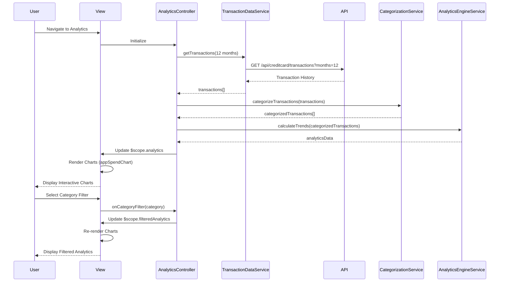

# Low-Level Design: Spending Analytics and Visualization

**Epic ID:** QE-5547

---

## a. Architecture Mapping

**HLD Component → AngularJS Artifact:**
- Analytics UI Screen → `AnalyticsController` + `views/analytics.html`
- Analytics Service → `AnalyticsService` (Factory)
- Transaction Data Service → `TransactionDataService` (Service)
- Data Analytics Engine → `AnalyticsEngineService` (Service)
- Categorization Service → `CategorizationService` (Service)
- Interactive Charts → `appSpendChart` (Directive using Chart.js or D3.js)

**Recommended Folder Structure:**
```
app/
  analytics/
    analytics.module.js
    analytics.controller.js
    analytics.service.js
    transaction-data.service.js
    analytics-engine.service.js
    categorization.service.js
    analytics.routes.js
    views/analytics.html
    directives/spend-chart.directive.js
  shared/
    services/
    directives/
```

---

## b. Component Specifications

| Name | Artifact Type | Responsibility | Key Dependencies |
|------|---------------|----------------|------------------|
| AnalyticsController | Controller | Orchestrates analytics view, manages chart data, handles time period selection | AnalyticsService, AnalyticsEngineService, $scope, $filter |
| AnalyticsService | Factory | Fetches spending analytics and trend data from REST API | $http, $q |
| TransactionDataService | Service | Retrieves historical transaction data for 12+ months from REST API | $http, $q |
| AnalyticsEngineService | Service | Performs trend calculations, pattern recognition, and data aggregation | None |
| CategorizationService | Service | Provides transaction categorization into 9 spending categories | $http |
| appSpendChart | Directive | Renders interactive spending charts (line, bar, pie) using Chart.js | Chart.js library |
| appCategoryFilter | Directive | Provides UI controls for filtering by spending category | None |
| analytics.html | View | Renders responsive analytics dashboard with charts and filters using Bootstrap | Bootstrap CSS, Chart.js |

---

## c. Data Model

```js
SpendingAnalytics = {
  userId: String,
  timeRange: TimeRange,
  monthlyTrends: Array<MonthlySpend>,
  categoryBreakdown: Array<CategorySpend>,
  totalSpend: Number,
  lastUpdated: Date
}

TimeRange = {
  startDate: Date,
  endDate: Date,
  periodType: String
}

MonthlySpend = {
  month: String,
  year: Number,
  totalAmount: Number,
  transactionCount: Number
}

CategorySpend = {
  categoryName: String,
  categoryCode: String,
  amount: Number,
  percentage: Number,
  transactionCount: Number,
  trend: String
}

SpendingCategory = {
  code: String,
  name: String,
  icon: String,
  color: String
}

Transaction = {
  transactionId: String,
  date: Date,
  amount: Number,
  merchant: String,
  category: String,
  cardId: String
}
```

**Spending Categories:** Food & Dining, Fuel, Shopping, Travel, Entertainment, Utilities, Healthcare, Education, Miscellaneous

---

## d. Data Flow

User navigates to the analytics view, triggering `AnalyticsController` initialization. The controller calls `TransactionDataService.getTransactions(timeRange)` to fetch 12 months of historical transaction data via REST API endpoint `/api/creditcard/transactions`. The raw transaction data is passed to `CategorizationService.categorizeTransactions()` which classifies each transaction into one of 9 spending categories. `AnalyticsEngineService.calculateTrends(categorizedData)` processes the categorized data to compute monthly spend trends and category-wise spending totals. The computed analytics are bound to `$scope.analytics` and rendered through `appSpendChart` directives, which use Chart.js to create interactive line charts (monthly trends) and pie/bar charts (category breakdown). Users can filter by category using `appCategoryFilter` directive, which updates the chart data through Angular's `$filter` service. Chart interactions (hover, click) trigger controller methods to display detailed breakdowns.

---

## e. Primary Sequence Diagram



---

## f. Implementation Notes

- Use constructor injection with `$inject` array annotation for all controllers and services to ensure minification safety
- Centralize all REST API calls in `TransactionDataService` and `AnalyticsService`; controllers never invoke `$http` directly
- Leverage ES6: arrow functions, `const`/`let`, template literals, array methods (map, filter, reduce) for data processing
- Use `$q` promises for async operations; implement caching in `TransactionDataService` to avoid redundant API calls
- Integrate Chart.js library in `appSpendChart` directive with responsive configuration and interactive event handlers

---

## g. Error Handling

HTTP interceptor captures API failures; display user-friendly error messages with retry option via Bootstrap modals.

---

## h. Security Notes

Requires token-based authentication via existing SSO; all transaction API calls include Authorization header with JWT token.