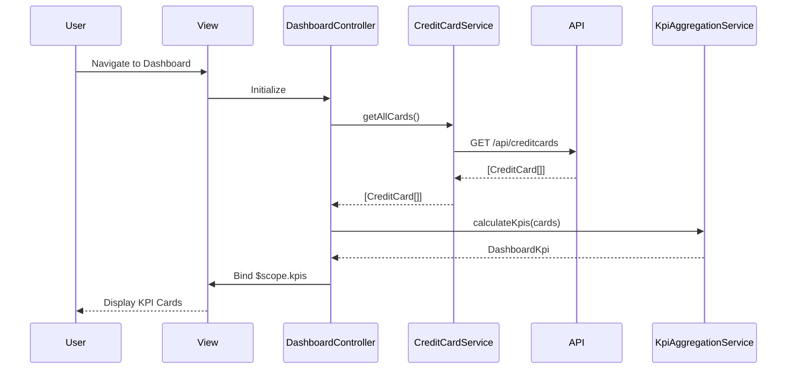

# Low-Level Design: Credit Card Dashboard with KPIs

**Epic ID:** QE-5554

---

## a. Architecture Mapping

- **Dashboard Screen** → `DashboardController` + `views/dashboard.html`
- **KPI Display Components** → `appKpiCard` directive (reusable card for each KPI metric)
- **Credit Card Data Retrieval** → `CreditCardService` (fetches card details, balances, limits via REST API)
- **User Authentication** → `AuthService` + `authInterceptor` (token-based auth, session management)
- **KPI Aggregation Logic** → `KpiAggregationService` (calculates totals, available credit)
- **Real-time Data Refresh** → `DashboardRefreshService` (polling mechanism for periodic updates)
- **Feature Module** → `app.dashboard`

**Folder Structure:**
```
app/
  dashboard/
    dashboard.module.js
    dashboard.controller.js
    dashboard.service.js
    dashboard.routes.js
    views/dashboard.html
  shared/
    services/creditCard.service.js
    services/auth.service.js
    services/kpiAggregation.service.js
    directives/kpiCard.directive.js
    interceptors/auth.interceptor.js
```

---

## b. Component Specifications

| Name | Artifact Type | Responsibility | Key Dependencies |
|------|---------------|----------------|------------------|
| `DashboardController` | Controller | Orchestrates dashboard view, triggers data load, handles refresh | `CreditCardService`, `KpiAggregationService`, `DashboardRefreshService` |
| `CreditCardService` | Service | Fetches credit card data (balances, limits, outstanding) from REST API | `$http`, `AuthService` |
| `KpiAggregationService` | Service | Aggregates KPIs (total spend, total limit, available credit, outstanding) across all cards | None |
| `DashboardRefreshService` | Service | Manages periodic polling (5-15 min intervals) for real-time data updates | `$interval`, `CreditCardService` |
| `AuthService` | Service | Manages user authentication state and token retrieval | `$http`, `$window` (localStorage) |
| `authInterceptor` | Interceptor | Attaches auth tokens to outgoing API requests | `AuthService` |
| `appKpiCard` | Directive | Renders individual KPI metric card with title, value, and icon | None |
| `app.dashboard` | Module | Encapsulates all dashboard-related components and routes | `ui.router`, `app.shared` |

---

## c. Data Model

```js
CreditCard = {
  cardId: String,
  cardNumber: String,
  cardType: String,
  totalLimit: Number,
  outstandingAmount: Number,
  monthlySpend: Number,
  availableCredit: Number
}

DashboardKpi = {
  totalMonthlySpend: Number,
  totalCreditLimit: Number,
  totalAvailableCredit: Number,
  totalOutstanding: Number,
  cardCount: Number
}
```

---

## d. Data Flow

User navigates to the dashboard view, triggering `DashboardController` initialization. The controller invokes `CreditCardService.getAllCards()` to fetch all user credit cards via REST API (`GET /api/creditcards`). Upon receiving the response, `KpiAggregationService.calculateKpis(cards)` processes the card array to compute aggregate metrics (total monthly spend, total credit limit, total available credit, total outstanding). The computed `DashboardKpi` object is bound to `$scope.kpis`, and the view renders each KPI using the `appKpiCard` directive. `DashboardRefreshService` initiates a polling interval to re-fetch and update KPIs every 5-15 minutes, ensuring real-time accuracy. Responsive Bootstrap grid classes ensure proper rendering across desktop, tablet, and mobile devices.

---

## e. Primary Sequence Diagram



---

## f. Implementation Notes

- Use constructor DI with `$inject` annotation for minification safety: `DashboardController.$inject = ['$scope', 'CreditCardService', 'KpiAggregationService', 'DashboardRefreshService']`
- Centralize all API calls in `CreditCardService`; controllers never call `$http` directly
- Leverage ES6 arrow functions and `const`/`let` for cleaner service logic; use template literals for API endpoint construction
- Implement `DashboardRefreshService` using `$interval` with configurable polling frequency (default 10 minutes)
- Use Bootstrap responsive grid (`col-xs-12 col-sm-6 col-md-3`) for KPI card layout to ensure mobile/tablet/desktop compatibility

---

## g. Error Handling

Interceptor-based error handling via `authInterceptor` for 401/403 responses; service-level try/catch with user notification via toast/alert for API failures.

---

## h. Security Notes

Requires token-based authentication via existing SSO; all API requests include Authorization header managed by `authInterceptor`.