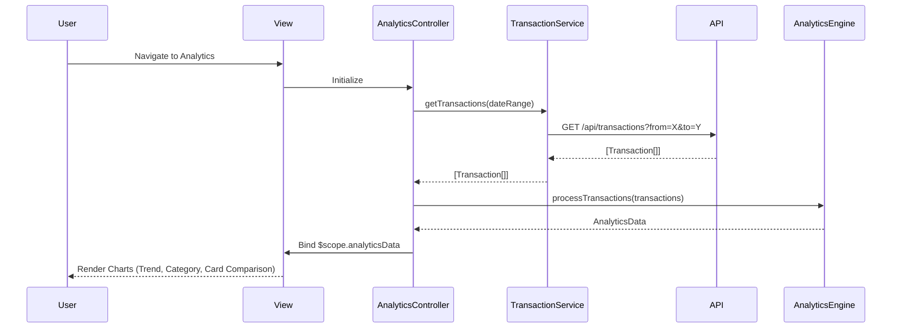

# Low-Level Design: Spending Analytics and Visualizations

**Epic ID:** QE-5555

---

## a. Architecture Mapping

- **Analytics Screen** → `AnalyticsController` + `views/analytics.html`
- **Monthly Trend Chart** → `appTrendChart` directive (line/bar chart for monthly spend)
- **Category Breakdown Chart** → `appCategoryChart` directive (pie/donut chart for 9 categories)
- **Card Comparison Chart** → `appCardComparisonChart` directive (bar chart for card-wise spend)
- **Transaction Data Retrieval** → `TransactionService` (fetches transaction history via REST API)
- **Analytics Processing** → `AnalyticsEngine` service (aggregates data by month, category, card)
- **Chart Rendering** → Integration with charting library (e.g., Chart.js) via custom directives
- **Feature Module** → `app.analytics`

**Folder Structure:**
```
app/
  analytics/
    analytics.module.js
    analytics.controller.js
    analytics.routes.js
    views/analytics.html
  shared/
    services/transaction.service.js
    services/analyticsEngine.service.js
    directives/trendChart.directive.js
    directives/categoryChart.directive.js
    directives/cardComparisonChart.directive.js
```

---

## b. Component Specifications

| Name | Artifact Type | Responsibility | Key Dependencies |
|------|---------------|----------------|------------------|
| `AnalyticsController` | Controller | Orchestrates analytics view, loads transaction data, triggers chart rendering | `TransactionService`, `AnalyticsEngine` |
| `TransactionService` | Service | Fetches transaction history from REST API with date range filters | `$http`, `AuthService` |
| `AnalyticsEngine` | Service | Aggregates transactions by month, category (9 predefined), and card; computes totals and percentages | None |
| `appTrendChart` | Directive | Renders interactive line/bar chart for monthly spend trends using Chart.js | `AnalyticsEngine` |
| `appCategoryChart` | Directive | Renders pie/donut chart for category-wise spend breakdown across 9 categories | `AnalyticsEngine` |
| `appCardComparisonChart` | Directive | Renders bar chart comparing spend across multiple credit cards | `AnalyticsEngine` |
| `app.analytics` | Module | Encapsulates all analytics components and routes | `ui.router`, `app.shared` |

---

## c. Data Model

```js
Transaction = {
  transactionId: String,
  cardId: String,
  amount: Number,
  category: String,
  date: Date,
  description: String
}

MonthlyTrend = {
  month: String,
  totalSpend: Number
}

CategoryBreakdown = {
  category: String,
  totalSpend: Number,
  percentage: Number
}

CardSpendComparison = {
  cardId: String,
  cardName: String,
  totalSpend: Number
}

AnalyticsData = {
  monthlyTrends: Array<MonthlyTrend>,
  categoryBreakdown: Array<CategoryBreakdown>,
  cardComparison: Array<CardSpendComparison>
}
```

---

## d. Data Flow

User navigates to the analytics view, triggering `AnalyticsController` initialization. The controller calls `TransactionService.getTransactions(dateRange)` to fetch historical transaction data via REST API (`GET /api/transactions?from=<date>&to=<date>`). Upon receiving the transaction array, the controller invokes `AnalyticsEngine.processTransactions(transactions)` which aggregates data into three structures: monthly trends (sum by month), category breakdown (sum and percentage across 9 categories: Food & Dining, Fuel, Shopping, Travel, Entertainment, Utilities, Healthcare, Education, Miscellaneous), and card-wise comparison (sum by cardId). The resulting `AnalyticsData` object is bound to `$scope.analyticsData`. Three chart directives (`appTrendChart`, `appCategoryChart`, `appCardComparisonChart`) watch their respective data bindings and render interactive visualizations using Chart.js, supporting touch interactions on mobile devices. Bootstrap responsive classes ensure proper layout across all screen sizes.

---

## e. Primary Sequence Diagram



---

## f. Implementation Notes

- Use constructor DI with `$inject`: `AnalyticsController.$inject = ['$scope', 'TransactionService', 'AnalyticsEngine']`
- Centralize API calls in `TransactionService`; use query parameters for date range filtering
- Leverage ES6 `Array.reduce()` and `Map` for efficient aggregation in `AnalyticsEngine`
- Integrate Chart.js via custom directives; each directive watches its data binding and re-renders on change using `$scope.$watch`
- Ensure chart load time < 2 seconds by pre-aggregating data at the service layer before passing to directives

---

## g. Error Handling

Interceptor-based error handling for API failures; service-level try/catch with user notification (toast/modal) if transaction data cannot be loaded or charts fail to render.

---

## h. Security Notes

Requires token-based auth via existing SSO; transaction data access restricted to authenticated user's own records via API-level authorization.