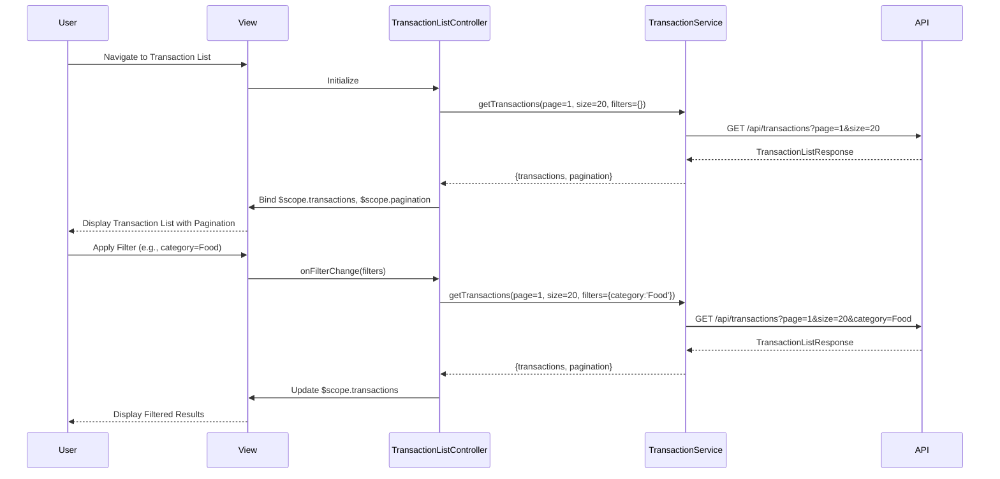

# Low-Level Design: Transaction Management

**Epic ID:** QE-5556

---

## a. Architecture Mapping

- **Transaction List Screen** → `TransactionListController` + `views/transactionList.html`
- **Transaction Detail Screen** → `TransactionDetailController` + `views/transactionDetail.html`
- **Search/Filter Component** → `appTransactionFilter` directive (search bar + filter dropdowns)
- **Pagination Component** → `appPagination` directive (page navigation controls)
- **Transaction Data Retrieval** → `TransactionService` (fetches transaction records via REST API)
- **Category Management** → `CategoryService` (provides category list and assignment logic)
- **Credit Card Linking** → `CreditCardService` (links transactions to specific cards)
- **Feature Module** → `app.transactions`

**Folder Structure:**
```
app/
  transactions/
    transactions.module.js
    transactionList.controller.js
    transactionDetail.controller.js
    transactions.routes.js
    views/transactionList.html
    views/transactionDetail.html
  shared/
    services/transaction.service.js
    services/category.service.js
    services/creditCard.service.js
    directives/transactionFilter.directive.js
    directives/pagination.directive.js
```

---

## b. Component Specifications

| Name | Artifact Type | Responsibility | Key Dependencies |
|------|---------------|----------------|------------------|
| `TransactionListController` | Controller | Orchestrates transaction list view, handles search/filter, manages pagination | `TransactionService`, `CategoryService`, `CreditCardService` |
| `TransactionDetailController` | Controller | Displays detailed view of a single transaction, supports category editing | `TransactionService`, `CategoryService` |
| `TransactionService` | Service | Fetches paginated transaction list, retrieves transaction details, updates transaction category via REST API | `$http`, `AuthService` |
| `CategoryService` | Service | Provides list of available categories, validates category assignments | `$http` |
| `CreditCardService` | Service | Fetches credit card details to display card name/type alongside transactions | `$http`, `AuthService` |
| `appTransactionFilter` | Directive | Renders search input and filter dropdowns (by card, category, date range); emits filter change events | None |
| `appPagination` | Directive | Renders pagination controls (prev/next, page numbers); emits page change events | None |
| `app.transactions` | Module | Encapsulates all transaction management components and routes | `ui.router`, `app.shared` |

---

## c. Data Model

```js
Transaction = {
  transactionId: String,
  cardId: String,
  cardName: String,
  amount: Number,
  category: String,
  date: Date,
  description: String,
  merchantName: String,
  status: String
}

PaginationMeta = {
  currentPage: Number,
  pageSize: Number,
  totalRecords: Number,
  totalPages: Number
}

TransactionListResponse = {
  transactions: Array<Transaction>,
  pagination: PaginationMeta
}

FilterCriteria = {
  searchText: String,
  cardId: String,
  category: String,
  dateFrom: Date,
  dateTo: Date
}
```

---

## d. Data Flow

User navigates to the transaction list view, triggering `TransactionListController` initialization. The controller invokes `TransactionService.getTransactions(page, pageSize, filters)` to fetch paginated transaction records via REST API (`GET /api/transactions?page=1&size=20&cardId=X&category=Y`). The API returns a `TransactionListResponse` containing the transaction array and pagination metadata. The controller binds `$scope.transactions` and `$scope.pagination` to the view. The `appTransactionFilter` directive captures user input (search text, card filter, category filter, date range) and emits filter change events; the controller responds by calling `TransactionService.getTransactions()` with updated filter criteria. The `appPagination` directive emits page change events, triggering re-fetch with the new page number. When a user clicks a transaction row, `ui-router` navigates to the detail view (`/transactions/:id`), and `TransactionDetailController` loads the full transaction record via `TransactionService.getTransactionById(id)`. If the user updates the transaction category, the controller calls `TransactionService.updateCategory(transactionId, newCategory)` and refreshes the view upon success.

---

## e. Primary Sequence Diagram



---

## f. Implementation Notes

- Use constructor DI with `$inject`: `TransactionListController.$inject = ['$scope', '$state', 'TransactionService', 'CategoryService', 'CreditCardService']`
- Centralize all API calls in `TransactionService`; use query parameters for pagination and filtering
- Leverage ES6 template literals for dynamic API endpoint construction: `` `${baseUrl}/transactions?page=${page}&size=${size}` ``
- Default page size to 20 transactions; make configurable via app constant
- Ensure search/filter operations complete within 1 second by implementing debouncing (300ms delay) on search input using `$timeout`

---

## g. Error Handling

Interceptor-based error handling for API failures; service-level try/catch with user notification (toast/alert) if transaction data cannot be loaded or category update fails.

---

## h. Security Notes

Requires token-based auth via existing SSO; transaction data access restricted to authenticated user's own records via API-level authorization.