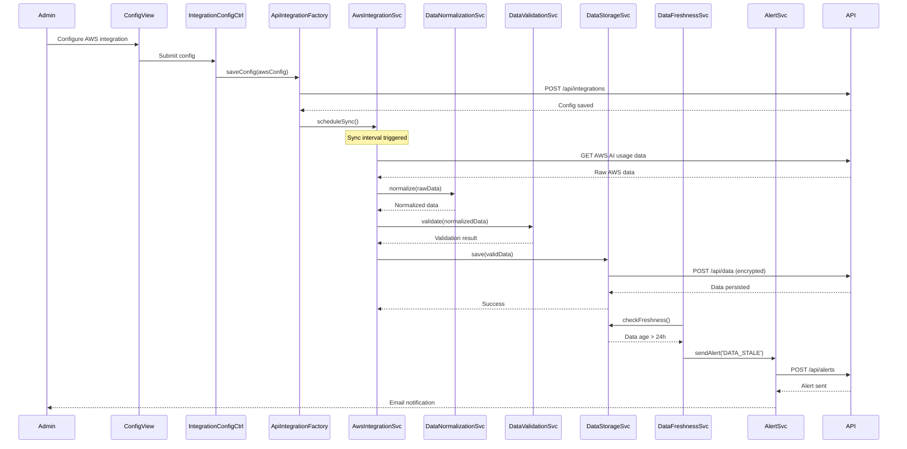

# Low-Level Design: Data Integration and Aggregation

## Epic ID: QE-5557

---

## a. Architecture Mapping

- **AWS API Integration** → Service (`awsIntegrationService`)
- **Azure API Integration** → Service (`azureIntegrationService`)
- **GCP API Integration** → Service (`gcpIntegrationService`)
- **API Integration Layer** → Factory (`apiIntegrationFactory`) - orchestrates provider-specific services
- **Data Normalization Engine** → Service (`dataNormalizationService`)
- **Data Quality Validator** → Service (`dataValidationService`)
- **Freshness Monitor** → Service (`dataFreshnessService`) + Controller (`monitoringController`)
- **Encrypted Data Store** → Service (`dataStorageService`) - REST API wrapper
- **Alert Service** → Service (`alertService`)
- **Configuration UI** → Controller (`integrationConfigController`) + View (`integration-config.html`)

**Recommended Folder Structure:**
```
app/
  integration/
    integration.module.js
    integrationConfig.controller.js
    awsIntegration.service.js
    azureIntegration.service.js
    gcpIntegration.service.js
    apiIntegration.factory.js
    views/integration-config.html
  data-processing/
    dataProcessing.module.js
    dataNormalization.service.js
    dataValidation.service.js
    dataFreshness.service.js
    dataStorage.service.js
  alerts/
    alert.service.js
  shared/
    interceptors/auth.interceptor.js
```

---

## b. Component Specifications

| Component Name | Artifact Type | Responsibility | Key Dependencies |
|---|---|---|---|
| `awsIntegrationService` | Service | Fetch AI usage/spend data from AWS APIs | `$http`, `apiIntegrationFactory`, `dataStorageService` |
| `azureIntegrationService` | Service | Fetch AI usage/spend data from Azure APIs | `$http`, `apiIntegrationFactory`, `dataStorageService` |
| `gcpIntegrationService` | Service | Fetch AI usage/spend data from GCP APIs | `$http`, `apiIntegrationFactory`, `dataStorageService` |
| `apiIntegrationFactory` | Factory | Orchestrate multi-provider data collection and manage API credentials | `awsIntegrationService`, `azureIntegrationService`, `gcpIntegrationService` |
| `dataNormalizationService` | Service | Transform provider-specific data into unified schema | `$q` |
| `dataValidationService` | Service | Validate data completeness, format, and business rules | None |
| `dataFreshnessService` | Service | Check data age and trigger alerts for stale data | `$interval`, `alertService` |
| `dataStorageService` | Service | Persist normalized data via REST API with encryption | `$http` |
| `alertService` | Service | Send notifications for data freshness and validation issues | `$http` |
| `integrationConfigController` | Controller | Manage UI for configuring cloud provider integrations | `apiIntegrationFactory`, `$scope` |
| `monitoringController` | Controller | Display data freshness status and validation results | `dataFreshnessService`, `dataValidationService`, `$scope` |

---

## c. Data Model

```javascript
// Unified AI usage data model after normalization
AIUsageData = {
  companyId: String,
  provider: String,  // 'AWS' | 'Azure' | 'GCP'
  serviceName: String,
  usageMetrics: Object,  // { requests: Number, computeHours: Number, ... }
  spendAmount: Number,
  currency: String,  // default 'USD'
  timestamp: Date,
  dataFreshness: Boolean,
  lastUpdated: Date
}

// Cloud provider integration configuration
IntegrationConfig = {
  configId: String,
  companyId: String,
  provider: String,
  apiEndpoint: String,
  credentials: Object,  // { apiKey: String, secretKey: String, ... }
  enabled: Boolean,
  syncInterval: Number  // minutes
}

// Data quality validation result
ValidationResult = {
  dataId: String,
  isValid: Boolean,
  errors: Array<String>,
  warnings: Array<String>,
  validatedAt: Date
}

// Alert notification
Alert = {
  alertId: String,
  type: String,  // 'DATA_STALE' | 'VALIDATION_ERROR' | 'SYNC_FAILURE'
  companyId: String,
  message: String,
  severity: String,  // 'LOW' | 'MEDIUM' | 'HIGH'
  createdAt: Date,
  acknowledged: Boolean
}
```

---

## d. Data Flow

Admin configures cloud provider integration via `integrationConfigController` → Controller invokes `apiIntegrationFactory.saveConfig()` → Factory stores credentials and schedules sync → On sync interval, factory triggers provider-specific services (`awsIntegrationService`, `azureIntegrationService`, `gcpIntegrationService`) → Each service fetches raw data via `$http` → Raw data passed to `dataNormalizationService` which transforms to unified schema → Normalized data validated by `dataValidationService` → Valid data persisted via `dataStorageService.save()` (encrypted REST call) → `dataFreshnessService` monitors timestamps and triggers `alertService` if data exceeds 24-hour threshold → Alerts displayed in `monitoringController` view and sent to Operating Partners.

---

## e. Primary Sequence Diagram



---

## f. Implementation Notes

- Use constructor injection with `$inject` array for all services/controllers to ensure minification safety
- Implement `$httpProvider.interceptors` for automatic token injection and error handling across all API calls
- Schedule periodic sync using `$interval` service; store interval references in factory for cleanup on `$destroy`
- Use `$q.all()` to parallelize data fetching from multiple providers and aggregate results efficiently
- Implement retry logic with exponential backoff in provider services for transient API failures

---

## g. Error Handling

HTTP interceptor captures API errors, logs to audit service, displays user-friendly notifications via `alertService`, and implements automatic retry for 5xx errors.

---

## h. Security Notes

Requires token-based auth via existing SSO; all API credentials encrypted at rest (AES-256) and in transit (TLS 1.2+); RBAC enforced at API layer.