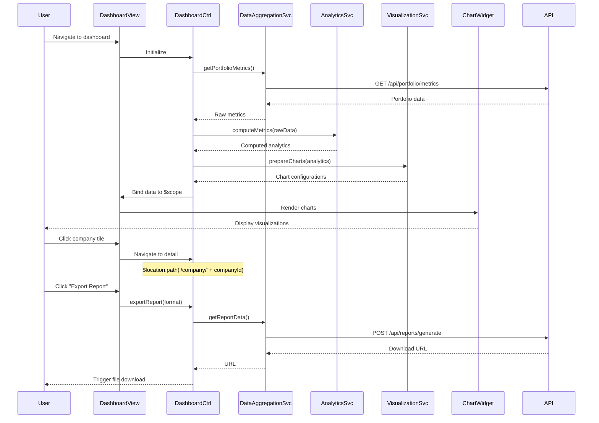

# Low-Level Design: Dashboard and Visualization

## Epic ID: QE-5558

---

## a. Architecture Mapping

- **Data Aggregation Layer** → Service (`dataAggregationService`) - consumes data from QE-5557
- **Analytics Engine** → Service (`analyticsService`)
- **Visualization Service** → Service (`visualizationService`) + Directive (`appChartWidget`)
- **Dashboard UI** → Controller (`dashboardController`) + View (`dashboard.html`)
- **Report Generator** → Service (`reportGeneratorService`)
- **Benchmarking Service** → Service (`benchmarkingService`)
- **Customizable Widgets** → Directive (`appDashboardWidget`) + Factory (`widgetConfigFactory`)
- **Drill-down View** → Controller (`companyDetailController`) + View (`company-detail.html`)
- **Executive Summary** → Controller (`executiveSummaryController`) + View (`executive-summary.html`)

**Recommended Folder Structure:**
```
app/
  dashboard/
    dashboard.module.js
    dashboard.controller.js
    companyDetail.controller.js
    executiveSummary.controller.js
    dataAggregation.service.js
    analytics.service.js
    visualization.service.js
    benchmarking.service.js
    reportGenerator.service.js
    widgetConfig.factory.js
    directives/dashboardWidget.directive.js
    directives/chartWidget.directive.js
    views/dashboard.html
    views/company-detail.html
    views/executive-summary.html
```

---

## b. Component Specifications

| Component Name | Artifact Type | Responsibility | Key Dependencies |
|---|---|---|---|
| `dataAggregationService` | Service | Fetch aggregated AI usage data from backend API | `$http` |
| `analyticsService` | Service | Compute metrics, trends, and cost optimization recommendations | `dataAggregationService`, `$q` |
| `visualizationService` | Service | Prepare chart data and configurations for UI rendering | `analyticsService` |
| `benchmarkingService` | Service | Compare portfolio companies against each other and industry averages | `$http`, `analyticsService` |
| `reportGeneratorService` | Service | Generate PDF/Excel reports from dashboard data | `$http`, `dataAggregationService` |
| `widgetConfigFactory` | Factory | Manage user's customized widget preferences (singleton state) | `$window.localStorage` |
| `dashboardController` | Controller | Orchestrate main dashboard view with customizable widgets | `dataAggregationService`, `analyticsService`, `widgetConfigFactory`, `$scope` |
| `companyDetailController` | Controller | Display drill-down analytics for a single portfolio company | `dataAggregationService`, `analyticsService`, `$routeParams`, `$scope` |
| `executiveSummaryController` | Controller | Render executive summary with high-level KPIs and cost savings | `analyticsService`, `reportGeneratorService`, `$scope` |
| `appDashboardWidget` | Directive | Reusable widget container supporting drag-drop and resize | `widgetConfigFactory` |
| `appChartWidget` | Directive | Render charts (bar, line, pie) using visualization data | `visualizationService` |

---

## c. Data Model

```javascript
// Aggregated portfolio-wide metrics
PortfolioMetrics = {
  totalCompanies: Number,
  totalAISpend: Number,
  averageSpendPerCompany: Number,
  topSpendingCompanies: Array<Object>,  // [{ companyId, name, spend }]
  costSavingsOpportunities: Array<Object>,  // [{ companyId, recommendation, potentialSavings }]
  dataFreshnessStatus: Object  // { fresh: Number, stale: Number }
}

// Company-specific drill-down data
CompanyDetail = {
  companyId: String,
  companyName: String,
  totalSpend: Number,
  spendByService: Array<Object>,  // [{ serviceName, amount, provider }]
  spendByDepartment: Array<Object>,  // [{ department, amount }]
  usageTrends: Array<Object>,  // [{ date, spend }]
  benchmarkScore: Number,  // vs industry average
  recommendations: Array<String>
}

// Widget configuration
WidgetConfig = {
  widgetId: String,
  type: String,  // 'chart' | 'table' | 'metric' | 'alert'
  title: String,
  position: Object,  // { row: Number, col: Number }
  size: Object,  // { width: Number, height: Number }
  dataSource: String,
  filters: Object
}

// Report export request
ReportRequest = {
  format: String,  // 'PDF' | 'EXCEL'
  dateRange: Object,  // { startDate: Date, endDate: Date }
  companyIds: Array<String>,
  includeCharts: Boolean,
  includeBenchmarks: Boolean
}

// Benchmark comparison
BenchmarkData = {
  companyId: String,
  metric: String,
  companyValue: Number,
  portfolioAverage: Number,
  industryAverage: Number,
  percentile: Number
}
```

---

## d. Data Flow

User navigates to dashboard → `dashboardController` loads → Controller calls `dataAggregationService.getPortfolioMetrics()` → Service fetches data via REST API → Data passed to `analyticsService.computeMetrics()` for trend analysis and recommendations → Analytics results sent to `visualizationService.prepareCharts()` → Chart configs bound to view via `appChartWidget` directives → User clicks company tile → `$location` navigates to company-detail route → `companyDetailController` loads with `$routeParams.companyId` → Controller calls `dataAggregationService.getCompanyDetail(companyId)` and `benchmarkingService.compare(companyId)` → Drill-down data rendered in view → User clicks "Export Report" → `reportGeneratorService.generate(reportRequest)` posts to API → API returns download URL → Browser initiates file download.

---

## e. Primary Sequence Diagram



---

## f. Implementation Notes

- Use `ui-router` for state management; define states for dashboard, company-detail, and executive-summary with resolve blocks for data pre-loading
- Implement chart rendering with Chart.js or D3.js wrapped in AngularJS directives for two-way binding and lifecycle management
- Store widget preferences in `localStorage` via `widgetConfigFactory` for persistence across sessions
- Use `$q.all()` to parallelize API calls for portfolio metrics and benchmarking data to minimize load time
- Implement lazy-loading for drill-down views to maintain <3s dashboard load time for main view

---

## g. Error Handling

HTTP interceptor handles API failures; fallback to cached data if available; user notified via toast notifications for transient errors.

---

## h. Security Notes

Requires token-based auth via existing SSO; RBAC enforced to filter visible companies per user role; all API calls include auth token in headers.