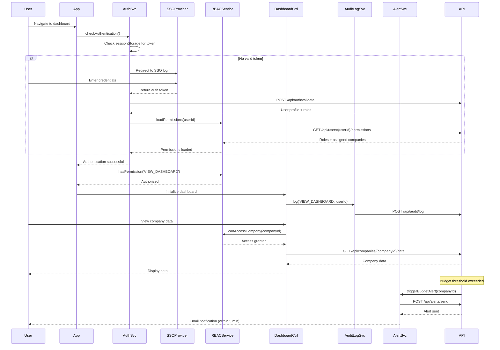

# Low-Level Design: Security and Access Control

## Epic ID: QE-5559

---

## a. Architecture Mapping

- **User** → N/A (external actor)
- **SSO Provider** → External service (SAML 2.0 / OAuth 2.0)
- **Authentication Service** → Service (`authenticationService`)
- **RBAC Engine** → Service (`rbacService`) + Factory (`permissionFactory`)
- **Dashboard Application** → Module (`app`) with route guards
- **Audit Logger** → Service (`auditLogService`) + Interceptor (`auditInterceptor`)
- **Alert Service** → Service (`alertService`) - reused from QE-5557
- **Encrypted Data Store** → Service (`secureStorageService`) - REST API wrapper
- **User Management UI** → Controller (`userManagementController`) + View (`user-management.html`)
- **Role Assignment UI** → Controller (`roleAssignmentController`) + View (`role-assignment.html`)
- **Budget Alert Config** → Controller (`budgetAlertController`) + View (`budget-alert-config.html`)

**Recommended Folder Structure:**
```
app/
  auth/
    auth.module.js
    authentication.service.js
    rbac.service.js
    permission.factory.js
    auditLog.service.js
    interceptors/audit.interceptor.js
    interceptors/auth.interceptor.js
  admin/
    admin.module.js
    userManagement.controller.js
    roleAssignment.controller.js
    budgetAlert.controller.js
    views/user-management.html
    views/role-assignment.html
    views/budget-alert-config.html
  shared/
    services/alert.service.js
    services/secureStorage.service.js
```

---

## b. Component Specifications

| Component Name | Artifact Type | Responsibility | Key Dependencies |
|---|---|---|---|
| `authenticationService` | Service | Handle SSO login/logout and token management | `$http`, `$window.sessionStorage` |
| `rbacService` | Service | Evaluate user permissions and enforce access control | `permissionFactory`, `authenticationService` |
| `permissionFactory` | Factory | Store and manage user roles and permissions (singleton) | None |
| `auditLogService` | Service | Log all user actions and system events to backend | `$http` |
| `auditInterceptor` | Interceptor | Automatically log all HTTP requests/responses | `auditLogService`, `$q` |
| `authInterceptor` | Interceptor | Inject auth token into all API requests and handle 401/403 | `authenticationService`, `$q`, `$location` |
| `alertService` | Service | Send budget threshold alerts and lockout recovery emails | `$http` |
| `secureStorageService` | Service | Persist sensitive data via encrypted REST API | `$http` |
| `userManagementController` | Controller | Admin UI for creating/updating/deleting users | `authenticationService`, `rbacService`, `$scope` |
| `roleAssignmentController` | Controller | Admin UI for assigning roles and company access to users | `rbacService`, `$scope` |
| `budgetAlertController` | Controller | Admin UI for configuring budget thresholds per company | `alertService`, `$scope` |

---

## c. Data Model

```javascript
// User authentication and profile
User = {
  userId: String,
  email: String,
  displayName: String,
  roles: Array<String>,  // ['ADMIN', 'OPERATING_PARTNER', 'DEAL_PARTNER', 'GENERAL_PARTNER']
  assignedCompanies: Array<String>,  // companyIds user can access
  ssoToken: String,
  tokenExpiry: Date,
  isLocked: Boolean,
  failedLoginAttempts: Number,
  lastLogin: Date
}

// Role and permission definition
Role = {
  roleId: String,
  roleName: String,
  permissions: Array<String>  // ['VIEW_DASHBOARD', 'EDIT_CONFIG', 'MANAGE_USERS', 'EXPORT_REPORTS']
}

// Audit log entry
AuditLog = {
  logId: String,
  userId: String,
  action: String,  // 'LOGIN', 'VIEW_COMPANY', 'EXPORT_REPORT', 'UPDATE_CONFIG', etc.
  resource: String,
  timestamp: Date,
  ipAddress: String,
  success: Boolean,
  details: Object
}

// Budget alert configuration
BudgetAlertConfig = {
  configId: String,
  companyId: String,
  thresholdAmount: Number,
  currency: String,
  notifyUsers: Array<String>,  // userIds
  enabled: Boolean,
  lastTriggered: Date
}

// Alert notification (from QE-5557, extended)
Alert = {
  alertId: String,
  type: String,  // 'BUDGET_EXCEEDED' | 'DATA_STALE' | 'VALIDATION_ERROR' | 'USER_LOCKOUT'
  companyId: String,
  userId: String,
  message: String,
  severity: String,
  createdAt: Date,
  acknowledged: Boolean
}
```

---

## d. Data Flow

User navigates to app → `authenticationService` checks for valid token in sessionStorage → If absent, redirects to SSO provider → SSO authenticates and returns token → `authenticationService.login(token)` stores token and fetches user profile → `rbacService.loadPermissions(userId)` retrieves roles and assigned companies → User navigates to dashboard → Route guard calls `rbacService.hasPermission('VIEW_DASHBOARD')` → If authorized, route resolves; else redirects to unauthorized page → All user actions logged by `auditInterceptor` → When user views company data, `rbacService.canAccessCompany(companyId)` validates access → Admin configures budget alert via `budgetAlertController` → Controller calls `alertService.configureBudgetAlert(config)` → Backend monitors spend and triggers alert when threshold exceeded → `alertService.sendAlert()` notifies assigned users within 5 minutes → If user locked out, admin uses `userManagementController` to reset → `authenticationService.unlockUser(userId)` sends recovery email within 2 minutes.

---

## e. Primary Sequence Diagram



---

## f. Implementation Notes

- Implement route guards using `ui-router` resolve blocks that call `rbacService.hasPermission()` before allowing navigation
- Store SSO token in `sessionStorage` (not `localStorage`) to auto-clear on browser close for enhanced security
- Use `$httpProvider.interceptors` to inject auth token into all requests and handle 401/403 by redirecting to login
- Implement `auditInterceptor` to automatically log all HTTP activity with user context without manual logging in each controller
- Use `$interval` in `alertService` to poll backend for budget threshold violations every 60 seconds and push notifications

---

## g. Error Handling

HTTP interceptor handles 401/403 by redirecting to SSO login; all auth failures logged to audit service; user notified via alert banner.

---

## h. Security Notes

SSO integration via SAML 2.0/OAuth 2.0; all tokens encrypted in transit (TLS 1.2+); RBAC enforced at both client route guards and API layer; audit logs immutable and encrypted at rest (AES-256).