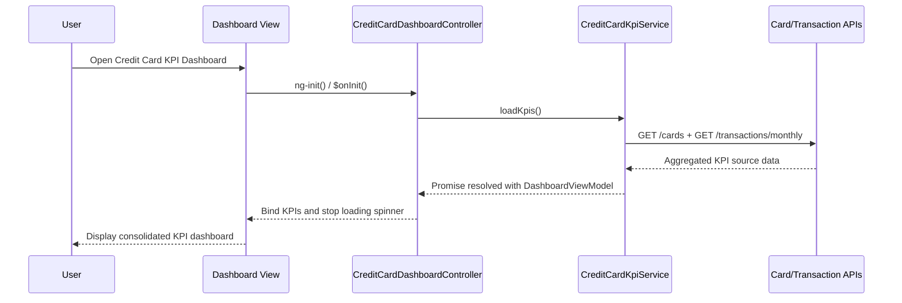

# a. Architecture Mapping (brief)
- Credit Card KPI Dashboard Screen → `CreditCardDashboardController` + `views/credit-card-dashboard.html` + `CreditCardKpiService` within module `app.creditcardDashboard`.
- KPI Aggregation Service → `CreditCardKpiService` (aggregates KPI data from card and transaction APIs).
- Credit Card Data Service → `CreditCardDataService` (fetches card balances and limits via REST).
- Transaction Service → `TransactionService` (fetches monthly spends and outstanding amounts via REST).

Recommended folder structure:
- `app/creditcard-dashboard/creditcard-dashboard.module.js`
- `app/creditcard-dashboard/creditcard-dashboard.controller.js`
- `app/creditcard-dashboard/creditcard-kpi.service.js`
- `app/creditcard-dashboard/creditcard-dashboard.routes.js`
- `app/creditcard-dashboard/views/creditcard-dashboard.html`
- `app/shared/services/creditcard-data.service.js`
- `app/shared/services/transaction.service.js`

# b. Component Specifications (table)
| Name | Artifact Type | Responsibility | Key Dependencies |
|---|---|---|---|
| app.creditcardDashboard | Module | Group all credit card dashboard components under a single feature module | `ui.router` |
| CreditCardDashboardController | Controller | Initialize dashboard, trigger KPI load/refresh, bind KPI data and loading/error state to view | `CreditCardKpiService`, `$scope`, `$interval`, `$stateParams` |
| CreditCardKpiService | Service | Orchestrate KPI retrieval and aggregation for all cards, apply client-side mapping from API to view models | `CreditCardDataService`, `TransactionService`, `$q` |
| CreditCardDataService | Service | Call backend Credit Card Data APIs for balances, limits, and available credit | `$http`, `EnvConfig` |
| TransactionService | Service | Call backend Transaction APIs for monthly spend and outstanding amounts | `$http`, `EnvConfig` |
| creditcard-dashboard.routes | Route Config | Configure dashboard state/URL and associate controller and template | `$stateProvider` |
| creditcardDashboardView | View (HTML Template) | Render KPI tiles, loading indicators, refresh actions, and responsive layout | `CreditCardDashboardController`, Bootstrap |

# c. Data Model (brief)
```js
KpiSummary = {
  totalCreditLimit: Number,
  totalAvailableCredit: Number,
  totalOutstandingAmount: Number,
  monthlySpend: Number,
  lastUpdatedAt: Date
}

CardKpi = {
  cardId: String,
  cardName: String,
  creditLimit: Number,
  availableCredit: Number,
  outstandingAmount: Number,
  monthlySpend: Number
}

DashboardViewModel = {
  kpiSummary: KpiSummary,
  cardKpis: Array<CardKpi>,
  isLoading: Boolean,
  errorMessage: String
}
```

# d. Data Flow (one paragraph)
User navigates to the credit card KPI dashboard route, which loads `creditcard-dashboard.html` bound to `CreditCardDashboardController`; on init or manual refresh, the controller calls `CreditCardKpiService.loadKpis()`, which in turn invokes `CreditCardDataService` and `TransactionService` REST endpoints to fetch card and transaction data, aggregates the responses into `DashboardViewModel` objects, and resolves a promise back to the controller, which updates scope-bound KPIs so the view re-renders KPI tiles and summary metrics in a responsive layout with loading and error indicators.

# e. Primary Sequence Diagram (ONE only)


# f. Implementation Notes (brief)
- Use `app.creditcardDashboard` module with `$stateProvider` state `creditcard-dashboard` mapped to `CreditCardDashboardController` and `creditcard-dashboard.html`.
- Implement `CreditCardKpiService` with ES6 `const`/`let`, arrow functions, and `$q.all` to aggregate `CreditCardDataService` and `TransactionService` promises.
- Keep all `$http` interactions inside `CreditCardDataService` and `TransactionService`; controller should only consume `CreditCardKpiService` abstractions.
- Use Bootstrap grid and responsive utility classes in the dashboard view for desktop/tablet/mobile layouts.
- Apply DI via `$inject` arrays on all controllers/services to remain minification-safe.

# g. Error Handling (ONE line)
Handle client-side errors via service-level promise rejections surfaced to the controller and shown as a generic dashboard error banner, with API failures intercepted by a shared `$http` interceptor for logging.

# h. Security Notes (ONE line)
Standard input validation and secure API calls assumed, with auth tokens attached via existing HTTP interceptor for all Credit Card and Transaction service requests.
