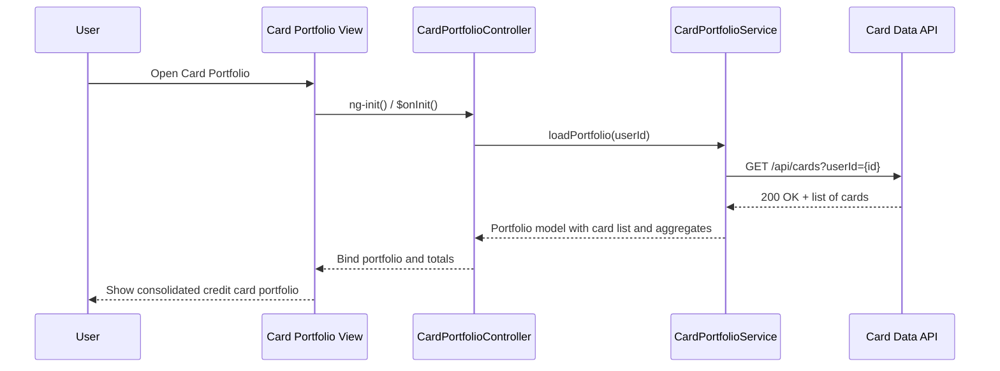

# a. Architecture Mapping (brief)
- Credit Card Portfolio Management Screen → `CardPortfolioController` + `views/card-portfolio.html` + `CardPortfolioService` within module `app.cardPortfolio`.
- Card Management Module (HLD) → AngularJS feature module `app.cardPortfolio` grouping portfolio controller, service, and routes.
- User Service → `UserService` (client-side wrapper for authentication and card ownership validation APIs).
- Credit Card Data Service → `CreditCardDataService` (CRUD operations for card records with encrypted storage on backend).
- Encryption Service → `EncryptionService` (client-side wrapper for encryption-related API or key management if exposed).

Recommended folder structure:
- `app/card-portfolio/card-portfolio.module.js`
- `app/card-portfolio/card-portfolio.controller.js`
- `app/card-portfolio/card-portfolio.service.js`
- `app/card-portfolio/card-portfolio.routes.js`
- `app/card-portfolio/views/card-portfolio.html`
- `app/shared/services/user.service.js`
- `app/shared/services/creditcard-data.service.js`
- `app/shared/services/encryption.service.js`

# b. Component Specifications (table)
| Name | Artifact Type | Responsibility | Key Dependencies |
|---|---|---|---|
| app.cardPortfolio | Module | Encapsulate credit card portfolio management feature (screens, routes, services) | `ui.router` |
| CardPortfolioController | Controller | Manage card list, add/edit flows, enforce 20-card limit, bind portfolio data to view | `CardPortfolioService`, `UserService`, `$scope`, `$state`, `$uibModal` |
| CardPortfolioService | Service | Coordinate portfolio operations (load, add, update, delete cards) and map API responses to view models | `CreditCardDataService`, `EncryptionService`, `$q` |
| UserService | Service | Expose user context and validation APIs (authentication status, card ownership checks) | `$http`, `EnvConfig` |
| CreditCardDataService | Service | Perform REST calls for creating, reading, updating, deleting card records | `$http`, `EnvConfig` |
| EncryptionService | Service | Wrap secure storage/encryption API calls for card details where applicable | `$http`, `EnvConfig` |
| card-portfolio.routes | Route Config | Define states/URLs for portfolio list and card details/add/edit views | `$stateProvider` |
| cardPortfolioView | View (HTML Template) | Render responsive multi-card list, add/edit forms, and capacity indicators | `CardPortfolioController`, Bootstrap |

# c. Data Model (brief)
```js
CreditCard = {
  id: String,
  userId: String,
  cardNickname: String,
  cardType: String,
  maskedCardNumber: String,
  creditLimit: Number,
  availableCredit: Number,
  outstandingBalance: Number,
  billingCycleDay: Number,
  isActive: Boolean
}

CardPortfolio = {
  userId: String,
  cards: Array<CreditCard>,
  maxCardsAllowed: Number,
  totalCreditLimit: Number,
  totalOutstandingBalance: Number
}
```

# d. Data Flow (one paragraph)
User navigates to the card portfolio route which loads `card-portfolio.html` bound to `CardPortfolioController`; on init the controller invokes `CardPortfolioService.loadPortfolio(userId)`, which validates user context via `UserService` if required, then calls `CreditCardDataService` (and optionally `EncryptionService`) to fetch decrypted card records, transforms them into `CardPortfolio` view models, and returns the result to the controller, which binds the data to scope so the view renders the card list and aggregated values, while add/update actions call corresponding service methods to persist changes and refresh the portfolio data displayed.

# e. Primary Sequence Diagram (ONE only)


# f. Implementation Notes (brief)
- Create `app.cardPortfolio` module with routes for `/cards` (list) and `/cards/new` or `/cards/:id` (add/edit) configured via `$stateProvider`.
- Implement `CardPortfolioService` using ES6 syntax and `$q` to wrap async API calls and centralize mapping between backend DTOs and `CreditCard`/`CardPortfolio` models.
- Ensure `CardPortfolioController` enforces the 20-card limit at UI level while delegating persistence and business rules to services.
- Use Bootstrap cards and grid system to display up to 20 cards responsively across devices.
- Define `$inject` arrays on controllers and services for DI safety after minification.

# g. Error Handling (ONE line)
Surface portfolio load/save errors via rejected promises from services to the controller, which displays concise inline or toast error messages, with low-level HTTP errors handled by a shared `$http` interceptor.

# h. Security Notes (ONE line)
Standard input validation and secure API calls with token-based authentication assumed, with sensitive card attributes stored only in encrypted backend data stores and not exposed in full in the UI.
