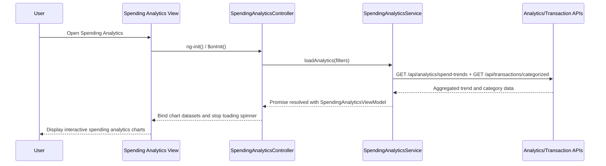

# a. Architecture Mapping (brief)
- Spending Analytics Screen → `SpendingAnalyticsController` + `views/spending-analytics.html` + `SpendingAnalyticsService` within module `app.spendingAnalytics`.
- Dashboard Service (HLD) → `SpendingAnalyticsService` (coordinates analytics data retrieval and chart preparation).
- Analytics Engine → backend analytics API surfaced through `AnalyticsService` (client-side wrapper for analytics operations).
- Transaction Service → `TransactionService` (client-side wrapper for categorized transaction APIs).

Recommended folder structure:
- `app/spending-analytics/spending-analytics.module.js`
- `app/spending-analytics/spending-analytics.controller.js`
- `app/spending-analytics/spending-analytics.service.js`
- `app/spending-analytics/spending-analytics.routes.js`
- `app/spending-analytics/views/spending-analytics.html`
- `app/shared/services/analytics.service.js`
- `app/shared/services/transaction.service.js`

# b. Component Specifications (table)
| Name | Artifact Type | Responsibility | Key Dependencies |
|---|---|---|---|
| app.spendingAnalytics | Module | Group spending analytics controllers, services, and routes into a feature module | `ui.router` |
| SpendingAnalyticsController | Controller | Drive analytics page lifecycle, trigger data loads based on filters, bind chart-ready data and loading states | `SpendingAnalyticsService`, `$scope`, `$stateParams` |
| SpendingAnalyticsService | Service | Orchestrate retrieval of trend and category data, combine responses, and build datasets for charts | `AnalyticsService`, `TransactionService`, `$q` |
| AnalyticsService | Service | Call backend Analytics Engine APIs for aggregated spending metrics and trends | `$http`, `EnvConfig` |
| TransactionService | Service | Retrieve categorized transaction data for the configured period and cards | `$http`, `EnvConfig` |
| spending-analytics.routes | Route Config | Configure analytics route/state and map to controller and template | `$stateProvider` |
| spendingAnalyticsView | View (HTML Template) | Render interactive charts (trends, category breakdown, card-wise analysis) and filters responsively | `SpendingAnalyticsController`, chart library, Bootstrap |

# c. Data Model (brief)
```js
SpendCategoryBreakdown = {
  category: String, // e.g., "Food & Dining"
  amount: Number,
  percentage: Number
}

MonthlyTrendPoint = {
  monthLabel: String,
  totalSpend: Number
}

CardSpendSummary = {
  cardId: String,
  cardName: String,
  totalSpend: Number
}

SpendingAnalyticsViewModel = {
  periodMonths: Number,
  categories: Array<SpendCategoryBreakdown>,
  monthlyTrends: Array<MonthlyTrendPoint>,
  cardSummaries: Array<CardSpendSummary>,
  isLoading: Boolean,
  errorMessage: String
}
```

# d. Data Flow (one paragraph)
User opens the spending analytics screen, loading `spending-analytics.html` bound to `SpendingAnalyticsController`, which on init or when the user changes filters calls `SpendingAnalyticsService.loadAnalytics(filters)`; this service coordinates calls to `AnalyticsService` and `TransactionService` to fetch aggregated trend data and categorized transaction data for the last 12 months, converts API DTOs into `SpendingAnalyticsViewModel` structures suitable for charting, resolves a promise back to the controller, and the controller updates scope so the view re-renders interactive charts and summaries in a responsive layout with loading and error handling states.

# e. Primary Sequence Diagram (ONE only)


# f. Implementation Notes (brief)
- Define `app.spendingAnalytics` module with a primary route (e.g., `/analytics/spend`) wired to `SpendingAnalyticsController` and `spending-analytics.html` using `$stateProvider`.
- Implement `SpendingAnalyticsService` with ES6 syntax and `$q.all` to combine analytics and transaction promises and normalize them into chart-friendly arrays.
- Keep HTTP interactions encapsulated in `AnalyticsService` and `TransactionService`, with controllers consuming only view models and not raw API DTOs.
- Use a standard charting library (e.g., Chart.js or similar) integrated in the view via simple directives or attributes, with Bootstrap to ensure responsive layout.
- Apply `$inject` arrays to all controllers/services and avoid any direct DOM manipulation from controllers.

# g. Error Handling (ONE line)
Handle analytics load failures via rejected promises with user-friendly error messages rendered above the charts, backed by a shared `$http` interceptor for global API error handling and optional logging.

# h. Security Notes (ONE line)
Standard input validation and secure API calls assumed, with authenticated access required for analytics endpoints and no sensitive card identifiers exposed beyond masked or minimal data in the UI.
