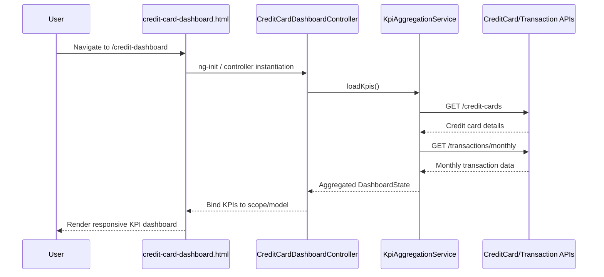

a. Architecture Mapping (brief)
- Responsive Dashboard UI → AngularJS Controller `CreditCardDashboardController` + view `credit-card-dashboard.html` in module `app.creditDashboard`.
- KPI Aggregation Service → AngularJS Service `KpiAggregationService` under `app.creditDashboard`.
- Credit Card Data Service (integration) → AngularJS Service `CreditCardDataService` in `shared/services`.
- Transaction Service (integration) → AngularJS Service `TransactionService` in `shared/services`.

Recommended folder structure:
- `app/creditDashboard/creditDashboard.module.js`
- `app/creditDashboard/creditDashboard.controller.js`
- `app/creditDashboard/creditDashboard.service.js` (KPI aggregation)
- `app/creditDashboard/views/credit-card-dashboard.html`
- `app/shared/services/creditCardData.service.js`
- `app/shared/services/transaction.service.js`

b. Component Specifications

| Name                         | Artifact Type | Responsibility                                                     | Key Dependencies                          |
|------------------------------|--------------|--------------------------------------------------------------------|-------------------------------------------|
| app.creditDashboard          | Module       | Group dashboard components, routes, and config for credit KPIs    | `ui.router`, `KpiAggregationService`      |
| CreditCardDashboardController| Controller   | Orchestrate dashboard view, trigger KPI load and refresh          | `KpiAggregationService`, `$scope`         |
| KpiAggregationService        | Service      | Aggregate KPIs from credit card and transaction services          | `$http`, `CreditCardDataService`, `TransactionService` |
| CreditCardDataService        | Service      | Wrap REST APIs for card details, balances, and credit limits      | `$http`                                   |
| TransactionService           | Service      | Wrap REST APIs for monthly spend and outstanding amounts          | `$http`                                   |
| credit-card-dashboard.html   | View         | Render responsive KPI cards and layout for all credit cards       | `CreditCardDashboardController`, Bootstrap |

c. Data Model (brief)

```js
CreditCardSummary = {
  cardId: String,
  cardNumberMasked: String,
  issuerName: String,
  totalCreditLimit: Number,
  outstandingAmount: Number,
  availableCredit: Number,
  monthlySpend: Number
}

DashboardState = {
  cards: Array<CreditCardSummary>,
  isLoading: Boolean,
  lastUpdated: Date
}
```

d. Data Flow (one paragraph)

User navigates to the credit card dashboard route, which loads `credit-card-dashboard.html`; the view initializes `CreditCardDashboardController`, which on load invokes `KpiAggregationService` to fetch consolidated KPIs; `KpiAggregationService` calls `CreditCardDataService` and `TransactionService` REST endpoints, computes per-card and overall KPIs, and returns a `DashboardState` object; the controller binds this state to the scope, and AngularJS updates the UI to render responsive KPI tiles reflecting monthly spend, total credit limit, available credit, and outstanding amounts.

e. Primary Sequence Diagram (ONE only)



f. Implementation Notes (brief)
- Use `ui.router` state `credit-dashboard` mapped to `credit-card-dashboard.html` and `CreditCardDashboardController`.
- Register `KpiAggregationService`, `CreditCardDataService`, and `TransactionService` in `app.creditDashboard` or shared module with `$inject` annotations for DI.
- Centralize REST endpoint URLs in the services using ES6 `const` for base paths and `$http` promises.
- Use ES6 features (arrow functions, `let`/`const`) within controllers and services with a transpilation step.
- Optimize perceived performance with initial skeleton UI and single aggregated API call when backend supports it.

g. Error Handling (ONE line)
Centralized `$http` interceptor catches failures; user-facing errors surfaced via a shared notification service.

h. Security Notes (ONE line)
Standard input validation and secure API calls assumed.
