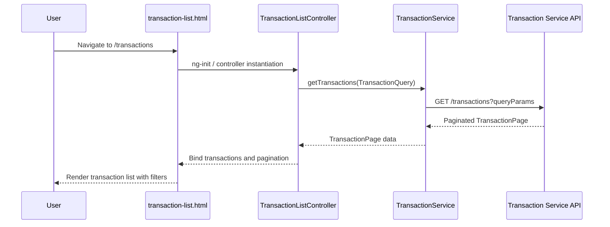

a. Architecture Mapping (brief)
- Transaction List Component → AngularJS Controller `TransactionListController` + view `transaction-list.html` in module `app.transactions`.
- Search and Filter Module → AngularJS Service `TransactionFilterService` and reusable directive `appTransactionFilters`.
- Transaction Service API integration → AngularJS Service `TransactionService` in `shared/services`.
- Credit Card Data Service integration → AngularJS Service `CreditCardDataService` in `shared/services`.

Recommended folder structure:
- `app/transactions/transactions.module.js`
- `app/transactions/transactions.controller.js`
- `app/transactions/transactions.filters.service.js`
- `app/transactions/views/transaction-list.html`
- `app/shared/services/transaction.service.js`
- `app/shared/services/creditCardData.service.js`

b. Component Specifications

| Name                          | Artifact Type | Responsibility                                                      | Key Dependencies                           |
|-------------------------------|--------------|---------------------------------------------------------------------|--------------------------------------------|
| app.transactions              | Module       | Group transaction list, filters, and routing configuration         | `ui.router`, `TransactionService`          |
| TransactionListController     | Controller   | Manage transaction list, pagination, and interaction with filters  | `TransactionService`, `TransactionFilterService`, `$scope` |
| TransactionFilterService      | Service      | Build and manage filter criteria and query parameters              | None (pure logic)                          |
| appTransactionFilters         | Directive    | Render reusable search and filter controls for transactions        | `TransactionFilterService`                 |
| TransactionService            | Service      | Wrap REST calls for transaction retrieval with pagination          | `$http`                                    |
| CreditCardDataService         | Service      | Map transaction data to specific credit cards via card metadata    | `$http`                                    |
| transaction-list.html         | View         | Render paginated transaction table and filter controls             | `TransactionListController`, Bootstrap     |

c. Data Model (brief)

```js
Transaction = {
  id: String,
  cardId: String,
  postedDate: Date,
  amount: Number,
  currency: String,
  merchantName: String,
  category: String,
  status: String
}

TransactionQuery = {
  cardId: String,
  dateFrom: Date,
  dateTo: Date,
  minAmount: Number,
  maxAmount: Number,
  searchText: String,
  page: Number,
  pageSize: Number
}

TransactionPage = {
  items: Array<Transaction>,
  totalCount: Number,
  page: Number,
  pageSize: Number
}
```

d. Data Flow (one paragraph)

User opens the transaction view route, loading `transaction-list.html`, which initializes `TransactionListController`; the controller initializes default `TransactionQuery`, triggers `TransactionService` to fetch a paginated `TransactionPage` based on current filters from `TransactionFilterService`, which sends query params to the Transaction Service REST API; the API responds with transaction records and total count, which the controller binds to the scope, and AngularJS updates the table and pagination controls while filter changes reissue requests to keep the UI in sync.

e. Primary Sequence Diagram (ONE only)



f. Implementation Notes (brief)
- Define `transactions` state in `ui.router` mapped to `transaction-list.html` and `TransactionListController`.
- Use `$inject` arrays on controller and services to ensure minification-safe DI.
- Encapsulate all HTTP calls in `TransactionService` with ES6 promises and centralized error handling.
- Implement server-side pagination parameters (page, pageSize, filters) built by `TransactionFilterService`.
- Apply Bootstrap table and form components for responsive list and filter layout.

g. Error Handling (ONE line)
Centralized `$http` interceptor catches failures; user-facing errors surfaced via a shared notification service.

h. Security Notes (ONE line)
Standard input validation and secure API calls assumed.
