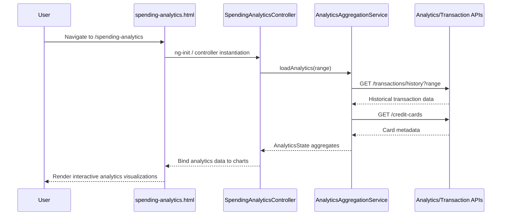

a. Architecture Mapping (brief)
- Analytics UI Component → AngularJS Controller `SpendingAnalyticsController` + view `spending-analytics.html` in module `app.spendingAnalytics`.
- Analytics Engine → AngularJS Service `AnalyticsEngineService` handling aggregation and categorization.
- Data Aggregation Layer → AngularJS Service `AnalyticsAggregationService` coordinating calls to backend services.
- Transaction Service integration → AngularJS Service `TransactionService` in `shared/services`.
- Credit Card Data Service integration → AngularJS Service `CreditCardDataService` in `shared/services`.

Recommended folder structure:
- `app/spendingAnalytics/spendingAnalytics.module.js`
- `app/spendingAnalytics/spendingAnalytics.controller.js`
- `app/spendingAnalytics/spendingAnalytics.engine.service.js`
- `app/spendingAnalytics/spendingAnalytics.aggregation.service.js`
- `app/spendingAnalytics/views/spending-analytics.html`
- `app/shared/services/transaction.service.js`
- `app/shared/services/creditCardData.service.js`

b. Component Specifications

| Name                          | Artifact Type | Responsibility                                                       | Key Dependencies                           |
|-------------------------------|--------------|----------------------------------------------------------------------|--------------------------------------------|
| app.spendingAnalytics         | Module       | Group analytics components, services, and routes                    | `ui.router`, `AnalyticsEngineService`      |
| SpendingAnalyticsController   | Controller   | Manage analytics view, trigger loading of charts and filters        | `AnalyticsAggregationService`, `$scope`    |
| AnalyticsEngineService        | Service      | Perform data aggregation, bucketing, and category-wise computations | `TransactionService`, `CreditCardDataService` |
| AnalyticsAggregationService   | Service      | Coordinate data fetch from services and transform for visualization | `AnalyticsEngineService`                   |
| TransactionService            | Service      | Provide historical transaction data for analytics                   | `$http`                                    |
| CreditCardDataService         | Service      | Provide card metadata and limits for card-wise analysis             | `$http`                                    |
| spending-analytics.html       | View         | Render charts for monthly trends, card-wise and category-wise spend | `SpendingAnalyticsController`, charting lib |

c. Data Model (brief)

```js
MonthlyTrendPoint = {
  month: String,
  totalSpend: Number
}

CardSpendSummary = {
  cardId: String,
  cardName: String,
  totalSpend: Number
}

CategorySpend = {
  categoryCode: String,
  categoryName: String,
  totalSpend: Number
}

AnalyticsState = {
  monthlyTrends: Array<MonthlyTrendPoint>,
  cardSummaries: Array<CardSpendSummary>,
  categorySpends: Array<CategorySpend>,
  isLoading: Boolean,
  selectedRangeMonths: Number
}
```

d. Data Flow (one paragraph)

User navigates to the spending analytics route, loading `spending-analytics.html`, which initializes `SpendingAnalyticsController`; the controller calls `AnalyticsAggregationService` to load analytics, which in turn invokes `TransactionService` and `CreditCardDataService` APIs, passing required date range and card filters; responses are sent to `AnalyticsEngineService` to compute monthly trends, card-wise and category-wise aggregates into an `AnalyticsState` object; the controller binds this state to the scope, and AngularJS updates the charts to render interactive visualizations for up to 12 months of data.

e. Primary Sequence Diagram (ONE only)



f. Implementation Notes (brief)
- Configure `spending-analytics` state in `ui.router` mapped to `spending-analytics.html` and `SpendingAnalyticsController`.
- Use `$inject` arrays for all controllers and services with ES6 modules/transpilation.
- Integrate a charting library (e.g., Chart.js) via directives or components encapsulating chart rendering.
- Implement data caching in `AnalyticsAggregationService` to meet 3-second visualization NFR for repeat views.
- Use promises and non-blocking UI updates to keep the dashboard responsive during data loads.

g. Error Handling (ONE line)
Centralized `$http` interceptor catches failures; user-facing errors surfaced via a shared notification service.

h. Security Notes (ONE line)
Standard input validation and secure API calls assumed.
