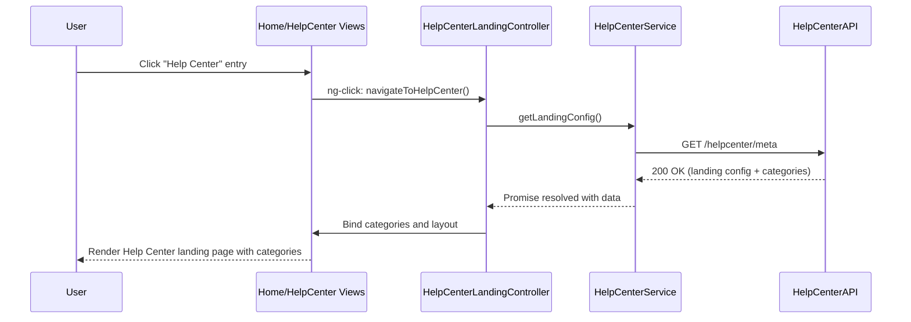

## a. Architecture Mapping
- Home Page → `app.helpCenter` module, `HelpCenterEntryController`, `home-helpcenter-entry.html` view
- Help Center Entry Point → `HelpCenterEntryController` + `home-helpcenter-entry.html` (button/link in main nav)
- Help Center Landing Page → `HelpCenterLandingController`, `help-center-landing.html` view
- Category Navigation (Getting Started, FAQs, Troubleshooting) → `helpCenterNav` directive + `HelpCenterCategoriesController`

Recommended folders:
- `app/helpcenter/helpcenter.module.js`
- `app/helpcenter/helpcenter-entry.controller.js`
- `app/helpcenter/helpcenter-landing.controller.js`
- `app/helpcenter/helpcenter.service.js`
- `app/helpcenter/views/help-center-landing.html`
- `app/helpcenter/directives/help-center-nav.directive.js`

## b. Component Specifications
| Name | Artifact Type | Responsibility | Key Dependencies |
| HomePageController | Controller | Expose Help Center entry link without altering existing home behavior | `ui-router`, `HelpCenterService` |
| HelpCenterEntryController | Controller | Handle click on Help Center entry and route to landing page | `ui-router` |
| HelpCenterLandingController | Controller | Load and present categories (Getting Started, FAQs, Troubleshooting) and responsive layout | `HelpCenterService`, `$window` |
| HelpCenterService | Service | Fetch category metadata and static content configuration from backend/CMS | `$http`, API `/helpcenter/meta` |
| helpCenterNav | Directive | Render category navigation bar/cards with accessible keyboard navigation | `HelpCenterCategoriesController` |
| HelpCenterCategoriesController | Controller | Bind category list and route to selected category views | `ui-router`, `HelpCenterService` |

## c. Data Model
```js
HelpCategory = { id: Number, code: String, name: String, description: String, order: Number };
HelpLandingConfig = { heroTitle: String, heroSubtitle: String, categories: Array<HelpCategory>, responsiveBreakpoints: Object };
NavigationItem = { id: Number, label: String, route: String, position: Number, isHelpCenter: Boolean };
```

## d. Data Flow
When the user clicks the Help Center entry on the Home Page, the view triggers `HelpCenterEntryController`, which uses `ui-router` to transition to the Help Center landing state; `HelpCenterLandingController` initializes, calling `HelpCenterService` to retrieve landing configuration and categories via REST API, the API responds with category data, the controller updates scope models, and AngularJS data binding refreshes the landing page view with accessible, responsive category tiles and navigation.

## e. Primary Sequence Diagram


## f. Implementation Notes
- Use `app.helpcenter` AngularJS module with `$stateProvider` to define `helpcenter.landing` route.
- Apply `$inject` arrays on all controllers/services for minification-safe DI.
- Centralize API calls in `HelpCenterService` using `$http` and ES6 promises.
- Implement responsive layout using Bootstrap grid and WCAG-compliant semantic HTML.
- Keep Home Page integration minimal by adding a single nav item wired via `ui-sref`.

## g. Error Handling
Centralized `$http` interceptor catches failures; user-facing errors surfaced via a shared notification service.

## h. Security Notes
Standard input validation and secure API calls assumed.
