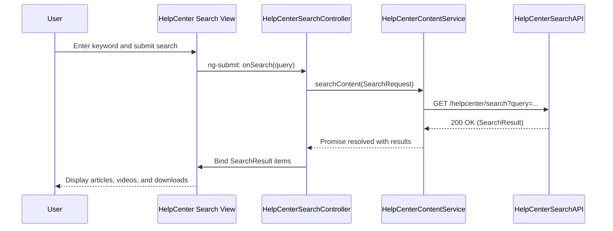

## a. Architecture Mapping
- Help Center Content Listing → `HelpCenterContentController`, `help-center-content.html` view
- Search Interface → `HelpCenterSearchController`, `help-center-search.html` view
- Content Delivery Service → `HelpCenterContentService` AngularJS service
- Video Player Component → `appVideoPlayer` directive
- Downloadable Materials List → `HelpCenterDownloadsController`, `help-center-downloads.html` view

Recommended folders:
- `app/helpcenter/helpcenter-content.controller.js`
- `app/helpcenter/helpcenter-search.controller.js`
- `app/helpcenter/helpcenter-downloads.controller.js`
- `app/helpcenter/helpcenter-content.service.js`
- `app/helpcenter/views/help-center-content.html`
- `app/helpcenter/views/help-center-search.html`
- `app/helpcenter/directives/video-player.directive.js`

## b. Component Specifications
| Name | Artifact Type | Responsibility | Key Dependencies |
| HelpCenterContentController | Controller | Load and display mixed content (articles, FAQs, videos, downloads) | `HelpCenterContentService` |
| HelpCenterSearchController | Controller | Manage keyword search input and bind search results | `HelpCenterContentService` |
| HelpCenterDownloadsController | Controller | Present downloadable materials and handle download actions | `HelpCenterContentService` |
| HelpCenterContentService | Service | Orchestrate REST calls to content API, video host and CDN endpoints | `$http`, APIs `/helpcenter/search`, `/helpcenter/content` |
| appVideoPlayer | Directive | Render embedded video player with accessible controls | Third-party video script, `HelpCenterContentController` |
| appDownloadLink | Directive | Provide consistent styled secure download links | `HelpCenterContentService` |

## c. Data Model
```js
HelpContent = { id: Number, title: String, type: String, summary: String, body: String, url: String, category: String, keywords: Array<String> };
SearchRequest = { query: String, filters: Array<String>, page: Number, pageSize: Number };
SearchResult = { items: Array<HelpContent>, totalCount: Number, elapsedMs: Number };
DownloadItem = { id: Number, name: String, fileUrl: String, sizeKb: Number, type: String };
VideoItem = { id: Number, title: String, embedUrl: String, thumbnailUrl: String, durationSec: Number };
```

## d. Data Flow
The user enters a keyword in the search field in the Help Center view, AngularJS binds the input to `HelpCenterSearchController`, which constructs a `SearchRequest` and calls `HelpCenterContentService` to invoke the search REST API; the backend aggregates results from CMS, video hosting, and CDN endpoints and returns a `SearchResult`, the service resolves the promise back to the controller, which updates the bound result list so the view renders articles, videos, and downloadable items with appropriate templates.

## e. Primary Sequence Diagram


## f. Implementation Notes
- Implement search state as `helpcenter.search` in `ui-router` with resolved initial query params.
- Keep all HTTP calls inside `HelpCenterContentService` using `$http` and ES6 promises.
- Reuse templates for content cards using `ng-repeat` with type-based `ng-switch`.
- Implement appVideoPlayer directive wrapping the external player script and exposing simple attributes.
- Use Bootstrap components for responsive content grids and search form layout.

## g. Error Handling
Centralized `$http` interceptor catches failures; user-facing errors surfaced via a shared notification service.

## h. Security Notes
Standard input validation and secure API calls assumed.
