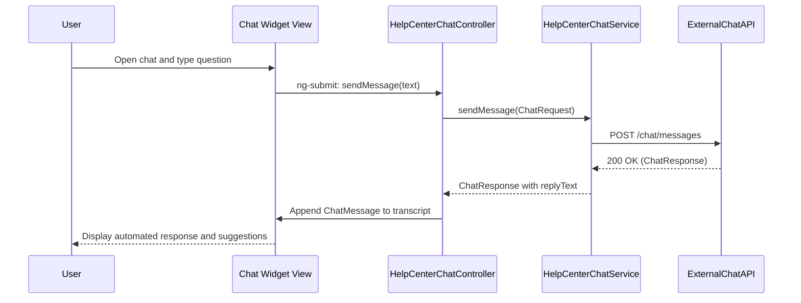

## a. Architecture Mapping
- Chat Assistant Interface → `HelpCenterChatController`, `help-center-chat.html` view
- Query Processing Engine → `HelpCenterChatService` AngularJS service
- Automated Response Engine → `HelpCenterResponseService` (wrapping external chat platform APIs)
- Knowledge Base Access → `HelpCenterKBService` for fetching curated FAQ/answer content
- Session Manager → `HelpCenterSessionFactory` singleton for managing chat sessions

Recommended folders:
- `app/helpcenter/chat/helpcenter-chat.controller.js`
- `app/helpcenter/chat/helpcenter-chat.service.js`
- `app/helpcenter/chat/helpcenter-response.service.js`
- `app/helpcenter/chat/helpcenter-kb.service.js`
- `app/helpcenter/chat/helpcenter-session.factory.js`
- `app/helpcenter/chat/views/help-center-chat.html`

## b. Component Specifications
| Name | Artifact Type | Responsibility | Key Dependencies |
| HelpCenterChatController | Controller | Manage chat UI state, send/receive messages and maintain transcript | `HelpCenterChatService`, `HelpCenterSessionFactory` |
| HelpCenterChatService | Service | Orchestrate requests between UI and external chat platform/query engine | `$http`, `HelpCenterResponseService`, `HelpCenterKBService` |
| HelpCenterResponseService | Service | Call external chat assistant platform APIs and normalize responses | `$http`, external chat API |
| HelpCenterKBService | Service | Retrieve FAQ/knowledge base entries used by chat | `$http`, API `/helpcenter/kb` |
| HelpCenterSessionFactory | Factory | Maintain session tokens, timestamps and limits for concurrent chats | `$window`, `$timeout` |
| appChatWidget | Directive | Render responsive, accessible chat widget anchored on Help Center landing page | `HelpCenterChatController` |

## c. Data Model
```js
ChatMessage = { id: Number, sessionId: String, from: String, text: String, timestamp: Date };
ChatSession = { id: String, userId: String, startedAt: Date, lastActivityAt: Date, isActive: Boolean };
ChatRequest = { sessionId: String, message: String, context: Object };
ChatResponse = { sessionId: String, replyText: String, suggestions: Array<String> };
```

## d. Data Flow
From the Help Center landing page, the user opens the chat widget, the view binds to `HelpCenterChatController`, which initializes or resumes a `ChatSession` via `HelpCenterSessionFactory`; when the user submits a question, the controller builds a `ChatRequest` and passes it to `HelpCenterChatService`, which calls `HelpCenterResponseService` to invoke the external chat API and, when needed, `HelpCenterKBService` for article links, then the service returns a `ChatResponse` to the controller, which appends new `ChatMessage` objects to the transcript and updates the view.

## e. Primary Sequence Diagram


## f. Implementation Notes
- Expose chat entry point on Help Center landing page as an appChatWidget directive toggle.
- Use `$inject` arrays and ES6 classes for controllers/services where transpilation is available.
- Throttle outbound chat requests to protect the external platform and meet concurrency targets.
- Ensure chat widget is fully keyboard-navigable and screen-reader friendly using ARIA roles.
- Track basic interaction metrics via existing analytics hooks without storing sensitive content.

## g. Error Handling
Centralized `$http` interceptor catches failures; user-facing errors surfaced via a shared notification service.

## h. Security Notes
Requires token-based auth to external chat platform; otherwise standard input validation and secure API calls assumed.
