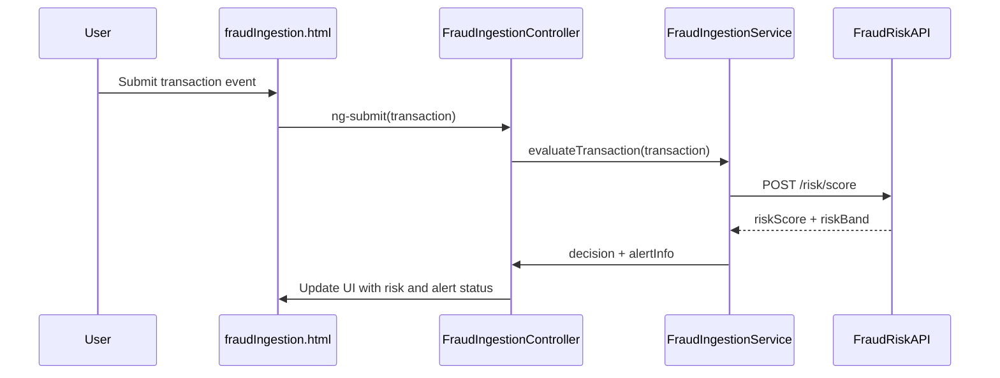

# a. Architecture Mapping
- Transaction Ingestion → app.fraudEngine module, FraudIngestionController + fraudIngestion.html, FraudIngestionService
- Fraud Risk Engine → FraudRiskService (risk scoring logic) within app.fraudEngine, used by controllers/services
- Policy Decision Engine → PolicyDecisionService (threshold evaluation and action mapping)
- Alert Creation → AlertCreationService + AlertCreationController + alertCreation.html
- Audit Service → AuditLogService (shared service in app.shared)

Recommended folders:
- app/fraudEngine/fraudEngine.module.js
- app/fraudEngine/fraudIngestion.controller.js
- app/fraudEngine/fraudRisk.service.js
- app/fraudEngine/policyDecision.service.js
- app/fraudEngine/alertCreation.controller.js
- app/fraudEngine/views/fraudIngestion.html
- app/fraudEngine/views/alertCreation.html
- app/shared/services/auditLog.service.js

# b. Component Specifications

| Name                   | Artifact Type | Responsibility                                                     | Dependencies                          |
|------------------------|--------------|--------------------------------------------------------------------|---------------------------------------|
| app.fraudEngine        | Module       | Group fraud engine controllers and services                       | ui.router, app.shared                 |
| FraudIngestionController | Controller | Manage transaction ingestion view, trigger risk evaluation        | FraudIngestionService, $state         |
| FraudIngestionService  | Service      | Receive transaction payloads, normalize schema, call FraudRiskService | $http, FraudRiskService, AuditLogService |
| FraudRiskService       | Service      | Calculate risk score using models and signals                     | $http, PolicyDecisionService          |
| PolicyDecisionService  | Service      | Map risk scores to policies, decide actions based on thresholds   | $http, AuditLogService                |
| AlertCreationController | Controller  | Orchestrate alert creation UI for risk decisions                  | AlertCreationService, $state          |
| AlertCreationService   | Service      | Create alerts and send to downstream systems                      | $http, AuditLogService                |
| AuditLogService        | Service      | Capture audit events for ingestion, risk, policy, and alerts      | $http                                 |

# c. Data Model
```js
Transaction = {
  transactionId: String,
  accountId: String,
  cardId: String,
  merchant: String,
  amount: Number,
  currency: String,
  timestamp: String,
  channel: String,
  geoLocation: String,
  deviceId: String
};

RiskScore = {
  transactionId: String,
  modelId: String,
  score: Number,
  riskBand: String,
  signalsUsed: Array<String>,
  modelVersion: String,
  evaluatedAt: String
};

PolicyDecision = {
  transactionId: String,
  riskBand: String,
  action: String,
  thresholdConfigId: String,
  createdAt: String
};

Alert = {
  alertId: String,
  transactionId: String,
  riskBand: String,
  action: String,
  status: String,
  createdAt: String,
  createdBy: String
};

AuditEvent = {
  eventId: String,
  transactionId: String,
  entityType: String,
  entityId: String,
  eventType: String,
  createdAt: String,
  createdBy: String
};
```

# d. Data Flow
User or upstream system submits a transaction event, the fraudIngestion.html view (or API-driven trigger) binds to FraudIngestionController, which forwards normalized transaction data to FraudIngestionService; FraudIngestionService calls FraudRiskService to compute the risk score, then PolicyDecisionService evaluates policies and thresholds via REST APIs, after which AlertCreationService persists any required alerts and AuditLogService records audit events; controllers update the scope/model and UI to reflect risk decisions and generated alerts.

# e. Primary Sequence Diagram


# f. Implementation Notes
- Use app.fraudEngine module with ui-router state for ingestion and alert screens.
- Apply `$inject` arrays for controllers/services and use ES6 `const`/`let` with transpilation.
- Centralize REST calls in FraudIngestionService, FraudRiskService, PolicyDecisionService, and AlertCreationService using `$http` promises.
- Use AuditLogService as a shared singleton for audit events across fraud engine components.
- Handle asynchronous flows with `$q` or native promises, avoiding nested callbacks.

# g. Error Handling
Use centralized `$http` interceptor for API errors with user-friendly notifications on the UI.

# h. Security Notes
Standard input validation and secure API calls assumed.
