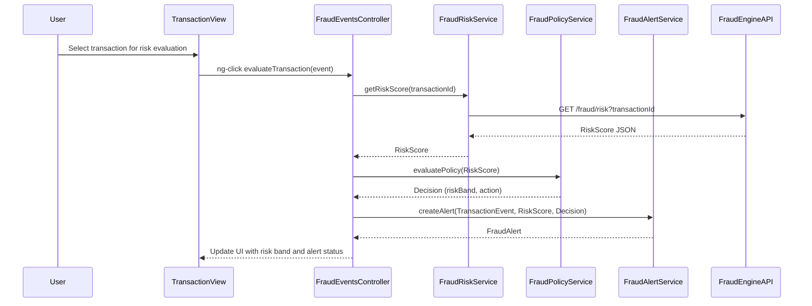

# a. Architecture Mapping (brief)
- Transaction Ingestion screen → `FraudEventsController` + `fraud-events.html` view.
- Fraud Risk Engine view (risk summary dashboard) → `FraudRiskEngineController` + `fraud-risk-engine.html`.
- Policy Decision configuration page → `PolicyDecisionController` + `policy-decision.html`.
- Alert Creation review screen → `FraudAlertController` + `fraud-alert.html`.
- Audit trail viewer → `FraudAuditController` + `fraud-audit.html`.
- Fraud core services → `FraudRiskService`, `FraudPolicyService`, `FraudAlertService`, `FraudAuditService`.
- Shared risk state/cache → `FraudStateFactory`.
- Cross-cutting logging & auth → `$http` interceptor `fraudHttpInterceptor`.

Recommended folder structure:
- `app/fraud/` (module, controllers, services, routes)
- `app/fraud/views/` (HTML templates)
- `app/shared/services/` (shared audit/logging services)
- `app/shared/interceptors/` (HTTP interceptors)

# b. Component Specifications

| Name | Artifact Type | Responsibility | Key Dependencies |
|---|---|---|---|
| `app.fraud` | Module | Groups fraud engine UI components and config | `ui.router`, shared modules |
| `FraudEventsController` | Controller | Displays ingested transaction events and basic filters | `FraudRiskService`, `FraudPolicyService` |
| `FraudRiskEngineController` | Controller | Shows risk scores, model versions, and risk band summaries | `FraudRiskService` |
| `PolicyDecisionController` | Controller | Manages threshold and policy mappings for actions | `FraudPolicyService` |
| `FraudAlertController` | Controller | Lists and drills into created fraud alerts | `FraudAlertService` |
| `FraudAuditController` | Controller | Renders audit trails for fraud decisions | `FraudAuditService` |
| `FraudRiskService` | Service | Calls REST APIs for risk scoring and risk band evaluation | `$http`, `FraudStateFactory` |
| `FraudPolicyService` | Service | Manages policy/threshold configs and decision rules | `$http`, `FraudStateFactory` |
| `FraudAlertService` | Service | Retrieves and persists fraud alert records | `$http` |
| `FraudAuditService` | Service | Fetches audit logs and decision histories | `$http` |
| `FraudStateFactory` | Factory | Holds shared risk configs, thresholds, cache of latest scores | none |
| `fraudHttpInterceptor` | Interceptor | Adds auth headers and logs API errors for fraud APIs | `$q`, `$injector` |

# c. Data Model (brief)

```js
TransactionEvent = {
  transactionId: String,
  accountId: String,
  cardId: String,
  merchant: String,
  amount: Number,
  currency: String,
  timestamp: String,
  channel: String,
  location: String,
  rawPayload: Object
};

RiskSignal = {
  name: String,
  value: Number,
  weight: Number,
  source: String
};

RiskScore = {
  transactionId: String,
  score: Number,
  band: String,
  modelVersion: String,
  evaluatedAt: String,
  signals: Array<RiskSignal>
};

PolicyConfig = {
  id: String,
  name: String,
  minScore: Number,
  maxScore: Number,
  action: String,
  enabled: Boolean,
  lastUpdatedBy: String,
  lastUpdatedAt: String
};

FraudAlert = {
  alertId: String,
  transactionId: String,
  accountId: String,
  riskScore: Number,
  riskBand: String,
  action: String,
  createdAt: String,
  status: String
};

AuditRecord = {
  id: String,
  entityType: String,
  entityId: String,
  eventType: String,
  createdAt: String,
  createdBy: String,
  details: Object
};
```

# d. Data Flow (one paragraph)
User selects a transaction event from the Transaction Ingestion view, the `FraudEventsController` loads event details and calls `FraudRiskService`, which invokes the risk engine REST API; the controller then calls `FraudPolicyService` to evaluate the returned `RiskScore` against configured `PolicyConfig`, receives the decision and forwards it to `FraudAlertService` to create a `FraudAlert`, and finally triggers `FraudAuditService` to log an `AuditRecord`, with the view updating in real time to show risk band, decision, and alert status.

# e. Primary Sequence Diagram



# f. Implementation Notes (brief)
- Use `app.fraud` module with `ui-router` states for each fraud screen (events, risk, policy, alerts, audit).
- Define services using ES6 `class` syntax wrapped in AngularJS service registration with `$inject` for dependencies.
- Centralize all fraud-related API endpoints in `FraudRiskService`, `FraudPolicyService`, `FraudAlertService`, and `FraudAuditService` using `$http`.
- Use promises with `.then()` and `.catch()` to handle async responses and update controllers.
- Configure `fraudHttpInterceptor` to inject auth tokens and handle error logging for fraud APIs.

# g. Error Handling (ONE line)
Client-side errors are handled via `$http` interceptor for API failures and controller-level `.catch()` blocks that surface concise notifications to the user.

# h. Security Notes (ONE line)
Requires token-based authentication with least-privilege access to fraud APIs and secure handling of transaction data.
