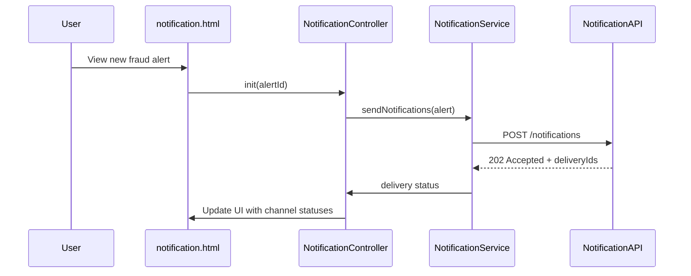

# a. Architecture Mapping
- Notification Router and channels (push/SMS/email) → app.fraudNotification module, NotificationController + notification.html, NotificationService
- Alert Service integration → AlertService (shared service) consumed by NotificationController
- Customer Response Service → CustomerResponseController + CustomerResponseService + customerResponse.html
- Alert State Manager → AlertStateService managing lifecycle transitions
- Analytics tracking → NotificationAnalyticsService in shared services

Recommended folders:
- app/fraudNotification/fraudNotification.module.js
- app/fraudNotification/notification.controller.js
- app/fraudNotification/notification.service.js
- app/fraudNotification/customerResponse.controller.js
- app/fraudNotification/customerResponse.service.js
- app/fraudNotification/alertState.service.js
- app/fraudNotification/views/notification.html
- app/fraudNotification/views/customerResponse.html
- app/shared/services/alert.service.js
- app/shared/services/notificationAnalytics.service.js

# b. Component Specifications

| Name                         | Artifact Type | Responsibility                                                            | Dependencies                                |
|------------------------------|--------------|---------------------------------------------------------------------------|---------------------------------------------|
| app.fraudNotification        | Module       | Group fraud notification and response components                         | ui.router, app.shared                       |
| NotificationController       | Controller   | Manage alert list and trigger multi-channel notification sending         | NotificationService, AlertService, $state   |
| NotificationService          | Service      | Route alerts to push/SMS/email providers via REST APIs                   | $http, NotificationAnalyticsService         |
| CustomerResponseController   | Controller   | Present alert details and capture customer confirm/report actions        | CustomerResponseService, AlertStateService  |
| CustomerResponseService      | Service      | Submit customer responses to backend and fetch alert context             | $http, AlertService                         |
| AlertStateService            | Service      | Track and update alert lifecycle states                                  | $http                                       |
| AlertService                 | Service      | Provide canonical alert data retrieval shared across modules             | $http                                       |
| NotificationAnalyticsService | Service      | Send notification and response events to analytics backend               | $http                                       |

# c. Data Model
```js
Alert = {
  alertId: String,
  transactionId: String,
  customerId: String,
  channel: String,
  status: String,
  createdAt: String,
  deliveredAt: String,
  resolvedAt: String
};

NotificationPreference = {
  customerId: String,
  preferredChannels: Array<String>,
  overridesEnabled: Boolean
};

CustomerResponse = {
  responseId: String,
  alertId: String,
  customerId: String,
  action: String,
  respondedAt: String,
  channel: String
};

AlertState = {
  alertId: String,
  state: String,
  updatedAt: String,
  updatedBy: String
};
```

# d. Data Flow
An alert created upstream is loaded into notification.html via NotificationController, which calls NotificationService to resolve appropriate channels and send notifications through REST APIs; customer receives the notification and opens customerResponse.html, where CustomerResponseController uses CustomerResponseService to load alert details and submit confirmation or report actions, AlertStateService updates alert lifecycle state via backend APIs, and NotificationAnalyticsService records delivery and response events, updating the UI with the current status.

# e. Primary Sequence Diagram


# f. Implementation Notes
- Use app.fraudNotification module with ui-router states for notification and response views.
- Apply `$inject` for all controllers/services and structure REST calls with `$http` promises.
- Encapsulate multi-channel routing logic inside NotificationService, not in controllers.
- Use shared AlertService for canonical alert retrieval across notification and response flows.
- Capture analytics via NotificationAnalyticsService using non-blocking calls.

# g. Error Handling
Use `$http` interceptor to handle notification API errors and surface concise messages to users.

# h. Security Notes
Requires token-based auth for alert and response APIs with no full card numbers shown in the UI.
