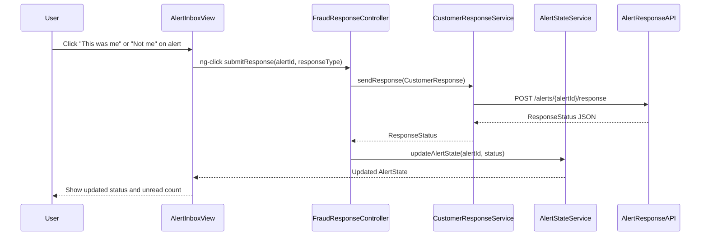

# a. Architecture Mapping (brief)
- Fraud Alert list and detail screens → `FraudNotificationController` + `fraud-notification.html` view.
- Notification preference settings page → `NotificationPreferenceController` + `notification-preference.html`.
- Alert grouping/prioritization view → `AlertInboxController` + `alert-inbox.html`.
- Customer response capture screen → `FraudResponseController` + `fraud-response.html`.
- Shared notification services → `NotificationRouterService`, `NotificationProviderService`, `CustomerResponseService`, `AlertStateService`.
- Shared preference state → `NotificationPreferenceFactory`.
- Cross-cutting auth/logging → `$http` interceptor `notificationHttpInterceptor`.

Recommended folder structure:
- `app/notifications/` (module, controllers, services, routes)
- `app/notifications/views/` (HTML templates)
- `app/shared/services/` (customer and analytics services)
- `app/shared/interceptors/` (HTTP interceptors)

# b. Component Specifications

| Name | Artifact Type | Responsibility | Key Dependencies |
|---|---|---|---|
| `app.notifications` | Module | Groups notification and alert response components | `ui.router`, shared modules |
| `FraudNotificationController` | Controller | Displays list of fraud alerts and details with masked card data | `AlertStateService`, `NotificationRouterService` |
| `NotificationPreferenceController` | Controller | Manages customer notification channel preferences | `NotificationPreferenceFactory`, `NotificationRouterService` |
| `AlertInboxController` | Controller | Provides grouped/prioritized alert inbox view | `AlertStateService` |
| `FraudResponseController` | Controller | Captures confirm/deny responses for alerts | `CustomerResponseService`, `AlertStateService` |
| `NotificationRouterService` | Service | Chooses delivery channels based on preferences and security flags | `$http`, `NotificationPreferenceFactory` |
| `NotificationProviderService` | Service | Wraps push/SMS/email provider REST APIs | `$http` |
| `CustomerResponseService` | Service | Sends customer responses to backend and retrieves statuses | `$http` |
| `AlertStateService` | Service | Maintains alert lifecycle state and unread counts | `$http`, `NotificationPreferenceFactory` |
| `NotificationPreferenceFactory` | Factory | Caches customer preferences and overrides | none |
| `notificationHttpInterceptor` | Interceptor | Adds auth headers and logs notification API errors | `$q`, `$injector` |

# c. Data Model (brief)

```js
FraudAlertSummary = {
  alertId: String,
  transactionId: String,
  merchant: String,
  amount: Number,
  currency: String,
  time: String,
  maskedCard: String,
  channel: String,
  status: String,
  priority: String
};

NotificationPreference = {
  customerId: String,
  allowPush: Boolean,
  allowSms: Boolean,
  allowEmail: Boolean,
  fallbackChannel: String,
  lastUpdatedAt: String,
  securityOverride: Boolean
};

CustomerResponse = {
  alertId: String,
  customerId: String,
  responseType: String,
  respondedAt: String,
  deviceInfo: String
};

AlertState = {
  alertId: String,
  status: String,
  createdAt: String,
  updatedAt: String,
  unread: Boolean,
  groupId: String
};
```

# d. Data Flow (one paragraph)
User opens the fraud alerts inbox view, the `AlertInboxController` loads `FraudAlertSummary` items via `AlertStateService`, which calls backend REST APIs; when the user selects an alert, `FraudNotificationController` fetches full details and masks card data in the view, and if the user confirms or denies the transaction, `FraudResponseController` sends a `CustomerResponse` via `CustomerResponseService` to the response API, which updates `AlertStateService` and triggers the UI to refresh alert status and unread counts.

# e. Primary Sequence Diagram



# f. Implementation Notes (brief)
- Define `app.notifications` module with `ui-router` states for inbox, detail, preferences, and response screens.
- Implement services using ES6 classes registered as AngularJS services with `$inject` arrays for DI.
- Route all notification and response-related HTTP calls through `NotificationRouterService`, `NotificationProviderService`, and `CustomerResponseService` using `$http`.
- Use promises to chain alert loading and response submission, updating `AlertStateService` and controllers upon resolve.
- Configure `notificationHttpInterceptor` to inject auth tokens, handle rate-limit responses, and log failures.

# g. Error Handling (ONE line)
Errors are managed via `$http` interceptor for notification APIs and controller-level `.catch()` paths that surface concise error banners in the views.

# h. Security Notes (ONE line)
Requires strong authentication for response actions with encrypted transport, masked card details, and secure notification links.
