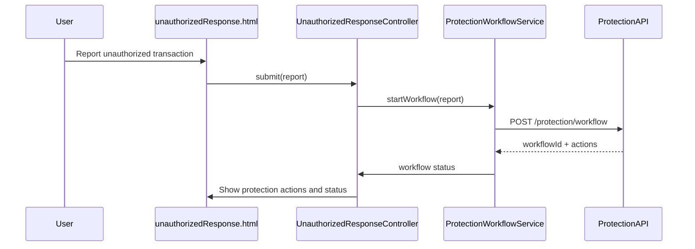

# a. Architecture Mapping
- Customer Unauthorized Response flow → app.securityResponse module, UnauthorizedResponseController + unauthorizedResponse.html
- Authentication Service integration → AuthService (shared) used by UnauthorizedResponseController
- Protection Workflow Engine → ProtectionWorkflowService coordinating downstream calls
- Card Management Service → CardManagementService handling block and replacement requests
- Fraud Case Management → FraudCaseService handling case creation and tracking
- Audit Trail → SecurityAuditService logging security events

Recommended folders:
- app/securityResponse/securityResponse.module.js
- app/securityResponse/unauthorizedResponse.controller.js
- app/securityResponse/protectionWorkflow.service.js
- app/securityResponse/cardManagement.service.js
- app/securityResponse/fraudCase.service.js
- app/securityResponse/views/unauthorizedResponse.html
- app/shared/services/auth.service.js
- app/shared/services/securityAudit.service.js

# b. Component Specifications

| Name                          | Artifact Type | Responsibility                                                             | Dependencies                      |
|-------------------------------|--------------|----------------------------------------------------------------------------|-----------------------------------|
| app.securityResponse          | Module       | Group unauthorized response and protection workflow components            | ui.router, app.shared             |
| UnauthorizedResponseController| Controller   | Drive UI for reporting unauthorized transactions and tracking progress    | ProtectionWorkflowService, AuthService, $state |
| ProtectionWorkflowService     | Service      | Orchestrate card blocking, account protection, case creation, and disputes| $http, CardManagementService, FraudCaseService, SecurityAuditService |
| CardManagementService         | Service      | Call card-management APIs for blocking and replacement                    | $http, SecurityAuditService       |
| FraudCaseService              | Service      | Integrate with fraud case-management system for case lifecycle operations | $http, SecurityAuditService       |
| AuthService                   | Service      | Handle step-up authentication checks for sensitive actions                | $http                             |
| SecurityAuditService          | Service      | Record protection workflow and security events into audit infrastructure  | $http                             |

# c. Data Model
```js
UnauthorizedReport = {
  reportId: String,
  customerId: String,
  transactionId: String,
  reason: String,
  reportedAt: String
};

ProtectionAction = {
  actionId: String,
  reportId: String,
  type: String,
  status: String,
  executedAt: String
};

CardBlockRequest = {
  requestId: String,
  cardId: String,
  reason: String,
  requestedAt: String
};

FraudCase = {
  caseId: String,
  customerId: String,
  transactionId: String,
  status: String,
  createdAt: String,
  investigatorId: String
};

SecurityAuditEvent = {
  eventId: String,
  eventType: String,
  entityId: String,
  createdAt: String,
  createdBy: String
};
```

# d. Data Flow
Customer opens unauthorizedResponse.html to report an unauthorized transaction, UnauthorizedResponseController first uses AuthService to ensure step-up authentication, then invokes ProtectionWorkflowService with the report payload; ProtectionWorkflowService calls CardManagementService and FraudCaseService via REST APIs to block cards, protect accounts, and create fraud cases, while SecurityAuditService records each action, and the controller updates the UI as workflow steps complete or fail.

# e. Primary Sequence Diagram


# f. Implementation Notes
- Implement app.securityResponse module with ui-router state for unauthorized response screen.
- Use `$inject` and ES6 syntax for all controllers and services with transpilation support.
- Centralize workflow orchestration in ProtectionWorkflowService, keeping controllers thin.
- Perform step-up auth checks via AuthService before invoking protection workflows.
- Log key security events via SecurityAuditService for audit and compliance.

# g. Error Handling
Use `$http` interceptor plus controller-level fallbacks to display concise error banners.

# h. Security Notes
Requires strong authentication with step-up verification and least-privilege access to protection APIs.
