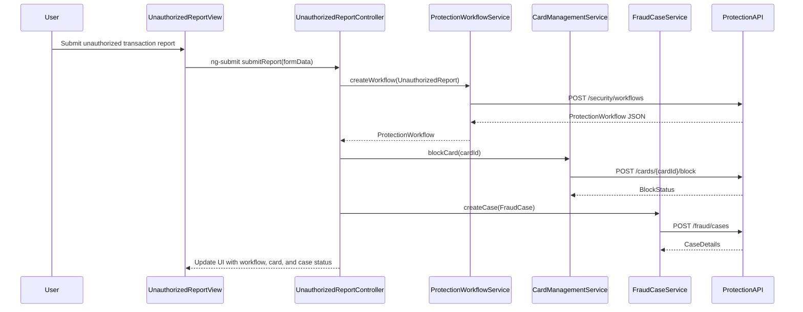

# a. Architecture Mapping (brief)
- Unauthorized transaction report screen → `UnauthorizedReportController` + `unauthorized-report.html` view.
- Protection workflow status dashboard → `ProtectionWorkflowController` + `protection-workflow.html`.
- Fraud case detail and tracking screen → `FraudCaseController` + `fraud-case.html`.
- Card block/replacement screen → `CardProtectionController` + `card-protection.html`.
- Shared protection services → `ProtectionWorkflowService`, `CardManagementService`, `FraudCaseService`, `AuditTrailService`.
- Shared security state → `ProtectionStateFactory`.
- Cross-cutting auth/logging → `$http` interceptor `securityHttpInterceptor`.

Recommended folder structure:
- `app/security/` (module, controllers, services, routes)
- `app/security/views/` (HTML templates)
- `app/shared/services/` (shared auth and audit services)
- `app/shared/interceptors/` (HTTP interceptors)

# b. Component Specifications

| Name | Artifact Type | Responsibility | Key Dependencies |
|---|---|---|---|
| `app.security` | Module | Groups security response workflows and configs | `ui.router`, shared modules |
| `UnauthorizedReportController` | Controller | Captures customer reports of unauthorized transactions | `ProtectionWorkflowService`, `ProtectionStateFactory` |
| `ProtectionWorkflowController` | Controller | Shows end-to-end protection workflow status | `ProtectionWorkflowService` |
| `FraudCaseController` | Controller | Displays fraud case details and investigation status | `FraudCaseService`, `AuditTrailService` |
| `CardProtectionController` | Controller | Manages card block and replacement actions | `CardManagementService`, `ProtectionWorkflowService` |
| `ProtectionWorkflowService` | Service | Orchestrates protection workflows and status updates | `$http`, `ProtectionStateFactory` |
| `CardManagementService` | Service | Calls card-management APIs to block and replace cards | `$http` |
| `FraudCaseService` | Service | Integrates with fraud case-management APIs | `$http` |
| `AuditTrailService` | Service | Fetches and records audit trail events | `$http` |
| `ProtectionStateFactory` | Factory | Maintains shared protection state and workflow context | none |
| `securityHttpInterceptor` | Interceptor | Applies auth headers and logs security API errors | `$q`, `$injector` |

# c. Data Model (brief)

```js
UnauthorizedReport = {
  reportId: String,
  customerId: String,
  transactionId: String,
  reportedAt: String,
  channel: String,
  description: String
};

ProtectionWorkflow = {
  workflowId: String,
  customerId: String,
  status: String,
  startedAt: String,
  updatedAt: String,
  steps: Array<String>
};

FraudCase = {
  caseId: String,
  customerId: String,
  transactionId: String,
  status: String,
  investigator: String,
  openedAt: String,
  updatedAt: String
};

CardProtection = {
  cardId: String,
  blockStatus: String,
  replacementRequested: Boolean,
  replacementCardId: String,
  updatedAt: String
};

SecurityAuditRecord = {
  id: String,
  entityType: String,
  entityId: String,
  eventType: String,
  createdAt: String,
  createdBy: String,
  details: Object
};
```

# d. Data Flow (one paragraph)
When a customer reports an unauthorized transaction from the report screen, `UnauthorizedReportController` posts an `UnauthorizedReport` via `ProtectionWorkflowService` to the protection workflow API, which returns a `ProtectionWorkflow` identifier; the controller then triggers `CardManagementService` to initiate `CardProtection` actions as needed, and `FraudCaseService` to create a `FraudCase`, with `ProtectionWorkflowController` and `FraudCaseController` polling or subscribing via services to update views as workflow and case statuses change.

# e. Primary Sequence Diagram



# f. Implementation Notes (brief)
- Implement `app.security` module with `ui-router` states for report, workflow, case, and card protection views.
- Use ES6 classes for services with `$inject` metadata to keep DI minification-safe.
- Centralize calls to protection, card-management, and case-management APIs in `ProtectionWorkflowService`, `CardManagementService`, and `FraudCaseService`.
- Use promises to chain workflow creation, card blocking, and case creation, updating controllers when results resolve.
- Configure `securityHttpInterceptor` to enforce auth headers and log security-related API errors.

# g. Error Handling (ONE line)
Client-side error handling uses `$http` interceptors and controller-level `.catch()` to show concise error messages for protection, card, and case operations.

# h. Security Notes (ONE line)
Requires strong step-up authentication, least-privilege API access, and secure handling of security and fraud case data.
