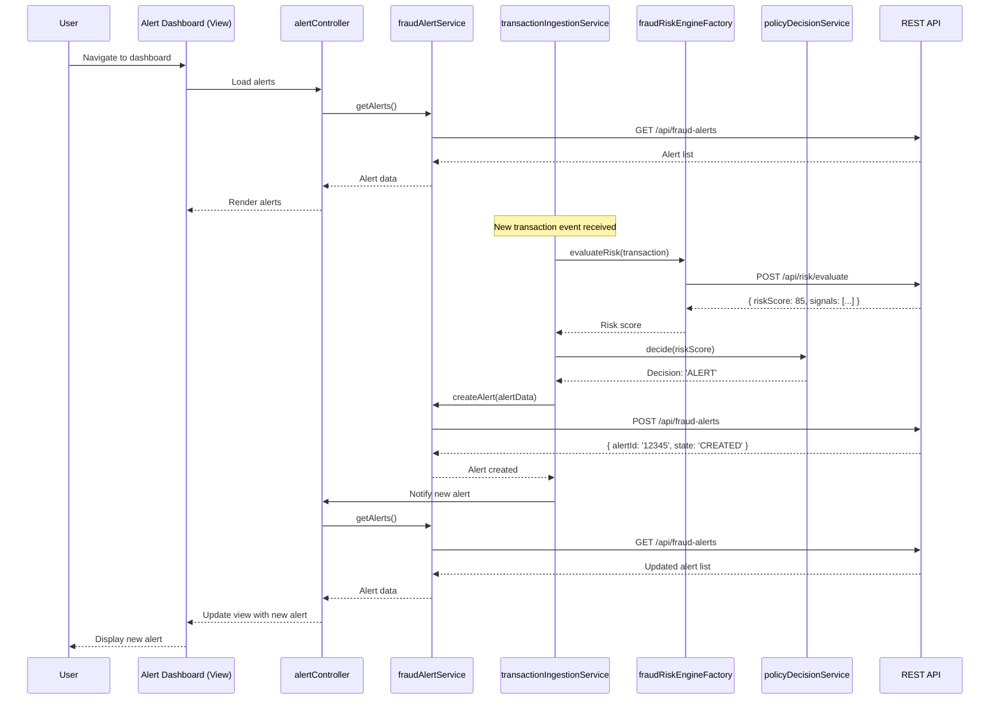

# Low-Level Design: Real-Time Fraud Detection System

**Epic ID:** QE-5707

---

## a. Architecture Mapping

- **Transaction Event Ingestion** → AngularJS Service (`transactionIngestionService`) + REST API integration
- **Fraud Risk Engine Interface** → AngularJS Factory (`fraudRiskEngineFactory`) for API calls
- **Policy Decision Engine** → AngularJS Service (`policyDecisionService`) with business logic
- **Fraud Alert Record Store** → AngularJS Service (`fraudAlertService`) + REST API for CRUD operations
- **Analytics & Monitoring Dashboard** → AngularJS Module (`analyticsModule`) + Controller (`analyticsController`) + View
- **Alert Management UI** → AngularJS Module (`fraudAlertModule`) + Controller (`alertController`) + Directives for alert display

**Recommended Folder Structure:**
```
/app
  /modules
    /fraud-alert
      fraud-alert.module.js
      alert.controller.js
      alert.service.js
      alert-list.directive.js
    /analytics
      analytics.module.js
      analytics.controller.js
      analytics.service.js
  /shared
    /services
      fraud-risk-engine.factory.js
      policy-decision.service.js
      transaction-ingestion.service.js
    /interceptors
      auth.interceptor.js
      error.interceptor.js
  /assets
    /css
    /templates
```

---

## b. Component Specifications

| Component Name | Artifact Type | Responsibility | Key Dependencies |
|----------------|---------------|----------------|------------------|
| `fraudAlertModule` | Module | Root module for fraud alert management UI | `ngRoute`, `fraudAlertService` |
| `alertController` | Controller | Manages alert list display, filtering, and state transitions | `fraudAlertService`, `$scope`, `$filter` |
| `fraudAlertService` | Service | Handles CRUD operations for fraud alerts via REST API | `$http`, `fraudRiskEngineFactory` |
| `alertListDirective` | Directive | Renders alert cards with status badges and action buttons | `fraudAlertService` |
| `fraudRiskEngineFactory` | Factory | Encapsulates fraud risk scoring API calls and response parsing | `$http`, `$q` |
| `policyDecisionService` | Service | Evaluates risk scores against thresholds and returns decision actions | `configService` |
| `transactionIngestionService` | Service | Polls or receives transaction events, ensures idempotency | `$http`, `$interval`, `fraudRiskEngineFactory` |
| `analyticsModule` | Module | Analytics and monitoring dashboard module | `ngRoute`, `analyticsService` |
| `analyticsController` | Controller | Displays metrics, charts, and model performance data | `analyticsService`, `$scope` |
| `analyticsService` | Service | Fetches analytics data and aggregates metrics from REST API | `$http` |
| `authInterceptor` | Interceptor | Attaches authentication tokens to outgoing API requests | `$q`, `authService` |
| `errorInterceptor` | Interceptor | Handles API errors globally and triggers user notifications | `$q`, `notificationService` |

---

## c. Data Model

**TransactionEvent (JS Object):**
```javascript
{
  transactionId: String,
  cardIdentifier: String,
  amount: Number,
  currency: String,
  merchantId: String,
  merchantName: String,
  timestamp: Date,
  location: Object { lat: Number, lon: Number },
  metadata: Object
}
```

**FraudAlert (JS Object):**
```javascript
{
  alertId: String,
  transactionId: String,
  riskScore: Number,
  riskBand: String, // 'LOW', 'MEDIUM', 'HIGH', 'CRITICAL'
  decision: String, // 'APPROVE', 'ALERT', 'STEP_UP', 'HOLD', 'DECLINE'
  state: String, // 'CREATED', 'REVIEWED', 'RESOLVED', 'ESCALATED'
  createdAt: Date,
  updatedAt: Date,
  reviewedBy: String,
  notes: String
}
```

**PolicyThreshold (JS Object):**
```javascript
{
  thresholdId: String,
  riskBand: String,
  minScore: Number,
  maxScore: Number,
  action: String,
  enabled: Boolean
}
```

---

## d. Data Flow

User navigates to the fraud alert dashboard; `alertController` invokes `fraudAlertService.getAlerts()` which calls the REST API (`GET /api/fraud-alerts`) to fetch current alerts. When a new transaction event arrives (via polling or webhook in `transactionIngestionService`), the service calls `fraudRiskEngineFactory.evaluateRisk(transaction)` which posts transaction data to the fraud risk engine API (`POST /api/risk/evaluate`). The API returns a risk score; `policyDecisionService.decide(riskScore)` evaluates it against configured thresholds and determines the action. If an alert is warranted, `fraudAlertService.createAlert(alertData)` posts to `POST /api/fraud-alerts`, creating a new alert record. The UI polls or receives a push notification, triggering `alertController` to refresh the alert list, updating the view with the new alert displayed via `alertListDirective`.

---

## e. Primary Sequence Diagram



---

## f. Implementation Notes

- Use AngularJS Dependency Injection to inject services and factories into controllers; declare all dependencies explicitly in array notation for minification safety.
- Implement `fraudRiskEngineFactory` with promise-based API calls using `$http` and `$q` for chaining; handle timeouts with fail-open logic (default to 'APPROVE' if engine unavailable).
- Use ES6 classes for service definitions where appropriate, transpiled via Babel; leverage arrow functions for concise callbacks and lexical `this` binding.
- Implement idempotency in `transactionIngestionService` by maintaining a local cache (or checking via API) of processed transaction IDs before invoking risk evaluation.
- Configure `authInterceptor` to attach JWT tokens from session storage to all API requests; `errorInterceptor` catches 401/403 and redirects to login, other errors trigger toast notifications.

---

## g. Error Handling

Client-side errors are managed via HTTP interceptors (`errorInterceptor`) that catch API failures, log to console, and display user-friendly notifications using a toast service; service methods use try/catch with promise rejection for graceful degradation.

---

## h. Security Notes

Requires token-based authentication via existing SSO; all API calls include JWT in Authorization header; sensitive alert data encrypted in transit (HTTPS) and access controlled by role-based permissions.

---

**End of Document**