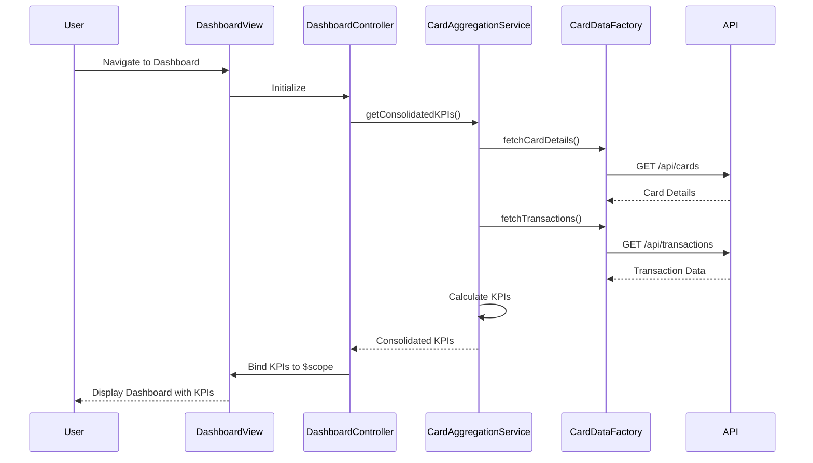

# Low-Level Design: Credit Card Analysis Dashboard

## Epic ID: QE-5713

---

## a. Architecture Mapping

- **Dashboard Module** → AngularJS Module (`creditCardDashboard`)
- **Dashboard View** → HTML5 template with Bootstrap grid (`dashboard.html`)
- **Dashboard Controller** → AngularJS Controller (`DashboardController`)
- **Data Aggregation Service** → AngularJS Service (`CardAggregationService`)
- **API Integration** → AngularJS Factory (`CardDataFactory`)
- **KPI Display Components** → AngularJS Directives (`kpiCard`, `cardSummary`)

**Recommended Folder Structure:**
```
/app
  /modules
    /dashboard
      dashboard.module.js
      dashboard.controller.js
      dashboard.html
  /services
    card-aggregation.service.js
  /factories
    card-data.factory.js
  /directives
    kpi-card.directive.js
    card-summary.directive.js
  /models
    card.model.js
```

---

## b. Component Specifications

| Name | Artifact Type | Responsibility | Key Dependencies |
|------|---------------|----------------|------------------|
| creditCardDashboard | Module | Root module for dashboard feature | angular, ui.router, ngResource |
| DashboardController | Controller | Orchestrates dashboard view, fetches and formats KPI data | CardAggregationService, $scope |
| CardAggregationService | Service | Aggregates card data, calculates KPIs (monthly spend, total limit, available credit, outstanding) | CardDataFactory |
| CardDataFactory | Factory | REST API calls to fetch card details and transaction data | $http, $q |
| kpiCard | Directive | Renders individual KPI metric card with value and label | None |
| cardSummary | Directive | Displays summary of individual credit card with key attributes | None |
| dashboard.html | View | Responsive Bootstrap layout displaying all cards and KPIs | Bootstrap CSS |

---

## c. Data Model

**Card Model (card.model.js):**
```javascript
{
  cardId: String,
  cardNumber: String (masked),
  cardholderName: String,
  creditLimit: Number,
  currentBalance: Number,
  availableCredit: Number,
  outstandingAmount: Number
}
```

**Dashboard KPI Model:**
```javascript
{
  totalMonthlySpend: Number,
  totalCreditLimit: Number,
  totalAvailableCredit: Number,
  totalOutstanding: Number,
  cards: Array<Card>
}
```

---

## d. Data Flow

User navigates to the dashboard view, triggering DashboardController initialization. The controller calls CardAggregationService.getConsolidatedKPIs(), which invokes CardDataFactory to fetch card details and transaction data via REST API. The service aggregates data across all cards, calculating total monthly spend, total credit limit, available credit, and outstanding amounts. Aggregated KPIs are returned to the controller, which binds them to $scope. The view renders responsive KPI cards using kpiCard and cardSummary directives, displaying real-time consolidated metrics for single or multiple cards.

---

## e. Primary Sequence Diagram



---

## f. Implementation Notes

- Use AngularJS 1.x module pattern with dependency injection for all controllers, services, and factories
- Implement CardAggregationService as singleton service using ES6 class syntax for aggregation logic
- Use $http service with promise chaining ($q) for REST API calls in CardDataFactory
- Apply Bootstrap responsive grid (col-xs, col-sm, col-md, col-lg) for multi-device layout support
- Implement custom directives (kpiCard, cardSummary) with isolated scope for reusable KPI visualization components

---

## g. Error Handling

HTTP interceptor-based error handling with $q rejection, displaying user-friendly notifications via toastr or similar for API failures.

---

## h. Security Notes

Requires token-based authentication via existing SSO; card numbers displayed in masked format; secure HTTPS API calls enforced.