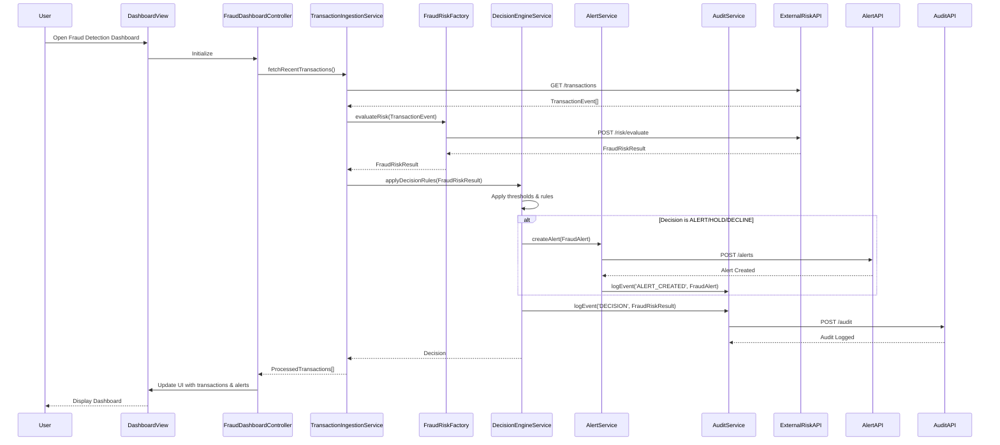

# Low-Level Design: QE-5716

## a. Architecture Mapping

- **Transaction Event Ingestion** → AngularJS Service (`TransactionIngestionService`) + REST API integration
- **Fraud Risk Engine** → AngularJS Factory (`FraudRiskFactory`) wrapping external risk API
- **Decision Engine** → AngularJS Service (`DecisionEngineService`) with business rule logic
- **Alert Service** → AngularJS Service (`AlertService`) for alert creation and notification
- **Audit & Analytics** → AngularJS Service (`AuditService`) for logging and metrics
- **UI Dashboard** → AngularJS Module (`fraudDetectionApp`), Controller (`FraudDashboardController`), View (HTML5/Bootstrap)

**Recommended Folder Structure:**
```
/app
  /modules
    /fraud-detection
      /controllers
        fraud-dashboard.controller.js
        transaction-monitor.controller.js
      /services
        transaction-ingestion.service.js
        decision-engine.service.js
        alert.service.js
        audit.service.js
      /factories
        fraud-risk.factory.js
      /directives
        transaction-card.directive.js
      /views
        dashboard.html
        transaction-monitor.html
  /shared
    /services
      http-interceptor.service.js
    /filters
      risk-level.filter.js
```

## b. Component Specifications

| Component Name | Artifact Type | Responsibility | Key Dependencies |
|---|---|---|---|
| `fraudDetectionApp` | Module | Root module for fraud detection feature | `ngRoute`, `TransactionIngestionService`, `DecisionEngineService` |
| `FraudDashboardController` | Controller | Manages dashboard view, displays transaction risk summary and alerts | `DecisionEngineService`, `AlertService`, `AuditService` |
| `TransactionMonitorController` | Controller | Real-time transaction monitoring, displays incoming events and risk scores | `TransactionIngestionService`, `FraudRiskFactory` |
| `TransactionIngestionService` | Service | Validates, deduplicates, and forwards transaction events to fraud-risk engine | `$http`, `FraudRiskFactory`, `AuditService` |
| `FraudRiskFactory` | Factory | Wraps external fraud-risk engine API, returns risk scores and decisions | `$http`, `$q` |
| `DecisionEngineService` | Service | Applies configurable thresholds and business rules to map risk scores to actions | `AlertService`, `AuditService` |
| `AlertService` | Service | Creates and sends canonical fraud-alert records to downstream alert service | `$http`, `AuditService` |
| `AuditService` | Service | Logs all decisions, scores, and events to audit API for compliance and analytics | `$http` |
| `TransactionCardDirective` | Directive | Reusable UI component to display individual transaction details with risk indicator | `riskLevelFilter` |
| `HttpInterceptorService` | Service | Handles authentication tokens, retries, and global error handling for API calls | `$q`, `$injector` |
| `riskLevelFilter` | Filter | Transforms risk score to human-readable level (Low/Medium/High/Confirmed Fraud) | None |

## c. Data Model

**TransactionEvent (JS Object):**
```javascript
{
  transactionId: String,
  cardId: String,
  amount: Number,
  currency: String,
  merchantId: String,
  merchantName: String,
  timestamp: Date,
  location: Object { lat: Number, lon: Number },
  metadata: Object
}
```

**FraudRiskResult (JS Object):**
```javascript
{
  transactionId: String,
  riskScore: Number,
  riskLevel: String, // 'LOW', 'MEDIUM', 'HIGH', 'CONFIRMED_FRAUD'
  decision: String, // 'APPROVE', 'MONITOR', 'ALERT', 'STEP_UP', 'HOLD', 'DECLINE'
  evaluatedAt: Date,
  modelVersion: String
}
```

**FraudAlert (JS Object):**
```javascript
{
  alertId: String,
  transactionId: String,
  cardId: String,
  riskScore: Number,
  riskLevel: String,
  decision: String,
  createdAt: Date,
  status: String // 'PENDING', 'ACKNOWLEDGED', 'RESOLVED'
}
```

**AuditRecord (JS Object):**
```javascript
{
  recordId: String,
  transactionId: String,
  eventType: String, // 'INGESTION', 'RISK_EVALUATION', 'DECISION', 'ALERT_CREATED'
  payload: Object,
  timestamp: Date
}
```

## d. Data Flow

User views the fraud detection dashboard. The `FraudDashboardController` initializes and calls `TransactionIngestionService` to fetch recent transaction events via REST API. Each transaction is passed to `FraudRiskFactory`, which invokes the external fraud-risk engine API and returns a `FraudRiskResult` with risk score and decision. The `DecisionEngineService` applies configurable thresholds and business rules to the risk result; if the decision is 'ALERT', 'HOLD', or 'DECLINE', it calls `AlertService` to create a canonical `FraudAlert` record and POST it to the downstream alert API. Simultaneously, `AuditService` logs the transaction event, risk evaluation, decision, and alert creation as `AuditRecord` objects to the audit API. The controller updates the view with the processed transactions, risk indicators, and alerts, rendered using Bootstrap-styled HTML5 templates and the `TransactionCardDirective`. Real-time updates are achieved via periodic polling or WebSocket integration (if available).

## e. Primary Sequence Diagram



## f. Implementation Notes

- Use AngularJS Dependency Injection to inject services and factories into controllers; ensure singleton pattern for stateful services.
- Leverage ES6 classes and arrow functions for cleaner service/factory definitions; transpile with Babel if targeting older browsers.
- Implement idempotency in `TransactionIngestionService` using a local cache (e.g., `$cacheFactory`) or session storage to deduplicate transaction IDs.
- Use `$http` interceptors (`HttpInterceptorService`) for token-based authentication, automatic retry logic, and centralized error handling.
- Integrate REST APIs with promise-based patterns (`$q`) for asynchronous risk evaluation and alert creation; chain `.then()` and `.catch()` for flow control.

## g. Error Handling

Interceptor-based global error handling via `HttpInterceptorService`; API failures trigger user notifications (toast/modal) and fallback to fail-safe decision rules in `DecisionEngineService`.

## h. Security Notes

Requires token-based authentication via existing SSO; all API calls use HTTPS with encrypted payloads; least-privilege access enforced for fraud-risk and alert APIs.