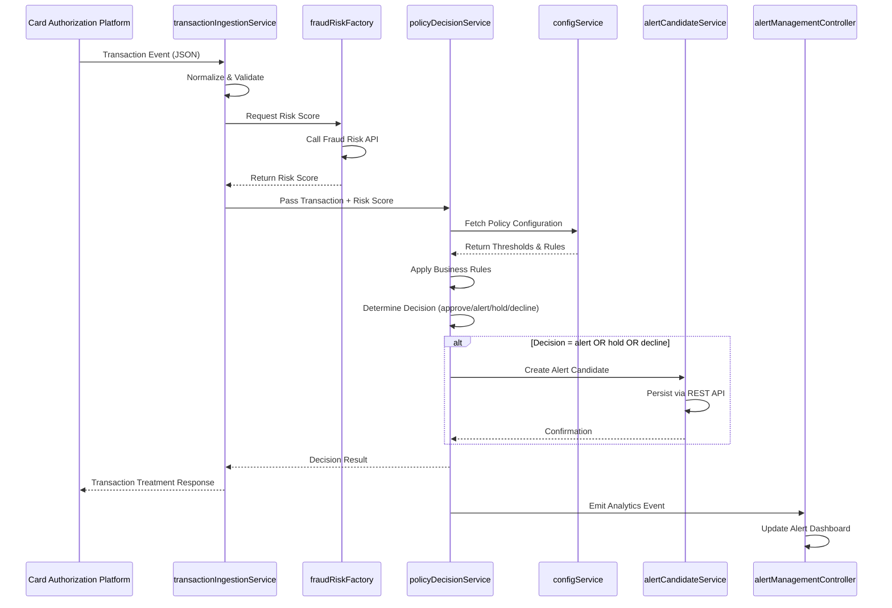

# Low-Level Design: QE-5724
## Real-Time Fraud Detection System

---

## a. Architecture Mapping

- **Transaction Event Ingestion** → AngularJS Service (`transactionIngestionService`) + REST API integration
- **Fraud Risk Engine Interface** → AngularJS Factory (`fraudRiskFactory`) for risk score retrieval
- **Policy Decision Engine** → AngularJS Service (`policyDecisionService`) for rule evaluation
- **Alert Candidate Store** → AngularJS Service (`alertCandidateService`) + REST API persistence
- **Analytics & Monitoring Dashboard** → AngularJS Controller (`analyticsController`) + Directive (`fraudMetricsWidget`)
- **Configuration Management** → AngularJS Service (`configService`) for threshold/policy management

**Recommended Folder Structure:**
```
app/
├── modules/
│   └── fraud-detection/
│       ├── controllers/
│       │   ├── analyticsController.js
│       │   └── alertManagementController.js
│       ├── services/
│       │   ├── transactionIngestionService.js
│       │   ├── policyDecisionService.js
│       │   ├── alertCandidateService.js
│       │   └── configService.js
│       ├── factories/
│       │   └── fraudRiskFactory.js
│       ├── directives/
│       │   └── fraudMetricsWidget.js
│       ├── views/
│       │   ├── analytics.html
│       │   └── alert-management.html
│       └── models/
│           ├── transaction.model.js
│           ├── alert.model.js
│           └── policy.model.js
└── common/
    └── interceptors/
        └── authInterceptor.js
```

---

## b. Component Specifications

| Component Name | Artifact Type | Responsibility | Key Dependencies |
|----------------|---------------|----------------|------------------|
| `fraudDetectionModule` | Module | Root module for fraud detection functionality | `ngRoute`, `ngResource` |
| `transactionIngestionService` | Service | Normalize, validate, and forward transaction events to fraud-risk engine | `$http`, `fraudRiskFactory` |
| `fraudRiskFactory` | Factory | Call fraud-risk engine API and return risk scores synchronously | `$resource`, `$q` |
| `policyDecisionService` | Service | Apply configurable thresholds and business rules to determine transaction treatment | `configService`, `alertCandidateService` |
| `alertCandidateService` | Service | Create and persist alert candidates based on risk decisions | `$http`, `$q` |
| `configService` | Service | Fetch and cache risk thresholds and policy configurations from backend | `$http`, `$cacheFactory` |
| `analyticsController` | Controller | Manage analytics dashboard view for fraud performance and model drift | `$scope`, `analyticsService` |
| `alertManagementController` | Controller | Display and manage alert candidates for review | `$scope`, `alertCandidateService` |
| `fraudMetricsWidget` | Directive | Reusable widget to display fraud metrics (approve/alert/hold/decline counts) | `analyticsService` |
| `authInterceptor` | Interceptor | Attach authentication tokens to all outgoing API requests | `$q`, `authService` |

---

## c. Data Model

**Transaction Model** (`transaction.model.js`):
```javascript
{
  transactionId: String,
  cardId: String,
  amount: Number,
  currency: String,
  merchantId: String,
  merchantName: String,
  merchantCategory: String,
  timestamp: Date,
  location: Object { latitude: Number, longitude: Number, country: String },
  authorizationStatus: String // 'pending', 'approved', 'declined'
}
```

**Alert Candidate Model** (`alert.model.js`):
```javascript
{
  alertId: String,
  transactionId: String,
  cardId: String,
  riskScore: Number,
  riskBand: String, // 'low', 'medium', 'high', 'confirmed-fraud'
  decision: String, // 'approve', 'alert', 'hold', 'decline'
  createdAt: Date,
  status: String, // 'pending', 'reviewed', 'resolved'
  reviewedBy: String,
  notes: String
}
```

**Policy Configuration Model** (`policy.model.js`):
```javascript
{
  policyId: String,
  riskThresholds: Object {
    low: Number,
    medium: Number,
    high: Number,
    confirmedFraud: Number
  },
  decisionRules: Array [{
    riskBand: String,
    action: String // 'approve', 'alert', 'hold', 'decline'
  }],
  failSafeBehavior: String, // 'fail-safe', 'fail-open'
  lastUpdated: Date
}
```

---

## d. Data Flow

When a transaction event arrives from the card authorization platform, the `transactionIngestionService` normalizes and validates the event data, then invokes the `fraudRiskFactory` to call the fraud-risk engine API and retrieve a risk score. The risk score and transaction context are passed to the `policyDecisionService`, which fetches the current policy configuration via `configService` and applies business rules to determine the appropriate action (approve, alert, hold, or decline). If the decision warrants an alert, the `alertCandidateService` creates and persists an alert candidate record via REST API. Throughout this flow, analytics events are emitted to the backend for monitoring. The UI reflects the decision in real-time via two-way data binding in the `alertManagementController`, and the `analyticsController` displays aggregated fraud metrics using the `fraudMetricsWidget` directive.

---

## e. Primary Sequence Diagram



---

## f. Implementation Notes

- Use AngularJS Dependency Injection to inject services and factories into controllers and other services for testability and modularity.
- Implement ES6 classes for models (`transaction.model.js`, `alert.model.js`, `policy.model.js`) with constructor validation.
- Use `$resource` or `$http` for REST API integration; wrap all API calls in promises (`$q`) for consistent async handling.
- Apply `authInterceptor` globally via `$httpProvider.interceptors` to attach authentication tokens to all outgoing requests.
- Cache policy configurations in `configService` using `$cacheFactory` to minimize redundant API calls and improve latency.

---

## g. Error Handling

Use HTTP interceptor (`authInterceptor`) for global error handling with try/catch blocks in services; display user-friendly notifications via a toast service for API failures and fallback to fail-safe/fail-open behavior as configured.

---

## h. Security Notes

Requires token-based authentication via existing SSO; all sensitive transaction and alert data encrypted in transit (HTTPS) and at rest; least privilege access enforced via role-based authorization in backend APIs.