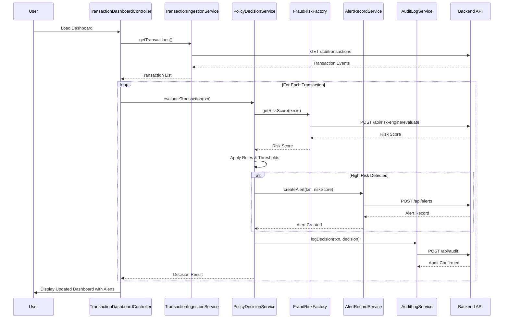

# Low-Level Design: QE-5747

## a. Architecture Mapping

- **Transaction Event Ingestion Service** → AngularJS Service (TransactionIngestionService) + REST API endpoint
- **Fraud Risk Engine Integration** → AngularJS Factory (FraudRiskFactory) calling external risk API
- **Policy Decision Engine** → AngularJS Service (PolicyDecisionService) with business rule logic
- **Alert Record Service** → AngularJS Service (AlertRecordService) + REST API for CRUD operations
- **Analytics & Audit Store** → AngularJS Service (AuditLogService) for event tracking
- **Transaction Dashboard UI** → AngularJS Module (fraudAlertModule) with Controller (TransactionDashboardController) and View

**Recommended Folder Structure:**
```
app/
├── modules/
│   └── fraud-alert/
│       ├── controllers/
│       ├── services/
│       ├── factories/
│       ├── views/
│       └── fraud-alert.module.js
├── shared/
│   ├── services/
│   └── interceptors/
└── app.js
```

## b. Component Specifications

| Name | Artifact Type | Responsibility | Key Dependencies |
|------|---------------|----------------|------------------|
| fraudAlertModule | AngularJS Module | Root module for fraud alert functionality | ngRoute, ngResource |
| TransactionDashboardController | Controller | Manages transaction list view and user interactions | TransactionIngestionService, PolicyDecisionService |
| TransactionIngestionService | Service | Fetches and manages transaction event data from API | $http, API_CONFIG |
| FraudRiskFactory | Factory | Calls fraud risk engine API and returns risk scores | $resource, RISK_API_ENDPOINT |
| PolicyDecisionService | Service | Applies business rules and thresholds to determine transaction outcomes | FraudRiskFactory, POLICY_CONFIG |
| AlertRecordService | Service | Creates and manages fraud alert records | $http, API_CONFIG |
| AuditLogService | Service | Logs decisions and events to audit store | $http, AUDIT_API_ENDPOINT |
| TransactionDetailController | Controller | Displays individual transaction details and decision history | AlertRecordService, AuditLogService |
| HttpInterceptor | Service | Handles authentication tokens and global error handling | $q, AuthService |

## c. Data Model

**TransactionEvent**
```javascript
{
  transactionId: String,
  cardIdentifier: String,
  amount: Number,
  currency: String,
  merchantName: String,
  merchantCategory: String,
  timestamp: Date,
  location: Object { latitude: Number, longitude: Number },
  status: String // 'pending', 'approved', 'declined', 'hold'
}
```

**RiskScore**
```javascript
{
  transactionId: String,
  score: Number, // 0-100
  riskLevel: String, // 'low', 'medium', 'high', 'critical'
  evaluatedAt: Date
}
```

**FraudAlert**
```javascript
{
  alertId: String,
  transactionId: String,
  riskScore: Number,
  decision: String, // 'approve', 'alert', 'hold', 'decline'
  reason: String,
  createdAt: Date,
  resolvedAt: Date,
  resolvedBy: String
}
```

**AuditRecord**
```javascript
{
  auditId: String,
  transactionId: String,
  eventType: String,
  eventData: Object,
  timestamp: Date,
  userId: String
}
```

## d. Data Flow

User views the transaction dashboard which triggers TransactionDashboardController to call TransactionIngestionService, fetching transaction events from the backend API. For each transaction, the controller invokes PolicyDecisionService, which internally calls FraudRiskFactory to retrieve the risk score from the fraud risk engine. PolicyDecisionService applies configurable thresholds and business rules to the risk score, determining the outcome (approve/alert/hold/decline). If the transaction is flagged, AlertRecordService creates a canonical fraud alert record via REST API. Simultaneously, AuditLogService logs the decision event to the audit store. The UI updates to display transaction status, risk level, and any alerts, with visual indicators (color-coded badges) reflecting the decision outcome.

## e. Primary Sequence Diagram



## f. Implementation Notes

- Use AngularJS Dependency Injection to inject services and factories into controllers; define all API endpoints in a centralized CONFIG constant.
- Implement idempotency by checking transactionId uniqueness before creating alert records; use $http interceptors for request/response transformation.
- Leverage ES6 arrow functions, const/let, and template literals in service methods for cleaner code.
- Use $resource for RESTful API interactions with fraud risk engine and alert record endpoints; configure default headers for authentication tokens.
- Apply MVC pattern strictly: Controllers handle view logic and user input, Services encapsulate business logic and API calls, Views bind to controller scope using ng-model and ng-repeat.

## g. Error Handling

HTTP interceptor captures API errors globally, logs them via AuditLogService, and displays user-friendly notifications using a toast service; try/catch blocks wrap critical service methods.

## h. Security Notes

Requires token-based authentication via existing SSO; all API calls include Authorization header with JWT token managed by AuthService interceptor.