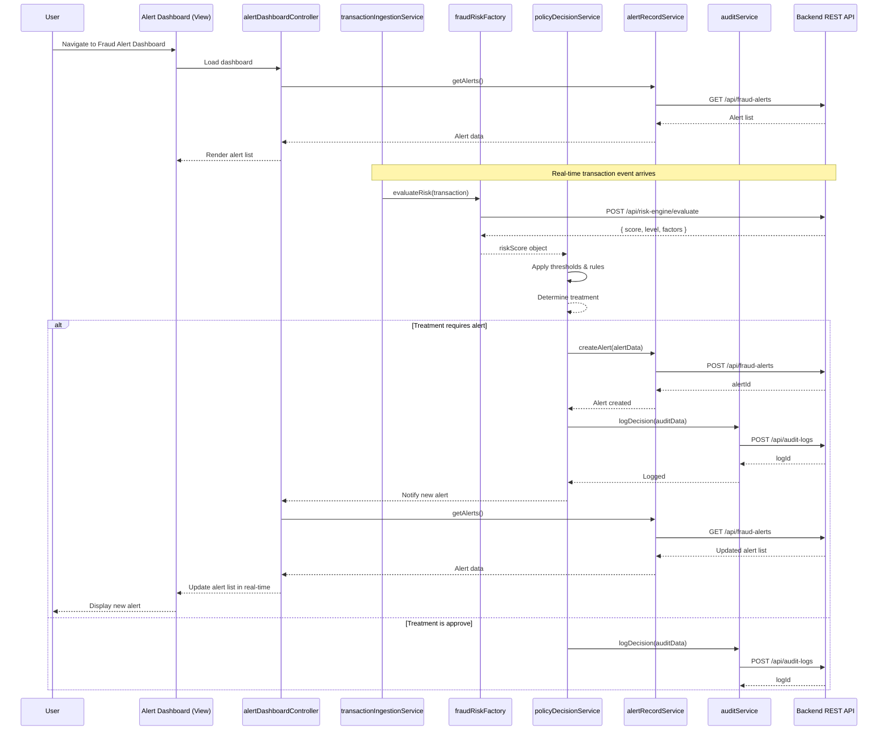

# Low-Level Design: QE-5752
## Credit Card Fraud Alert System

---

## a. Architecture Mapping

- **Transaction Event Ingestion** → AngularJS Service (`transactionIngestionService`) + REST API integration
- **Fraud Risk Engine** → AngularJS Factory (`fraudRiskFactory`) calling backend risk scoring API
- **Policy Decision Engine** → AngularJS Service (`policyDecisionService`) evaluating thresholds and rules
- **Alert Record Store** → Backend REST API; AngularJS Service (`alertRecordService`) for CRUD operations
- **Audit & Analytics** → AngularJS Service (`auditService`) logging decisions to backend
- **UI Dashboard** → AngularJS Module (`fraudAlertModule`), Controllers (`alertDashboardController`, `alertDetailController`), Views (HTML5 templates)

**Recommended Folder Structure:**
```
app/
  modules/
    fraud-alert/
      controllers/
      services/
      factories/
      directives/
      views/
      fraud-alert.module.js
  shared/
    services/
    directives/
  assets/
    css/
    js/
```

---

## b. Component Specifications

| Component Name | Artifact Type | Responsibility | Key Dependencies |
|---|---|---|---|
| `fraudAlertModule` | Module | Root module for fraud alert functionality | `ngRoute`, `ngResource`, `ui.bootstrap` |
| `alertDashboardController` | Controller | Manage alert list view, filtering, pagination | `alertRecordService`, `$scope`, `$filter` |
| `alertDetailController` | Controller | Display single alert details and decision history | `alertRecordService`, `$routeParams`, `auditService` |
| `transactionIngestionService` | Service | Fetch and normalize transaction events from backend | `$http`, `API_ENDPOINTS` |
| `fraudRiskFactory` | Factory | Call fraud risk engine API and return risk score + level | `$resource`, `API_ENDPOINTS` |
| `policyDecisionService` | Service | Apply configurable thresholds to risk score and determine treatment (approve/alert/step-up/hold/decline) | `fraudRiskFactory`, `configService` |
| `alertRecordService` | Service | CRUD operations for fraud alert records | `$http`, `API_ENDPOINTS` |
| `auditService` | Service | Log all fraud decisions and state transitions to audit backend | `$http`, `API_ENDPOINTS` |
| `configService` | Service | Retrieve and cache configurable risk thresholds and policy rules | `$http`, `API_ENDPOINTS` |
| `alertListDirective` | Directive | Reusable component to render alert list with sorting and filtering | `alertRecordService` |
| `riskBadgeDirective` | Directive | Display risk level badge (low/medium/high/confirmed fraud) with color coding | None |

---

## c. Data Model

**Transaction Object:**
```javascript
{
  transactionId: String,
  cardId: String,
  amount: Number,
  currency: String,
  merchantName: String,
  merchantCategory: String,
  timestamp: Date,
  location: Object { lat: Number, lon: Number, country: String },
  authorizationStatus: String
}
```

**RiskScore Object:**
```javascript
{
  transactionId: String,
  score: Number,  // 0-100
  level: String,  // 'low' | 'medium' | 'high' | 'confirmed_fraud'
  factors: Array<String>,
  timestamp: Date
}
```

**PolicyDecision Object:**
```javascript
{
  transactionId: String,
  riskScore: Number,
  riskLevel: String,
  treatment: String,  // 'approve' | 'alert' | 'step_up' | 'hold' | 'decline'
  reason: String,
  timestamp: Date
}
```

**FraudAlert Object:**
```javascript
{
  alertId: String,
  transactionId: String,
  cardId: String,
  riskScore: Number,
  riskLevel: String,
  treatment: String,
  status: String,  // 'open' | 'reviewed' | 'resolved' | 'false_positive'
  createdAt: Date,
  updatedAt: Date,
  reviewedBy: String,
  notes: String
}
```

**AuditLog Object:**
```javascript
{
  logId: String,
  transactionId: String,
  eventType: String,  // 'risk_evaluated' | 'policy_applied' | 'alert_created' | 'alert_updated'
  payload: Object,
  timestamp: Date,
  userId: String
}
```

---

## d. Data Flow

User navigates to the fraud alert dashboard; `alertDashboardController` invokes `alertRecordService` to fetch alert records from the backend REST API. For real-time transaction monitoring, `transactionIngestionService` polls or receives webhook events and passes each transaction to `fraudRiskFactory`, which calls the fraud risk engine API and returns a risk score and level. `policyDecisionService` retrieves configurable thresholds via `configService`, evaluates the risk score against policy rules, and determines the treatment action. If the treatment is 'alert', 'step_up', 'hold', or 'decline', `alertRecordService` creates a new fraud alert record via POST to the backend API. Simultaneously, `auditService` logs the decision event to the audit backend. The UI updates the alert list in real-time, and the user can drill into alert details via `alertDetailController`, which fetches the full alert and audit history and displays it with risk badge styling via `riskBadgeDirective`.

---

## e. Primary Sequence Diagram



---

## f. Implementation Notes

- Use AngularJS dependency injection to inject services and factories into controllers; follow naming convention `<feature><Type>` (e.g., `alertRecordService`).
- Implement `$http` interceptors for global error handling, authentication token injection, and request/response logging.
- Use `$resource` or `$http` for REST API calls; centralize endpoint configuration in a constant (`API_ENDPOINTS`).
- Apply ES6 features: arrow functions for callbacks, `const`/`let` for variable declarations, template literals for string interpolation, and Promises for async operations.
- Leverage Bootstrap CSS classes for responsive layout, buttons, badges, tables, and modals; use `ui.bootstrap` directives for advanced components (pagination, modals, tooltips).

---

## g. Error Handling

Global `$http` interceptor captures API errors, logs them via `auditService`, displays user-friendly notifications using Bootstrap alerts or modals, and handles 401/403 with redirect to login.

---

## h. Security Notes

Requires token-based authentication via existing SSO; all API calls include Authorization header; sensitive transaction and alert data encrypted in transit (HTTPS) and at rest.

---

**End of LLD Document**