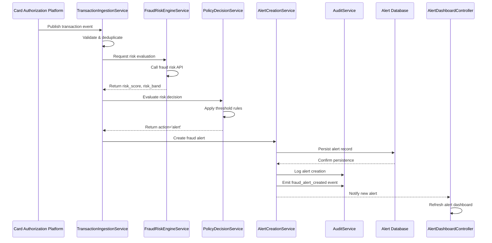

# Low-Level Design: QE-5757

## a. Architecture Mapping

- **Transaction Event Ingestion Service** → AngularJS Module: `fraudDetection.ingestion` + Service: `TransactionIngestionService`
- **Fraud Risk Engine Integration** → Service: `FraudRiskEngineService` (REST API client)
- **Policy Decision Engine** → Service: `PolicyDecisionService` + Factory: `RiskThresholdFactory`
- **Alert Creation Service** → Service: `AlertCreationService` + Controller: `AlertManagementController`
- **Alert Database** → REST API endpoints consumed by services
- **Audit & Analytics Service** → Service: `AuditService` + Factory: `AnalyticsEventFactory`
- **UI Components** → Module: `fraudDetection.alerts` + Controller: `AlertDashboardController` + Directive: `alertCard`

**Recommended Folder Structure:**
```
app/
├── modules/
│   └── fraud-detection/
│       ├── controllers/
│       ├── services/
│       ├── factories/
│       ├── directives/
│       └── views/
├── shared/
│   ├── services/
│   └── interceptors/
└── assets/
```

## b. Component Specifications

| Name | Artifact Type | Responsibility | Key Dependencies |
|------|--------------|----------------|------------------|
| TransactionIngestionService | Service | Validate, deduplicate, and forward transaction events to fraud risk engine | $http, FraudRiskEngineService, AuditService |
| FraudRiskEngineService | Service | Call external fraud risk API and return risk score/band | $http, $q, API_CONFIG |
| PolicyDecisionService | Service | Apply configurable thresholds to risk scores and determine action (approve/monitor/alert/decline) | RiskThresholdFactory, AuditService |
| RiskThresholdFactory | Factory | Provide configurable risk threshold configuration | API_CONFIG |
| AlertCreationService | Service | Generate canonical fraud alert records and persist to database | $http, AuditService, AnalyticsEventFactory |
| AlertManagementController | Controller | Manage alert dashboard UI state and user interactions | AlertCreationService, $scope |
| AlertDashboardController | Controller | Display alert list, filters, and metrics | AlertCreationService, $scope, $filter |
| alertCard | Directive | Render individual alert card with severity, status, and actions | AlertCreationService |
| AuditService | Service | Log all decisions, state transitions, and system events | $http, $log |
| AnalyticsEventFactory | Factory | Create standardized analytics event payloads | - |
| AuthInterceptor | Interceptor | Attach authentication tokens to outbound API requests | $q, $injector, AuthService |

## c. Data Model

**Transaction Event:**
```javascript
{
  transaction_id: String,
  account_id: String,
  card_id: String,
  merchant: String,
  amount: Number,
  currency: String,
  timestamp: Date,
  channel: String
}
```

**Risk Assessment:**
```javascript
{
  transaction_id: String,
  risk_score: Number,
  risk_band: String, // 'low' | 'medium' | 'high'
  evaluated_at: Date
}
```

**Policy Decision:**
```javascript
{
  transaction_id: String,
  action: String, // 'approve' | 'monitor' | 'alert' | 'decline'
  threshold_applied: Number,
  decided_at: Date
}
```

**Fraud Alert:**
```javascript
{
  alert_id: String,
  transaction_id: String,
  customer_id: String,
  severity: String, // 'low' | 'medium' | 'high' | 'critical'
  status: String, // 'created' | 'resolved' | 'expired'
  created_at: Date,
  expires_at: Date,
  resolved_at: Date
}
```

## d. Data Flow

User (system) publishes a transaction event from the card authorization platform. The TransactionIngestionService validates and deduplicates the event, then calls FraudRiskEngineService to obtain a risk score and band. PolicyDecisionService evaluates the risk score against configured thresholds from RiskThresholdFactory and determines the appropriate action. If the action is 'alert', AlertCreationService generates a canonical fraud alert record and persists it via REST API, while AuditService logs the decision and AnalyticsEventFactory emits a fraud_alert_created event. The AlertDashboardController refreshes the UI to display the new alert via the alertCard directive, and all state transitions are captured for compliance and monitoring.

## e. Primary Sequence Diagram



## f. Implementation Notes

- Use AngularJS dependency injection for all services, factories, and controllers to ensure testability and modularity.
- Implement ES6 classes for services and use arrow functions for concise promise chaining in API calls.
- Use $http interceptors (AuthInterceptor) for centralized authentication token attachment and error handling.
- Apply MVC pattern: Controllers manage view state, Services handle business logic and API integration, Factories provide configuration.
- Ensure idempotency by checking transaction_id uniqueness in TransactionIngestionService before forwarding to risk engine.

## g. Error Handling

HTTP interceptor-based error handling with try/catch blocks in services, user notifications via toastr/alert service, and failsafe logging to AuditService for all exceptions.

## h. Security Notes

Requires token-based authentication via existing SSO, with AuthInterceptor attaching bearer tokens to all API requests; input validation enforced in TransactionIngestionService.