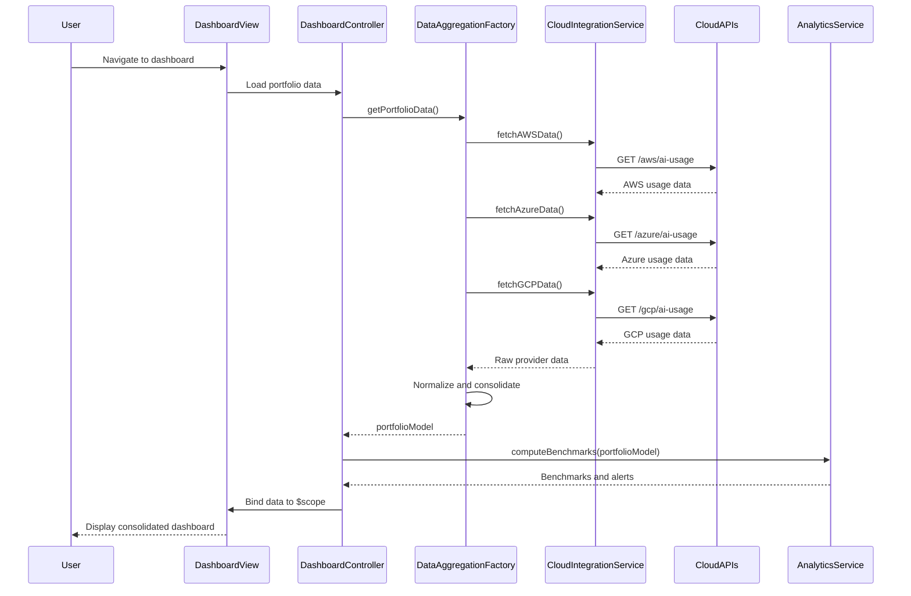

# Low-Level Design: AI Portfolio Management Dashboard

## Epic ID: QE-5773

---

## a. Architecture Mapping

- **API Integration Layer** → AngularJS Service (`cloudIntegrationService`) for AWS/Azure/GCP API calls
- **Data Aggregation Service** → AngularJS Factory (`dataAggregationFactory`) for normalizing and consolidating provider data
- **Analytics Engine** → AngularJS Service (`analyticsService`) for computing benchmarks, trends, and anomalies
- **Dashboard UI** → AngularJS Module (`dashboardModule`) with Controllers (`dashboardController`, `companyDetailController`) and Views (HTML5 templates)
- **Report Generator** → AngularJS Service (`reportService`) for PDF/Excel export
- **Authentication** → AngularJS Service (`authService`) integrating with SSO provider
- **Role-Based Access Control** → AngularJS Service (`rbacService`) for permission checks

**Recommended Folder Structure:**
```
/app
  /modules
    /dashboard
      dashboard.module.js
      dashboard.controller.js
      dashboard.view.html
      company-detail.controller.js
      company-detail.view.html
  /services
    cloudIntegration.service.js
    dataAggregation.factory.js
    analytics.service.js
    report.service.js
    auth.service.js
    rbac.service.js
  /directives
    data-freshness-indicator.directive.js
    alert-widget.directive.js
  /models
    portfolio.model.js
    company.model.js
  /assets
    /css
    /images
```

---

## b. Component Specifications

| Component Name | Artifact Type | Responsibility | Key Dependencies |
|---|---|---|---|
| `dashboardModule` | Module | Root module for dashboard feature, declares all controllers, services, directives | `ngRoute`, `ui.bootstrap`, `authService`, `rbacService` |
| `dashboardController` | Controller | Manages main dashboard view, loads portfolio-wide AI usage data, handles filtering and sorting | `dataAggregationFactory`, `analyticsService`, `rbacService`, `$scope` |
| `companyDetailController` | Controller | Manages company drill-down view, displays department/project-level AI usage | `dataAggregationFactory`, `$routeParams`, `$scope` |
| `cloudIntegrationService` | Service | Fetches AI usage/spend data from AWS, Azure, GCP APIs via REST calls | `$http`, `authService` |
| `dataAggregationFactory` | Factory | Normalizes and consolidates data from multiple cloud providers into unified format | `cloudIntegrationService`, `portfolioModel` |
| `analyticsService` | Service | Computes benchmarks, trends, anomalies, and cost-saving recommendations | `dataAggregationFactory`, `companyModel` |
| `reportService` | Service | Generates and exports PDF/Excel reports from dashboard data | `$http`, `dataAggregationFactory` |
| `authService` | Service | Handles SSO authentication, token management, and session validation | `$http`, `$window` |
| `rbacService` | Service | Enforces role-based access control, checks user permissions for companies and features | `authService`, `$http` |
| `dataFreshnessIndicatorDirective` | Directive | Displays warning icon and tooltip when company data is older than 24 hours | `$scope`, `$filter` |
| `alertWidgetDirective` | Directive | Displays budget threshold alerts and data freshness notifications | `$scope`, `analyticsService` |
| `portfolioModel` | Model | Represents portfolio-wide AI usage and spend data structure | None |
| `companyModel` | Model | Represents individual company AI usage, spend, and metadata | None |

---

## c. Data Model

**portfolioModel (JavaScript Object):**
```javascript
{
  portfolioId: String,
  companies: Array<companyModel>,
  totalSpend: Number,
  lastUpdated: Date,
  currency: String // default: 'USD'
}
```

**companyModel (JavaScript Object):**
```javascript
{
  companyId: String,
  companyName: String,
  aiProviders: Array<String>, // ['AWS', 'Azure', 'GCP']
  totalSpend: Number,
  budgetThreshold: Number,
  lastDataSync: Date,
  departments: Array<{
    departmentName: String,
    spend: Number,
    services: Array<String>
  }>,
  isDataFresh: Boolean, // true if lastDataSync within 24 hours
  alertStatus: String // 'none', 'budget_exceeded', 'data_stale'
}
```

**userModel (JavaScript Object):**
```javascript
{
  userId: String,
  userName: String,
  role: String, // 'Enterprise Admin', 'Operating Partner', 'Deal Partner', 'General Partner'
  assignedCompanies: Array<String>, // companyIds
  permissions: Array<String> // ['view_dashboard', 'export_reports', 'manage_users']
}
```

---

## d. Data Flow

User authenticates via SSO (`authService`) → Dashboard view loads → `dashboardController` calls `dataAggregationFactory.getPortfolioData()` → Factory invokes `cloudIntegrationService` to fetch data from AWS/Azure/GCP REST APIs → Service returns raw data → Factory normalizes and consolidates into `portfolioModel` → `analyticsService` computes benchmarks and checks budget thresholds → Controller binds aggregated data to `$scope` → View renders real-time dashboard with company cards, spend charts, and alerts → User clicks company card → `companyDetailController` loads department-level data via `dataAggregationFactory.getCompanyDetail(companyId)` → Drill-down view displays detailed usage → User exports report → `reportService` calls backend API to generate PDF/Excel → File downloads to user's browser.

---

## e. Primary Sequence Diagram



---

## f. Implementation Notes

- Use AngularJS Dependency Injection to inject services into controllers and factories for testability and modularity
- Implement ES6 classes for models (`portfolioModel`, `companyModel`) with getter/setter methods for data validation
- Use `$http` interceptor to attach SSO tokens to all outbound API requests and handle 401/403 responses globally
- Leverage Bootstrap grid system and responsive utilities for mobile-friendly dashboard layout
- Cache aggregated data in `dataAggregationFactory` using `$cacheFactory` to reduce redundant API calls and improve load time

---

## g. Error Handling

HTTP interceptor-based error handling with try/catch in services; user-facing notifications via Bootstrap alerts for API failures, stale data, and budget threshold breaches.

---

## h. Security Notes

Requires token-based authentication via existing SSO; all API calls include bearer token; RBAC enforced client-side via `rbacService` and server-side via API gateway.