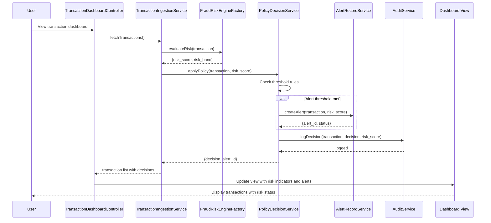

# Low-Level Design: QE-5776 - Fraud Alert Risk Evaluation & Decisioning Layer

## a. Architecture Mapping

- **Transaction Ingestion Service** → AngularJS Service (TransactionIngestionService) + REST API endpoint
- **Fraud Risk Engine** → AngularJS Factory (FraudRiskEngineFactory) wrapping external risk scoring API
- **Policy Decision Engine** → AngularJS Service (PolicyDecisionService) for threshold evaluation logic
- **Alert Record Service** → AngularJS Service (AlertRecordService) + REST API for alert CRUD operations
- **Audit & Analytics** → AngularJS Service (AuditService) for logging decision outcomes
- **Transaction Dashboard UI** → AngularJS Module (fraudAlertModule) with Controller (TransactionDashboardController) and View (transaction-dashboard.html)

**Recommended Folder Structure:**
```
/app
  /modules
    /fraud-alert
      /controllers
      /services
      /factories
      /directives
      /views
      /models
```

## b. Component Specifications

| Component Name | Artifact Type | Responsibility | Key Dependencies |
|----------------|---------------|----------------|------------------|
| fraudAlertModule | AngularJS Module | Root module for fraud alert functionality | ngRoute, ngResource |
| TransactionDashboardController | Controller | Manages transaction list view and triggers risk evaluation | TransactionIngestionService, PolicyDecisionService |
| TransactionIngestionService | Service | Validates, deduplicates, and forwards transactions to risk engine | $http, FraudRiskEngineFactory |
| FraudRiskEngineFactory | Factory | Wraps external fraud risk scoring API calls | $http, $q |
| PolicyDecisionService | Service | Applies configurable thresholds to risk scores and determines action | AlertRecordService, AuditService |
| AlertRecordService | Service | Creates and manages canonical fraud alert records | $http, $q |
| AuditService | Service | Logs decision outcomes, risk scores, and alert lifecycle events | $http |
| TransactionModel | Model/Factory | Represents transaction data structure | None |
| AlertModel | Model/Factory | Represents alert record structure | None |

## c. Data Model

**TransactionModel:**
```javascript
{
  transaction_id: String,
  account_id: String,
  card_id: String,
  merchant: String,
  amount: Number,
  currency: String,
  timestamp: Date,
  channel: String,
  risk_score: Number,
  risk_band: String,
  decision: String // 'approve', 'alert', 'hold', 'decline'
}
```

**AlertModel:**
```javascript
{
  alert_id: String,
  transaction_id: String,
  account_id: String,
  card_id: String,
  risk_score: Number,
  risk_band: String,
  action: String,
  created_at: Date,
  status: String // 'open', 'resolved', 'escalated'
}
```

**PolicyThresholdModel:**
```javascript
{
  threshold_id: String,
  risk_band: String,
  min_score: Number,
  max_score: Number,
  action: String
}
```

## d. Data Flow

User views the transaction dashboard; TransactionDashboardController loads transaction events via TransactionIngestionService, which validates and deduplicates incoming data. The service calls FraudRiskEngineFactory to obtain risk scores and risk bands for each transaction. PolicyDecisionService receives the risk output, applies configurable threshold rules from PolicyThresholdModel, and determines the appropriate action (approve/alert/hold/decline). If the alert threshold is met, AlertRecordService creates a canonical alert record with a unique alert_id. AuditService logs all decision outcomes, risk scores, and alert lifecycle transitions. The controller updates the view with transaction statuses, risk indicators, and alert notifications, providing real-time feedback to the user.

## e. Primary Sequence Diagram



## f. Implementation Notes

- Use AngularJS dependency injection to inject services and factories into controllers for testability and modularity
- Implement idempotency in TransactionIngestionService using transaction_id-based deduplication (cache or local storage)
- Use $http interceptors for centralized error handling, retry logic, and authentication token injection
- Leverage ES6 Promises ($q service) for asynchronous API calls to risk engine and alert services
- Apply MVC pattern strictly: Controllers manage UI logic, Services handle business logic and API integration, Models define data structures

## g. Error Handling

Interceptor-based global error handling with $http interceptors; try/catch blocks in service methods with user-friendly notifications via toastr or custom alert directive.

## h. Security Notes

Requires token-based authentication via existing SSO; all API calls include authorization headers; sensitive transaction data encrypted in transit (HTTPS) and at rest.