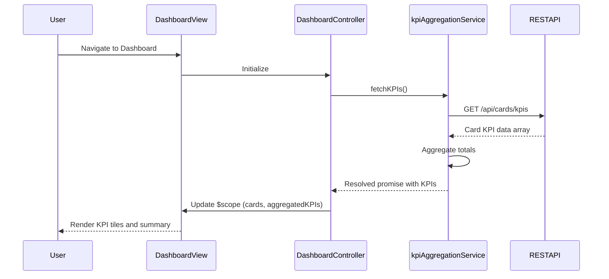

# Low-Level Design: QE-6083 - Multi-Card Dashboard KPIs

## a. Architecture Mapping

- **Responsive Dashboard UI** → AngularJS Module (`dashboardModule`) + Controller (`DashboardController`) + HTML5/CSS3/Bootstrap views
- **KPI Aggregation Service** → AngularJS Service (`kpiAggregationService`) using $http for REST API calls
- **Card & Transaction Data Store** → Backend REST API endpoints consumed by services
- **UI Layout & KPI Config** → AngularJS Constants/Config provider for layout and KPI metadata

**Recommended Folder Structure:**
```
app/
├── modules/
│   └── dashboard/
│       ├── controllers/
│       │   └── dashboardController.js
│       ├── services/
│       │   └── kpiAggregationService.js
│       ├── views/
│       │   └── dashboard.html
│       └── dashboardModule.js
├── shared/
│   ├── constants/
│   │   └── kpiConfig.js
│   └── directives/
│       └── kpiTile.js
└── assets/
    └── css/
        └── dashboard.css
```

## b. Component Specifications

| Component Name | Artifact Type | Responsibility | Key Dependencies |
|----------------|---------------|----------------|------------------|
| dashboardModule | Module | Register dashboard components and configure routing | angular, ngRoute |
| DashboardController | Controller | Orchestrate KPI data loading, handle user interactions, bind data to view | $scope, kpiAggregationService, $timeout |
| kpiAggregationService | Service | Fetch and aggregate card/transaction data from REST APIs, compute KPIs | $http, $q |
| kpiTile | Directive | Reusable UI component for rendering individual KPI summary tiles | None |
| kpiConfig | Constant | Store KPI metadata (labels, thresholds, formatting rules) | None |
| dashboard.html | View | Responsive layout with Bootstrap grid displaying KPI tiles for multiple cards | Bootstrap CSS |

## c. Data Model

**CardKPI (JavaScript Object):**
```javascript
{
  cardId: String,
  cardName: String,
  monthlySpend: Number,
  totalCreditLimit: Number,
  availableCredit: Number,
  outstandingAmount: Number
}
```

**DashboardViewModel (Controller Scope):**
```javascript
{
  cards: Array<CardKPI>,
  aggregatedKPIs: {
    totalMonthlySpend: Number,
    totalCreditLimit: Number,
    totalAvailableCredit: Number,
    totalOutstanding: Number
  },
  isLoading: Boolean,
  errorMessage: String
}
```

## d. Data Flow

User navigates to the dashboard → `dashboard.html` loads and `DashboardController` initializes → Controller calls `kpiAggregationService.fetchKPIs()` → Service sends GET request to `/api/cards/kpis` REST endpoint → API returns array of card KPI data → Service aggregates totals and returns promise → Controller updates `$scope.cards` and `$scope.aggregatedKPIs` → View renders KPI tiles using `kpiTile` directive with two-way data binding → User sees responsive dashboard with summary tiles and visual indicators.

## e. Primary Sequence Diagram



## f. Implementation Notes

- Use AngularJS 1.x module pattern with dependency injection for all controllers and services
- Leverage Bootstrap responsive grid (col-xs/sm/md/lg) to ensure dashboard renders correctly on mobile, tablet, and desktop
- Implement `kpiAggregationService` using $http with promise-based API calls; cache results for 2-second refresh window using $timeout
- Use AngularJS directives for reusable KPI tile components with isolated scope for modularity
- Apply ES6 arrow functions and const/let in service and controller logic for cleaner code

## g. Error Handling

HTTP interceptor captures API errors; controller displays user-friendly error message in dashboard view using $scope.errorMessage.

## h. Security Notes

Standard input validation and secure API calls assumed; user authentication and session management handled by existing platform layer.