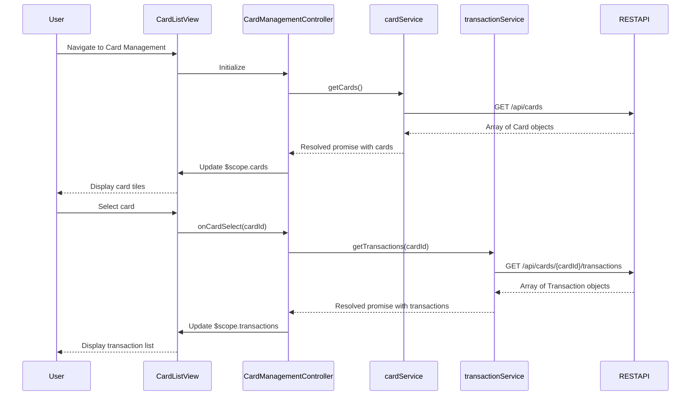

# Low-Level Design: QE-6084 - Multiple Card and Transaction Management

## a. Architecture Mapping

- **Card & Transaction UI** → AngularJS Module (`cardManagementModule`) + Controller (`CardManagementController`) + HTML5/CSS3/Bootstrap views
- **Card Management Service** → AngularJS Service (`cardService`) for card-related REST API calls
- **Transaction Service** → AngularJS Service (`transactionService`) for transaction-related REST API calls
- **Card & Transaction Repository** → Backend REST API endpoints providing card and transaction data

**Recommended Folder Structure:**
```
app/
├── modules/
│   └── cardManagement/
│       ├── controllers/
│       │   └── cardManagementController.js
│       ├── services/
│       │   ├── cardService.js
│       │   └── transactionService.js
│       ├── views/
│       │   ├── cardList.html
│       │   └── transactionList.html
│       └── cardManagementModule.js
├── shared/
│   ├── filters/
│   │   └── currencyFormat.js
│   └── directives/
│       └── cardTile.js
└── assets/
    └── css/
        └── cardManagement.css
```

## b. Component Specifications

| Component Name | Artifact Type | Responsibility | Key Dependencies |
|----------------|---------------|----------------|------------------|
| cardManagementModule | Module | Register card and transaction management components | angular, ngRoute |
| CardManagementController | Controller | Manage card selection, load card details and transactions, handle UI state | $scope, cardService, transactionService, $routeParams |
| cardService | Service | Fetch card details (limit, available credit, outstanding) from REST API | $http, $q |
| transactionService | Service | Fetch transaction list for selected card with filtering by date range | $http, $q |
| cardTile | Directive | Reusable card display component showing card-level KPIs | None |
| currencyFormat | Filter | Format currency values consistently across views | None |
| cardList.html | View | Display multiple cards with summary info; allow card selection | Bootstrap CSS |
| transactionList.html | View | Display transaction table with date, amount, category for selected card | Bootstrap CSS |

## c. Data Model

**Card (JavaScript Object):**
```javascript
{
  cardId: String,
  cardNumber: String,
  cardName: String,
  creditLimit: Number,
  availableCredit: Number,
  outstandingBalance: Number,
  cardType: String
}
```

**Transaction (JavaScript Object):**
```javascript
{
  transactionId: String,
  cardId: String,
  date: Date,
  amount: Number,
  category: String,
  description: String,
  merchantName: String
}
```

**CardManagementViewModel (Controller Scope):**
```javascript
{
  cards: Array<Card>,
  selectedCard: Card,
  transactions: Array<Transaction>,
  isLoadingCards: Boolean,
  isLoadingTransactions: Boolean,
  errorMessage: String
}
```

## d. Data Flow

User navigates to card management view → `cardList.html` loads and `CardManagementController` initializes → Controller calls `cardService.getCards()` → Service sends GET request to `/api/cards` → API returns array of user's cards → Controller updates `$scope.cards` → View renders card tiles → User selects a card → Controller calls `transactionService.getTransactions(cardId)` → Service sends GET request to `/api/cards/{cardId}/transactions` → API returns transaction array → Controller updates `$scope.transactions` → `transactionList.html` renders transaction table with date, amount, and category.

## e. Primary Sequence Diagram



## f. Implementation Notes

- Use AngularJS dependency injection to inject cardService and transactionService into CardManagementController
- Implement services using $http with promise-based pattern; handle 3-second timeout constraint with loading indicators
- Use AngularJS filters (currencyFormat) for consistent currency display across card and transaction views
- Apply Bootstrap table and grid components for responsive card and transaction list rendering
- Implement card selection using ng-click and $scope methods to trigger transaction loading

## g. Error Handling

HTTP interceptor-based error handling with try/catch in service methods; user notification via $scope.errorMessage displayed in view.

## h. Security Notes

Data visibility restricted to authenticated user context; platform layer enforces access control and identity verification.