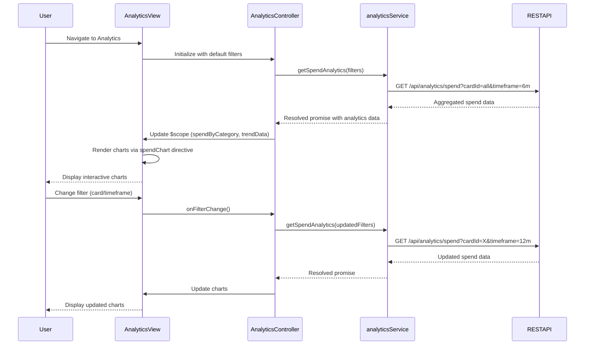

# Low-Level Design: QE-6085 - Spend Analytics and Insights

## a. Architecture Mapping

- **Analytics & Insights UI** → AngularJS Module (`analyticsModule`) + Controller (`AnalyticsController`) + HTML5/CSS3/Bootstrap views with charting library integration
- **Analytics Aggregation Service** → AngularJS Service (`analyticsService`) for fetching aggregated spend data via REST API
- **Spend Aggregation Store** → Backend REST API endpoints providing pre-aggregated spend data by card, category, and timeframe
- **Category & Date Config** → AngularJS Constant (`categoryConfig`, `dateConfig`) for shared taxonomy and date range definitions

**Recommended Folder Structure:**
```
app/
├── modules/
│   └── analytics/
│       ├── controllers/
│       │   └── analyticsController.js
│       ├── services/
│       │   └── analyticsService.js
│       ├── views/
│       │   └── analytics.html
│       ├── directives/
│       │   └── spendChart.js
│       └── analyticsModule.js
├── shared/
│   ├── constants/
│   │   ├── categoryConfig.js
│   │   └── dateConfig.js
│   └── filters/
│       └── dateRange.js
└── assets/
    ├── css/
    │   └── analytics.css
    └── js/
        └── chart.js (or D3/Highcharts)
```

## b. Component Specifications

| Component Name | Artifact Type | Responsibility | Key Dependencies |
|----------------|---------------|----------------|------------------|
| analyticsModule | Module | Register analytics components and configure charting library | angular, ngRoute, chart.js |
| AnalyticsController | Controller | Manage filter state (card, timeframe), load spend data, update chart models | $scope, analyticsService, categoryConfig, dateConfig |
| analyticsService | Service | Fetch aggregated spend data from REST API with filter parameters | $http, $q |
| spendChart | Directive | Render interactive spend charts (line, bar, pie) using charting library | chart.js or D3 |
| categoryConfig | Constant | Define spend categories (Food & Dining, Fuel, Shopping, Travel, Entertainment, Utilities, Healthcare, Education, Miscellaneous) | None |
| dateConfig | Constant | Define available date ranges (1 month, 3 months, 6 months, 12 months, 24 months) | None |
| dateRange | Filter | Format date ranges for display in filter controls | None |
| analytics.html | View | Responsive layout with filter controls and chart containers | Bootstrap CSS, chart.js |

## c. Data Model

**SpendData (JavaScript Object):**
```javascript
{
  cardId: String,
  cardName: String,
  period: String,
  categorySpend: {
    "Food & Dining": Number,
    "Fuel": Number,
    "Shopping": Number,
    "Travel": Number,
    "Entertainment": Number,
    "Utilities": Number,
    "Healthcare": Number,
    "Education": Number,
    "Miscellaneous": Number
  },
  totalSpend: Number
}
```

**TrendData (JavaScript Object):**
```javascript
{
  month: String,
  totalSpend: Number,
  cardWiseSpend: Array<{cardId: String, spend: Number}>
}
```

**AnalyticsViewModel (Controller Scope):**
```javascript
{
  selectedCard: String,
  selectedTimeframe: String,
  spendByCategory: Object,
  trendData: Array<TrendData>,
  chartData: Object,
  isLoading: Boolean,
  errorMessage: String
}
```

## d. Data Flow

User navigates to analytics view → `analytics.html` loads and `AnalyticsController` initializes with default filters (all cards, last 6 months) → Controller calls `analyticsService.getSpendAnalytics(filters)` → Service sends GET request to `/api/analytics/spend?cardId=all&timeframe=6m` → API returns aggregated spend data by category and monthly trends → Controller updates `$scope.spendByCategory` and `$scope.trendData` → `spendChart` directive renders interactive charts → User changes filter (card or timeframe) → Controller re-calls service with updated filters → Charts update within 2 seconds.

## e. Primary Sequence Diagram



## f. Implementation Notes

- Use AngularJS dependency injection for analyticsService and config constants in AnalyticsController
- Integrate Chart.js or D3.js via custom directive (spendChart) with isolated scope for reusability and encapsulation
- Implement filter controls using ng-model and ng-change to trigger controller methods that reload analytics data
- Use $http with caching strategy to minimize redundant API calls when users toggle between previously loaded filters
- Apply Bootstrap responsive utilities to ensure charts render correctly across mobile, tablet, and desktop devices

## g. Error Handling

Interceptor-based error handling for API failures; controller displays error message and fallback empty state in analytics view.

## h. Security Notes

Standard input validation and secure API calls assumed; user-specific data filtering enforced by backend API layer.