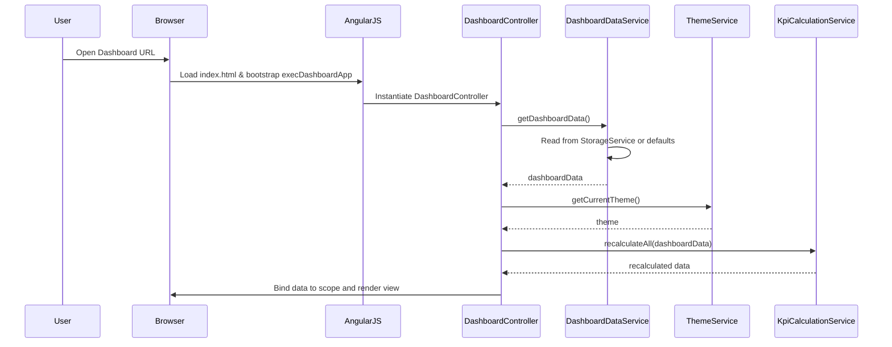
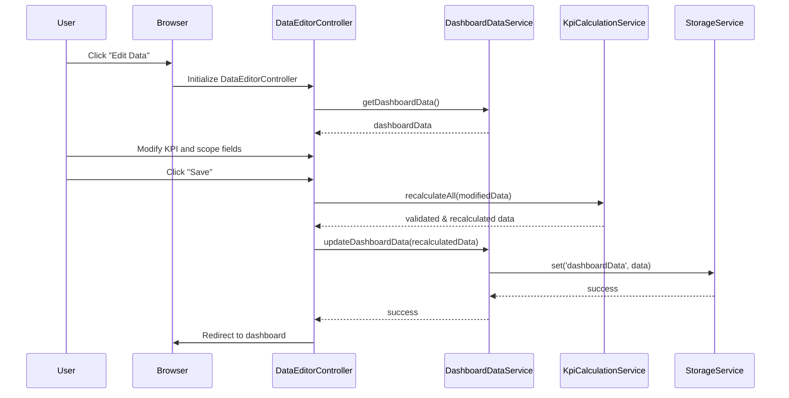
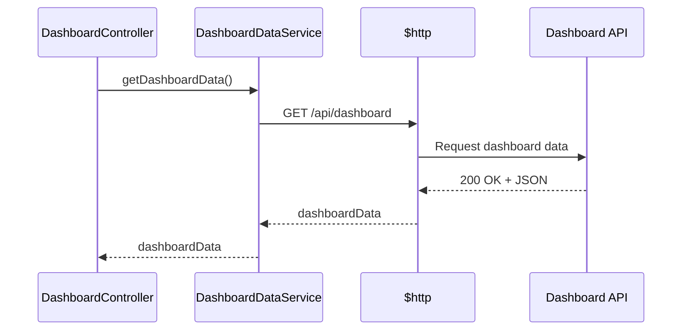
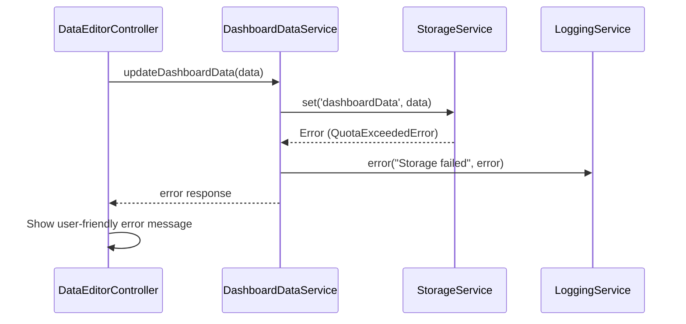

# Low-Level Design (LLD) – Executive Testing Summary Dashboard (Epic QE-EXEC)

## 1. Application Architecture

### 1.1 Overall Architecture

The Executive Testing Summary Dashboard is a single-page, client-side web application built using:
- AngularJS 1.x (MVC pattern)
- JavaScript ES6
- HTML5
- CSS3 & Bootstrap
- REST APIs (future extensibility; initial version uses browser storage only)

The application follows a modular AngularJS structure with clear separation of concerns:
- **Views (HTML templates)**: Present KPI tiles, progress bars, scope tiles, data and theme editors.
- **Controllers**: Orchestrate view logic, bind data models to views, handle user actions.
- **Services/Factories**: Encapsulate data management (testing data, theme data), persistence, calculations.
- **Directives**: Reusable UI components (progress bars, KPI tiles, scope tiles, color pickers).
- **Filters**: Data formatting (percentages, status labels, date formatting).
- **Configuration**: Angular module bootstrapping, routing (if needed), environment configuration, logging configuration.

There is no dedicated backend in the initial release. Data is persisted using `localStorage` (or `sessionStorage` fallback). The architecture is designed to be API-ready so future integration with ADO/Jira or backend services is straightforward.

### 1.2 AngularJS Module Structure

- **Module Name**: `execDashboardApp`
- **Primary AngularJS artifacts**:
  - Module: `execDashboardApp`
  - Config: `app.config.js`
  - Run Block: `app.run.js`
  - Controllers:
    - `DashboardController`
    - `DataEditorController`
    - `ThemeEditorController`
    - `SettingsController` (optional, for advanced settings/logging)
  - Services/Factories:
    - `DashboardDataService`
    - `ThemeService`
    - `StorageService`
    - `KpiCalculationService`
    - `LoggingService`
  - Directives:
    - `kpiTile`
    - `scopeTile`
    - `progressBar`
    - `statusBadge`
    - `themePreview`
  - Filters:
    - `percentage`
    - `statusLabel`
    - `etaFormatter`

### 1.3 Recommended Project Folder Structure

```text
/ (root)
|-- index.html
|-- app/
|   |-- app.module.js
|   |-- app.config.js
|   |-- app.run.js
|   |-- controllers/
|   |   |-- dashboard.controller.js
|   |   |-- data-editor.controller.js
|   |   |-- theme-editor.controller.js
|   |   |-- settings.controller.js
|   |-- services/
|   |   |-- dashboard-data.service.js
|   |   |-- theme.service.js
|   |   |-- storage.service.js
|   |   |-- kpi-calculation.service.js
|   |   |-- logging.service.js
|   |-- directives/
|   |   |-- kpi-tile.directive.js
|   |   |-- scope-tile.directive.js
|   |   |-- progress-bar.directive.js
|   |   |-- status-badge.directive.js
|   |   |-- theme-preview.directive.js
|   |-- filters/
|   |   |-- percentage.filter.js
|   |   |-- status-label.filter.js
|   |   |-- eta-formatter.filter.js
|   |-- config/
|   |   |-- environment.config.js
|   |   |-- logging.config.js
|-- assets/
|   |-- css/
|   |   |-- styles.css
|   |   |-- theme.css
|   |-- js/
|   |   |-- vendor/ (AngularJS, Bootstrap, etc.)
|   |-- img/
|-- templates/
|   |-- dashboard.html
|   |-- data-editor.html
|   |-- theme-editor.html
|   |-- partials/
|       |-- kpi-tile.html
|       |-- scope-tile.html
|       |-- progress-bar.html
```

## 2. Component Specifications

### 2.1 Module: `execDashboardApp`
- **Type**: AngularJS Module
- **File**: `app/app.module.js`
- **Responsibility**: Root module defining app dependencies and initializing the AngularJS application.
- **Public API**: N/A (module definition only).
- **Dependencies**:
  - `ngRoute` or `ui.router` (if routing used)
  - `ngAnimate` (for visual transitions)
  - `ngSanitize` (for HTML-safe text in cards)
  - `ui.bootstrap` (optional, for Bootstrap components)

**Sample Implementation Skeleton**:
```js
angular.module('execDashboardApp', ['ngRoute', 'ngAnimate', 'ngSanitize']);
```

### 2.2 Controller: `DashboardController`
- **Type**: Controller
- **File**: `app/controllers/dashboard.controller.js`
- **Responsibility**:
  - Orchestrate display of the executive dashboard.
  - Bind KPI summaries, testing scope statuses, workflow progress, APB flow progress.
  - Handle user interactions from the main dashboard (e.g., navigate to editors, apply theme).
- **Public Methods**:
  - `vm.init()` – Initialize dashboard data and theme.
  - `vm.refresh()` – Reload data and themes from services.
  - `vm.openDataEditor()` – Route to data editor view.
  - `vm.openThemeEditor()` – Route to theme editor view.
  - `vm.applyTheme(themeKey)` – Apply a selected theme.
  - `vm.resetTheme()` – Reset to default theme.
- **Inputs**:
  - Data from `DashboardDataService` (KPI data, scope data, workflow/APB data).
  - Theme information from `ThemeService`.
- **Outputs**:
  - View model bound to dashboard template (`dashboard.html`).
  - Events to child directives (e.g., updated theme, updated data).
- **Injected Dependencies**:
  - `DashboardDataService`
  - `ThemeService`
  - `KpiCalculationService`
  - `LoggingService`
  - `$scope`, `$location` (or `$state` if using `ui.router`)

### 2.3 Controller: `DataEditorController`
- **Type**: Controller
- **File**: `app/controllers/data-editor.controller.js`
- **Responsibility**:
  - Provide editable form interface for updating testing program data.
  - Validate inputs (counts, ETAs, statuses).
  - Save changes via `DashboardDataService`.
- **Public Methods**:
  - `vm.loadData()` – Load current dashboard data into form models.
  - `vm.addScope(scopeType)` – Add new testing scope entry.
  - `vm.removeScope(scopeId)` – Remove existing scope entry.
  - `vm.save()` – Validate and persist changes.
  - `vm.cancel()` – Revert unsaved changes/navigate back.
- **Inputs**:
  - Existing data from `DashboardDataService`.
  - User form inputs for KPIs, testing scopes, progress.
- **Outputs**:
  - Updated data persisted via services.
  - Validation error messages to UI.
- **Injected Dependencies**:
  - `DashboardDataService`
  - `KpiCalculationService`
  - `LoggingService`
  - `$location` / `$state`

### 2.4 Controller: `ThemeEditorController`
- **Type**: Controller
- **File**: `app/controllers/theme-editor.controller.js`
- **Responsibility**:
  - Manage theme customization: colors for KPI tiles, scope tiles, status groups, backgrounds.
  - Allow saving and resetting of themes.
- **Public Methods**:
  - `vm.loadTheme()` – Load current active theme.
  - `vm.applyPreset(presetName)` – Apply a pre-defined theme (if available).
  - `vm.updateTileColor(group, color)` – Set colors for groups or individual tiles.
  - `vm.saveTheme()` – Persist customized theme.
  - `vm.resetTheme()` – Reset to default theme.
- **Inputs**:
  - Theme metadata from `ThemeService`.
  - User selections for colors and theme presets.
- **Outputs**:
  - Updated theme configurations persisted via `ThemeService`.
- **Injected Dependencies**:
  - `ThemeService`
  - `LoggingService`

### 2.5 Service: `DashboardDataService`
- **Type**: Service (AngularJS service)
- **File**: `app/services/dashboard-data.service.js`
- **Responsibility**:
  - Maintain core data models for KPIs and testing scopes.
  - Provide CRUD operations for dashboard data.
  - Coordinate persistence via `StorageService`.
- **Public Methods**:
  - `getDashboardData()` – Returns full data snapshot.
  - `updateDashboardData(dashboardData)` – Persists new data.
  - `getKpis()` – Returns KPI list.
  - `getTestingScopes()` – Returns list of scopes by category.
  - `getWorkflows()` – Returns workflow/APB data.
  - `resetToDefaults()` – Reset all data to defaults.
- **Inputs**:
  - Default configuration from `environment.config.js`.
  - Stored data from `StorageService`.
- **Outputs**:
  - Data structures for KPIs, scopes, workflows.
- **Injected Dependencies**:
  - `StorageService`
  - `KpiCalculationService`

### 2.6 Service: `ThemeService`
- **Type**: Service
- **File**: `app/services/theme.service.js`
- **Responsibility**:
  - Manage themes, colors, presets.
  - Provide current theme to views and directives.
  - Persist theme selection between sessions.
- **Public Methods**:
  - `getCurrentTheme()`
  - `setCurrentTheme(theme)`
  - `getDefaultTheme()`
  - `getPresets()`
  - `resetTheme()`
- **Inputs**:
  - Theme configuration from `environment.config.js`.
  - Stored theme from `StorageService`.
- **Outputs**:
  - Theme JSON object reused by directives.
- **Injected Dependencies**:
  - `StorageService`

### 2.7 Service: `StorageService`
- **Type**: Service
- **File**: `app/services/storage.service.js`
- **Responsibility**:
  - Abstract browser storage, providing a unified API for local persistence.
  - Support `localStorage` with graceful fallback to `sessionStorage`.
- **Public Methods**:
  - `get(key)` – Read stored JSON object.
  - `set(key, value)` – Persist JSON object.
  - `remove(key)` – Delete key.
  - `clear()` – Optional; clear all keys owned by app.
- **Inputs/Outputs**: Generic.
- **Injected Dependencies**: `$window`

### 2.8 Service: `KpiCalculationService`
- **Type**: Service
- **File**: `app/services/kpi-calculation.service.js`
- **Responsibility**:
  - Calculate KPIs and derived metrics such as completion percentages, in-progress metrics.
  - Keep business rules for automatic percentage calculations centrally.
- **Public Methods**:
  - `calculateKpiSummary(kpiData)` – Returns aggregated summary.
  - `calculateScopeProgress(scope)` – Returns progress percent and status.
  - `recalculateAll(dashboardData)` – Recompute all metrics.
- **Inputs**:
  - KPI and scope data.
- **Outputs**:
  - Derived metrics for display.

### 2.9 Service: `LoggingService`
- **Type**: Service
- **File**: `app/services/logging.service.js`
- **Responsibility**:
  - Centralized logging for debugging and telemetry.
  - Wrap `console` and integrate with external logging endpoints if required.
- **Public Methods**:
  - `info(message, meta)`
  - `warn(message, meta)`
  - `error(message, meta)`
  - `debug(message, meta)`

### 2.10 Directive: `kpiTile`
- **Type**: Directive (Element)
- **File**: `app/directives/kpi-tile.directive.js`
- **Template**: `templates/partials/kpi-tile.html`
- **Responsibility**:
  - Render individual KPI card including title, value, delta, and progress bar.
  - Apply theme colors.
- **Scope Bindings**:
  - `kpi` (object, two-way or one-way `<`)
  - `theme` (object, one-way `<`)
- **Dependencies**:
  - `ThemeService` for default colors (optional).

### 2.11 Directive: `scopeTile`
- **Type**: Directive
- **File**: `app/directives/scope-tile.directive.js`
- **Template**: `templates/partials/scope-tile.html`
- **Responsibility**:
  - Render testing scope tile with use case counts, agentification progress, ETA, status group.
- **Scope Bindings**:
  - `scopeData` (object `<`)
  - `theme` (object `<`)
- **Dependencies**: None mandatory; can inject `ThemeService`.

### 2.12 Directive: `progressBar`
- **Type**: Directive
- **File**: `app/directives/progress-bar.directive.js`
- **Template**: `templates/partials/progress-bar.html`
- **Responsibility**:
  - Render Bootstrap-based progress bar with configurable color and label.
- **Scope Bindings**:
  - `value` (number)
  - `max` (number)
  - `label` (string)
  - `colorClass` (string)

### 2.13 Directive: `statusBadge`
- **Type**: Directive
- **File**: `app/directives/status-badge.directive.js`
- **Template**: Inline HTML or partial.
- **Responsibility**:
  - Display status chips (e.g., `In Progress`, `Design in Progress`).
  - Apply colors from theme.

### 2.14 Directive: `themePreview`
- **Type**: Directive
- **File**: `app/directives/theme-preview.directive.js`
- **Template**: `templates/partials/theme-preview.html`
- **Responsibility**:
  - Preview theme selections before saving.

### 2.15 Filters

#### 2.15.1 Filter: `percentage`
- **File**: `app/filters/percentage.filter.js`
- **Responsibility**: Format a number as percentage string with configurable decimals.

#### 2.15.2 Filter: `statusLabel`
- **File**: `app/filters/status-label.filter.js`
- **Responsibility**: Map internal status codes to human-readable labels.

#### 2.15.3 Filter: `etaFormatter`
- **File**: `app/filters/eta-formatter.filter.js`
- **Responsibility**: Format ETA dates into executive-friendly strings.

## 3. Component Responsibilities

### 3.1 Business Logic Ownership

- **Controllers**: Own orchestration logic and view-binding only. They do not perform heavy computation or persistence directly.
- **Services**: Own business rules (KPI calculations, grouping by status—In Progress/Design in Progress, validation rules for counts and ETAs) and persistence.
- **Directives**: Own DOM and UI behavior (progress visuals, theming, tooltips).

### 3.2 UI Handling

- `DashboardController` handles layout-level interactions (navigation, refresh, applying themes).
- `kpiTile` and `scopeTile` directives handle rendering of tiles.
- `ThemeEditorController` manages UI for theme changes; theme changes are propagated via `ThemeService` and watchers on the dashboard.

### 3.3 State Management

- Application-level state (KPI data, scopes list, theme) is maintained in:
  - `DashboardDataService` – for data state.
  - `ThemeService` – for theme state.
- Controllers read from services at initialization and write changes back via service methods.
- Persistent state is mirrored in browser storage.

### 3.4 API Communication

- Initial release: No backend. `StorageService` simulates persistence.
- Future-ready design: `DashboardDataService` and `ThemeService` can be extended to use HTTP REST APIs via `$http` without changing controller code.

### 3.5 Validation

- Input validation is performed in `DataEditorController` using AngularJS form validation and custom validation logic.
- `KpiCalculationService` performs sanity checks (e.g., completed <= total, percentages within 0–100).

## 4. Interface Specifications

Although initial implementation uses browser storage, interfaces are defined to support REST APIs.

### 4.1 Internal Angular Interfaces

#### 4.1.1 `DashboardDataService` Methods

```js
// Returns Promise resolving to dashboardData object
DashboardDataService.getDashboardData();

// Persists dashboardData and returns Promise
DashboardDataService.updateDashboardData(dashboardData);

DashboardDataService.getKpis(); // returns array
DashboardDataService.getTestingScopes(); // returns array
DashboardDataService.getWorkflows(); // returns array
DashboardDataService.resetToDefaults();
```

#### 4.1.2 `ThemeService` Methods

```js
ThemeService.getCurrentTheme(); // returns theme object
ThemeService.setCurrentTheme(theme); // persists
ThemeService.getDefaultTheme();
ThemeService.getPresets(); // returns array
ThemeService.resetTheme();
```

### 4.2 REST API Interface (Future-Ready Spec)

#### 4.2.1 Get Dashboard Data
- **Endpoint**: `/api/dashboard`
- **Method**: `GET`
- **Request**: None
- **Response 200**:
```json
{
  "kpis": [
    {"id": "totalUseCases", "label": "Total Use Cases", "value": 120},
    {"id": "completedUseCases", "label": "Completed Use Cases", "value": 90},
    {"id": "agentifiedUseCases", "label": "Agentified Use Cases", "value": 70}
  ],
  "testingScopes": [
    {
      "id": "sprint-testing",
      "name": "Sprint Testing",
      "statusGroup": "IN_PROGRESS",
      "totalUseCases": 20,
      "completedUseCases": 15,
      "agentifiedUseCases": 10,
      "eta": "2024-12-15"
    }
  ],
  "workflows": [
    {
      "id": "workflow-1",
      "name": "Core Workflow",
      "completed": true
    }
  ]
}
```
- **Error Responses**:
  - `500` – `{ "errorCode": "DASHBOARD_FETCH_ERROR", "message": "Failed to load dashboard data." }`

#### 4.2.2 Update Dashboard Data
- **Endpoint**: `/api/dashboard`
- **Method**: `PUT`
- **Request Payload**: Same structure as response.
- **Response 200**: `{ "status": "SUCCESS" }`
- **Validation Errors (400)**:
```json
{
  "errorCode": "VALIDATION_ERROR",
  "message": "Invalid dashboard data.",
  "details": [
    {"field": "completedUseCases", "issue": "Completed cannot exceed total"}
  ]
}
```

#### 4.2.3 Get Theme
- **Endpoint**: `/api/theme`
- **Method**: `GET`

#### 4.2.4 Update Theme
- **Endpoint**: `/api/theme`
- **Method**: `PUT`
- **Payload**:
```json
{
  "name": "Executive Blue",
  "kpiTileColor": "#004b8d",
  "scopeTileColor": "#006bb3",
  "backgroundColor": "#f7f9fc",
  "statusColors": {
    "IN_PROGRESS": "#ffc107",
    "DESIGN_IN_PROGRESS": "#17a2b8",
    "COMPLETED": "#28a745"
  }
}
```

## 5. Data Model Design

### 5.1 Core JavaScript Objects

#### 5.1.1 `DashboardData`

```js
const DashboardData = {
  kpis: [],     // Array<Kpi>
  testingScopes: [], // Array<TestingScope>
  workflows: [],     // Array<Workflow>
  apbFlows: [],      // Array<ApbFlow>
  lastUpdated: null  // Date string ISO
};
```

- **Attributes**:
  - `kpis`: Array of `Kpi` objects.
  - `testingScopes`: All scopes (Sprint, Regression, API Automation, UI Automation, etc.).
  - `workflows`: Workflow completion status.
  - `apbFlows`: APB flow progress.
  - `lastUpdated`: ISO timestamp of last update.
- **Validation Rules**:
  - `kpis.length > 0`.
  - Unique IDs for KPIs/scopes/flows.

#### 5.1.2 `Kpi`

```js
const Kpi = {
  id: '',              // string
  label: '',           // string
  value: 0,            // number
  unit: '',            // string (e.g., 'count', '%')
  group: 'EXEC_SUMMARY', // string
  description: '',     // string
  targetValue: null,   // number
  percentage: 0        // number, derived
};
```

- **Validation**:
  - `value` >= 0.
  - if `unit === '%'`, `value` between 0 and 100.

#### 5.1.3 `TestingScope`

```js
const TestingScope = {
  id: '',
  name: '', // e.g., 'Sprint Testing'
  type: '', // e.g., 'SPRINT', 'REGRESSION', 'API_AUTOMATION'
  statusGroup: 'IN_PROGRESS', // 'IN_PROGRESS' | 'DESIGN_IN_PROGRESS' | 'COMPLETED'
  totalUseCases: 0,
  completedUseCases: 0,
  agentifiedUseCases: 0,
  eta: null, // ISO date string
  owner: '', // optional owner name
  notes: ''  // additional context
};
```

- **Validation**:
  - `completedUseCases <= totalUseCases`.
  - `agentifiedUseCases <= completedUseCases`.
  - `eta` must be a valid date or null.

#### 5.1.4 `Workflow`

```js
const Workflow = {
  id: '',
  name: '',
  totalSteps: 0,
  completedSteps: 0,
  status: 'IN_PROGRESS', // 'NOT_STARTED' | 'IN_PROGRESS' | 'COMPLETED'
  progress: 0 // derived percentage
};
```

#### 5.1.5 `ApbFlow`

```js
const ApbFlow = {
  id: '',
  name: '',
  status: 'IN_PROGRESS',
  progress: 0
};
```

#### 5.1.6 `Theme`

```js
const Theme = {
  name: 'Default',
  kpiTileColor: '#007bff',
  scopeTileColor: '#17a2b8',
  backgroundColor: '#ffffff',
  textColor: '#212529',
  statusColors: {
    IN_PROGRESS: '#ffc107',
    DESIGN_IN_PROGRESS: '#17a2b8',
    COMPLETED: '#28a745'
  },
  groupBackgrounds: {
    EXEC_SUMMARY: '#f8f9fa',
    TESTING_SCOPE: '#f8f9fa'
  }
};
```

- **Validation**:
  - Valid hex color codes.
  - Required keys present in `statusColors`.

### 5.2 State Transitions

- **TestingScope.statusGroup**:
  - `NOT_STARTED` -> `IN_PROGRESS` -> `COMPLETED`.
  - `DESIGN_IN_PROGRESS` can move to `IN_PROGRESS` then `COMPLETED`.
- **Workflow.status**:
  - `NOT_STARTED` -> `IN_PROGRESS` -> `COMPLETED`.

Validation functions in `KpiCalculationService` enforce permitted transitions.

## 6. Data Flow

### 6.1 Basic Flow

1. **User Action**: User opens dashboard URL.
2. **View Initialization**: `index.html` bootstraps AngularJS module `execDashboardApp`.
3. **Controller Initialization**: `DashboardController` executes `vm.init()`.
4. **Service Calls**:
   - `DashboardDataService.getDashboardData()` retrieves data (either from storage or defaults).
   - `ThemeService.getCurrentTheme()` retrieves theme.
5. **Model Preparation**:
   - `KpiCalculationService.recalculateAll(dashboardData)` computes percentages.
   - `DashboardController` binds results to scope.
6. **UI Render**:
   - KPI tiles and testing scope tiles display data using directives.

### 6.2 Editing Data Flow

1. User clicks "Edit Data".
2. `DashboardController` navigates to `/data-editor`.
3. `DataEditorController` loads current `DashboardData` via service.
4. User updates fields and clicks "Save".
5. `DataEditorController` validates inputs; on success:
   - Calls `DashboardDataService.updateDashboardData(newData)`.
   - Service persists via `StorageService.set('dashboardData', newData)`.
6. On save success, user is redirected back to dashboard; `DashboardController.refresh()` reloads data.

### 6.3 Editing Theme Flow

1. User opens Theme Editor.
2. `ThemeEditorController` calls `ThemeService.getCurrentTheme()`.
3. User adjusts colors; preview updated via `themePreview` directive.
4. On "Save Theme" click, `ThemeEditorController.saveTheme()` calls `ThemeService.setCurrentTheme(theme)`.
5. Theme is persisted and broadcast to the dashboard via a shared service or `$rootScope` event.

## 7. Sequence Diagrams (Mermaid)

### 7.1 Application Initialization



### 7.2 Primary User Workflow – Update Testing Scope Data



### 7.3 Service/API Interaction (Future Backend Integration)



### 7.4 Error Handling Scenario – Storage Failure



## 8. Implementation Details

### 8.1 AngularJS Implementation Approach

- Use `controllerAs` syntax and avoid `$scope` where possible (`vm = this`).
- Avoid putting logic in templates; logic resides in controllers and services.
- Use dependency injection with minification-safe array syntax.

### 8.2 JavaScript ES6 Patterns

- Use `const` and `let` instead of `var`.
- Use arrow functions for internal functional callbacks (not for Angular DI functions).
- Structure services using function constructors or ES5 compatible patterns, but keep ES6 syntax inside implementations.

### 8.3 Dependency Injection Details

Example for `DashboardController`:

```js
(function() {
  'use strict';

  angular
    .module('execDashboardApp')
    .controller('DashboardController', [
      'DashboardDataService',
      'ThemeService',
      'KpiCalculationService',
      'LoggingService',
      '$location',
      DashboardController
    ]);

  function DashboardController(DashboardDataService, ThemeService, KpiCalculationService, LoggingService, $location) {
    const vm = this;

    vm.init = function() {
      DashboardDataService.getDashboardData()
        .then(data => {
          vm.data = KpiCalculationService.recalculateAll(data);
        })
        .catch(err => LoggingService.error('Failed to load data', err));

      vm.theme = ThemeService.getCurrentTheme();
    };

    vm.init();
  }
})();
```

### 8.4 Business Logic Flow

- `KpiCalculationService` centralizes percentage calculation:
  - KPI completion percentage = `completedUseCases / totalUseCases * 100`.
  - Agentification progress per scope = `agentifiedUseCases / totalUseCases * 100`.
  - Executive KPIs aggregate across scopes.
- Grouping by status `IN_PROGRESS` vs `DESIGN_IN_PROGRESS` is implemented on `TestingScope` objects and used for section grouping in the view.

### 8.5 Validation Logic

- AngularJS form validation attributes: `ng-required`, `ng-pattern`, `ng-min`, `ng-max`.
- Custom validators in `DataEditorController`:
  - Ensure numeric fields.
  - Ensure no negative values.
  - Ensure relationships between fields (completed <= total etc.).
- Display error messages using Bootstrap alerts near the editor form.

### 8.6 State Management Approach

- No global mutable state; services store state.
- Immediately persist major changes to `localStorage`.
- On failure to persist, revert to last known good state and show error notification.

### 8.7 DOM Interaction Approach

- Direct DOM manipulation is avoided; use directives and data-binding.
- Use AngularJS animations (`ngAnimate`) for KPI tile transitions and theme changes.

### 8.8 API Integration Approach (Future)

- Introduce `$http` calls within `DashboardDataService` and `ThemeService` behind feature flags.
- `environment.config.js` defines API base URLs; services read from config.

## 9. Configuration

### 9.1 AngularJS Configuration Files

- **`app.config.js`**:
  - Configure routes (`/dashboard`, `/data-editor`, `/theme-editor`).
  - Configure `$httpProvider` interceptors for logging and error handling.
- **`app.run.js`**:
  - Initialize default data if storage is empty.
  - Register global error handlers.

### 9.2 Environment-Specific Properties (environment.config.js)

```js
(function() {
  'use strict';

  angular
    .module('execDashboardApp')
    .constant('ENV', {
      name: 'dev',
      apiBaseUrl: '', // empty for local-only
      storageKeyPrefix: 'execDashboard_',
      enableApiIntegration: false
    });
})();
```

### 9.3 API Base URLs

- `ENV.apiBaseUrl` used as base path for `$http` requests when `enableApiIntegration` is true.

### 9.4 Feature Flags

- `ENV.enableApiIntegration` (boolean).
- `ENV.enableAdvancedThemes` (optional flag to enable additional presets).

### 9.5 Logging and Telemetry Configuration

- `logging.config.js` defines log levels per environment:
```js
angular.module('execDashboardApp')
  .constant('LOG_LEVEL', 'INFO'); // DEBUG/INFO/WARN/ERROR
```

`LoggingService` respects `LOG_LEVEL` and suppresses lower-level logs in prod.

## 10. Error Handling and Resiliency

### 10.1 Client-Side Exception Handling

- Use `$exceptionHandler` override to capture uncaught exceptions and delegate to `LoggingService`.
- Show non-technical error toast for users.

### 10.2 REST API Error Handling

- `$http` interceptor logs failures and returns user-friendly messages.
- On `GET /api/dashboard` failure, fall back to local storage or default data.
- On `PUT /api/dashboard` failure, notify user and keep data locally (mark as unsynced if needed).

### 10.3 Retry Mechanisms

- For storage errors: no retries; show message suggesting clearing browser storage.
- For future API calls: implement simple exponential backoff (e.g., retry up to 3 times with 1s, 2s, 4s intervals).

### 10.4 Logging Strategy

- Log significant user actions (edit data, change theme, reset defaults).
- Log errors with stack traces and relevant data context.
- For enterprise integration, extend `LoggingService` to send logs to remote collector.

### 10.5 Recovery and Fallback Behavior

- If stored data is corrupted (JSON parse error), clear storage and load defaults.
- If theme configuration is invalid, revert to default theme.
- If calculations result in invalid percentages (NaN), fallback to 0 and log errors.

## 11. Security Considerations

### 11.1 Input Validation and Sanitization

- Use AngularJS built-in sanitization via `ngSanitize` where HTML may be displayed.
- Restrict user inputs to numeric fields for counts and ISO date strings for ETAs.

### 11.2 XSS Prevention

- Avoid using `ng-bind-html` except where absolutely needed; sanitize content.
- Escape all text-based inputs displayed in the UI.

### 11.3 CSRF Protection

- For future REST integration, leverage standard CSRF token headers configured on `$http`.
- Ensure APIs validate CSRF tokens or use same-site cookies.

### 11.4 Secure API Communication

- Require HTTPS for all API endpoints.
- Configure `ENV.apiBaseUrl` with `https://` URLs only.

### 11.5 Authentication and Authorization Integration Points

- Placeholder hooks in `app.run.js` to integrate with SSO or token-based auth.
- On future integration, intercept `$http` requests to inject bearer tokens.

### 11.6 Sensitive Data Handling

- Avoid storing sensitive data in `localStorage`.
- This dashboard uses non-sensitive testing metrics, but enforce generic best practice by scoping stored keys and clearing on logout.

### 11.7 Audit Logging Approach

- Maintain audit trail of critical changes (data edits, theme changes) in local log structure when backend is absent.
- On future backend integration, send audit logs as part of update APIs.

---

This LLD provides a complete, implementable design for the Executive Testing Summary Dashboard, mapping high-level requirements to specific AngularJS components, data models, flows, and configuration suitable for enterprise-grade implementation.