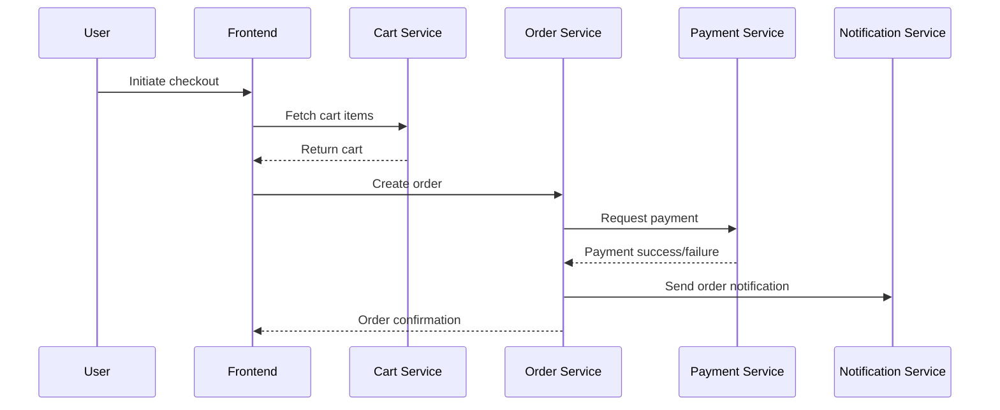
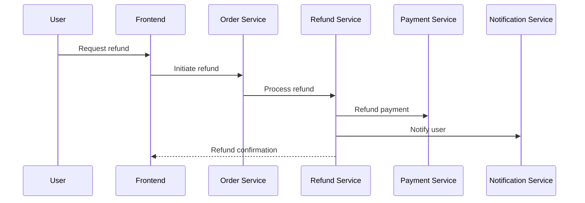

# Low-Level Design (LLD): Online Shopping Platform

## 1. Component Specifications

### 1.1 Authentication & Authorization Service
- **Tech Stack:** Node.js/Express, JWT, OAuth2, bcrypt
- **Responsibilities:**
  - User registration, login, password hashing
  - JWT token issuance, refresh, and validation
  - RBAC/ABAC enforcement at API endpoints
  - Integration with secrets management (Vault)
- **Endpoints:**
  - `POST /api/auth/register`
  - `POST /api/auth/login`
  - `POST /api/auth/logout`
  - `GET /api/auth/me`

### 1.2 Product Catalog Service
- **Tech Stack:** Node.js/Express, PostgreSQL/MySQL
- **Responsibilities:**
  - CRUD for products, categories
  - Search & filter (Elasticsearch/Redis caching)
  - Product image storage (S3-compatible object storage)
- **Endpoints:**
  - `GET /api/products`
  - `GET /api/products/:id`
  - `POST /api/products`
  - `PUT /api/products/:id`
  - `DELETE /api/products/:id`

### 1.3 Shopping Cart Service
- **Tech Stack:** Node.js/Express, PostgreSQL/MySQL
- **Responsibilities:**
  - Manage user carts (create, update, delete, retrieve)
  - Cart item validation (stock, price)
- **Endpoints:**
  - `GET /api/cart`
  - `POST /api/cart/items`
  - `PUT /api/cart/items/:id`
  - `DELETE /api/cart/items/:id`

### 1.4 Order & Checkout Service
- **Tech Stack:** Node.js/Express, PostgreSQL/MySQL
- **Responsibilities:**
  - Order creation, status updates
  - Checkout logic (cart validation, address, payment)
  - Refund initiation
- **Endpoints:**
  - `POST /api/orders`
  - `GET /api/orders/:id`
  - `POST /api/orders/:id/refund`

### 1.5 Payment Service
- **Tech Stack:** Node.js/Express, Integration with PCI DSS payment gateway
- **Responsibilities:**
  - Payment processing (credit card, UPI, wallet)
  - Fraud detection API integration
  - Payment status tracking
- **Endpoints:**
  - `POST /api/payments`
  - `GET /api/payments/:id/status`

### 1.6 Notification Service
- **Tech Stack:** Node.js/Express, Email/SMS API
- **Responsibilities:**
  - Send order, payment, and system notifications
  - User notification preferences
- **Endpoints:**
  - `POST /api/notifications`

### 1.7 Review & Refund Service
- **Tech Stack:** Node.js/Express, PostgreSQL/MySQL
- **Responsibilities:**
  - Product reviews CRUD
  - Refund processing and status
- **Endpoints:**
  - `POST /api/reviews`
  - `GET /api/reviews/:productId`
  - `POST /api/refunds`

### 1.8 Admin & Seller Dashboards
- **Tech Stack:** React/Angular frontend, REST APIs
- **Responsibilities:**
  - Product/order management, analytics, user management
- **Endpoints:**
  - `GET /api/admin/overview`
  - `GET /api/seller/products`

### 1.9 Audit Logging Service
- **Tech Stack:** Node.js, centralized logging (ELK/EFK stack)
- **Responsibilities:**
  - Log sensitive actions (user changes, payments, refunds)
  - Export logs for compliance

## 2. Data Flows

### 2.1 User Registration & Login
1. User submits registration form → Auth Service
2. Auth Service hashes password, stores user, issues JWT
3. User logs in, receives JWT for session

### 2.2 Product Browsing & Cart
1. User browses products (Catalog Service)
2. Adds items to cart (Cart Service)
3. Cart Service validates stock/pricing

### 2.3 Checkout & Payment
1. User initiates checkout (Order Service)
2. Order Service validates cart, creates order
3. Payment Service processes payment via gateway
4. On success, order is confirmed, Notification Service informs user

### 2.4 Refund Flow
1. User/admin initiates refund (Order/Refund Service)
2. Refund Service processes refund, updates order/payment status
3. Notification sent to user

## 3. Sequence Diagrams

### 3.1 Checkout Flow

### 3.2 Refund Flow

## 4. Implementation Details

- **API Gateway:** Central entry, TLS 1.3, rate limiting, JWT validation
- **Database:** PostgreSQL/MySQL, normalized schema, referential integrity
- **Caching:** Redis for product catalog and search
- **Object Storage:** S3-compatible for product images
- **Security:**
  - Input validation/output encoding
  - AES-256 encryption at rest, TLS 1.3 in transit
  - RBAC/ABAC via Auth Service
  - Centralized secrets management (Vault)
  - Audit logging for sensitive actions
- **Compliance:**
  - PCI DSS (payments), GDPR (consent, data retention), WCAG 2.1 AA (accessibility)
  - Data lineage and retention policies
- **Monitoring:** Centralized logging, alerting, health checks
- **Error Handling:**
  - Graceful payment failure, retry logic, circuit breaker for external APIs

## 5. Entity-Relationship Diagram (ERD) Reference
- See HLD for detailed domain model and relationships.

## 6. Requirements Traceability Matrix
| Requirement | Component/Service | LLD Coverage |
|-------------|------------------|--------------|
| Registration/Login | Auth Service | Endpoints, JWT, RBAC |
| Product Catalog/Search | Product Catalog Service | Endpoints, Caching |
| Shopping Cart | Cart Service | Endpoints, Validation |
| Secure Checkout | Order, Payment, Refund Services | Endpoints, PCI DSS |
| Order Tracking | Order, Notification Services | Endpoints, Notification |
| RBAC | Auth Service | RBAC/ABAC, JWT |
| Seller/Admin Dashboards | Dashboards | Endpoints, UI |
| Notifications/Reviews/Refunds | Notification, Review, Refund Services | Endpoints |
| Security/Compliance/Accessibility | All | Security, Compliance, WCAG |

---

**All requirements from the HLD and PRD are covered in this LLD.**
