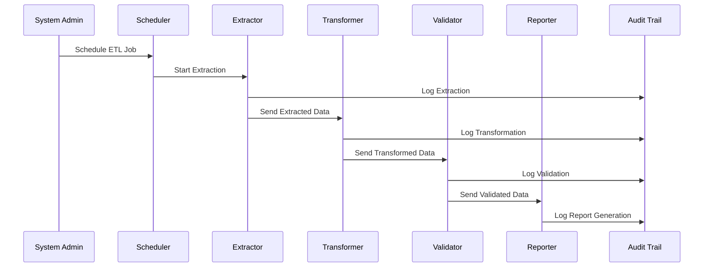
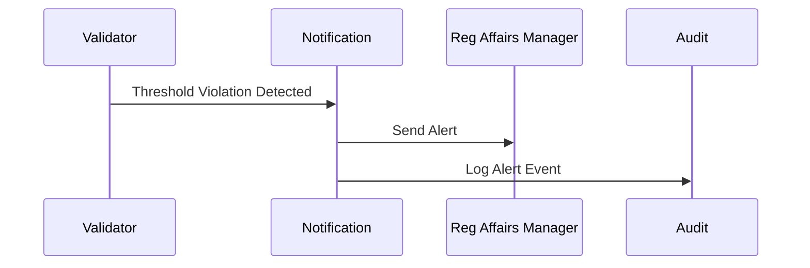

# Low-Level Design (LLD): ETL Data Management for EUMDR Compliance

## 1. Overview
This LLD details the implementation of ETL Data Management capabilities for EUMDR (European Medical Device Regulation) compliance, focusing on restricted substances reporting. It covers component specifications, data flows, sequence diagrams, and implementation details, ensuring alignment with regulatory and security standards.

---

## 2. Architectural Components

### 2.1. Data Source Integrator
- **Purpose:** Securely connects to ERP, PLM, and external substance databases.
- **Interfaces:** JDBC, REST, SFTP
- **Security:** TLS/SSL, credential encryption (AES-256)
- **Config:** Connection parameters, encrypted credential store

### 2.2. ETL Scheduler & Orchestrator
- **Purpose:** Schedules and coordinates ETL jobs
- **Tech:** Apache Airflow, Cron, or custom scheduler
- **Features:** Job dependency resolution, retry logic, monitoring hooks

### 2.3. Extractor
- **Purpose:** Pulls restricted substances data from sources
- **Features:** Incremental extraction, delta logging, error handling
- **Audit:** Extraction logs, UTC timestamps, lineage tracking

### 2.4. Transformer
- **Purpose:** Maps, standardizes, and formats data to EUMDR requirements
- **Features:** Field mapping, unit conversion, classification mapping, business rule engine
- **Compliance:** EUMDR Annex I, REACH, RoHS

### 2.5. Validator
- **Purpose:** Validates transformed data for quality and completeness
- **Features:** Mandatory field checks, business rule validation, consistency checks
- **Compliance:** ALCOA+, GxP, ISO 13485

### 2.6. Compliance Reporter
- **Purpose:** Generates EUMDR-compliant reports (XML, PDF)
- **Features:** Batch and single report generation, digital signatures, historical retrieval
- **Compliance:** Article 32, FDA 21 CFR Part 11

### 2.7. Audit Trail Engine
- **Purpose:** Logs all ETL operations, data access, and configuration changes
- **Features:** Immutable, tamper-evident storage, versioned configs, change management
- **Compliance:** FDA 21 CFR Part 11, GxP, ISO 13485

### 2.8. Notification & Alert System
- **Purpose:** Sends alerts for threshold violations, errors, and escalation
- **Features:** Configurable thresholds, email/system notifications, dashboard integration
- **Compliance:** ISO 14971, EUMDR risk management

### 2.9. SCIP Integration Module
- **Purpose:** Prepares and submits data to ECHA SCIP database
- **Features:** IUCLID file generation, API submission, status tracking
- **Compliance:** Waste Framework Directive

---

## 3. Data Flows

### 3.1. High-Level Data Flow
1. **Data Source Integrator** initiates secure connections
2. **Extractor** pulls data on schedule
3. **Transformer** standardizes and maps data
4. **Validator** checks data quality and compliance
5. **Compliance Reporter** generates reports
6. **SCIP Integration Module** submits to ECHA
7. **Audit Trail Engine** logs all steps
8. **Notification System** sends alerts as required

### 3.2. Data Lineage Example
- Source: ERP/PLM → Extraction (logged) → Staging → Transformation (logged) → Validation (logged) → Reporting → Submission

---

## 4. Sequence Diagrams

### 4.1. ETL Job Execution

### 4.2. Threshold Alert Handling

---

## 5. Implementation Details

### 5.1. Technology Stack
- **ETL Framework:** Apache Airflow, Python, SQL
- **Database:** PostgreSQL, encrypted storage
- **APIs:** REST for external integration (ECHA, ECHA SCIP)
- **Security:** TLS/SSL everywhere, OAuth2 for API access, audit logging
- **Reporting:** XML/PDF generation, digital signatures (PKI)
- **Notification:** SMTP, Slack, dashboard widgets

### 5.2. Security & Compliance
- All credentials encrypted at rest (AES-256)
- Audit trails are immutable and stored for 10+ years
- All access and job execution logged per GxP and FDA 21 CFR Part 11
- Data validation and transformation rules versioned and documented
- GDPR-compliant data handling and access logging

### 5.3. Error Handling & Resilience
- Retry logic with exponential backoff on extraction failures
- Alerting on persistent errors and failed jobs
- Redundancy for critical components (scheduler, database)
- Rollback capability for configuration changes

### 5.4. Audit Trail & Change Management
- Every ETL, access, and config change logged with user, timestamp, before/after values
- Archived configs for rollback and inspection
- Regular audit log reviews and automated anomaly detection

### 5.5. Reporting & Submission
- Reports generated on-demand or scheduled
- Digital signature and timestamp on every report
- SCIP submission module prepares IUCLID files and submits via ECHA API
- All submissions, statuses, and confirmations logged

---

## 6. Compliance Mapping Table
| Requirement | Component(s) | Implementation |
|-------------|-------------|----------------|
| EUMDR (2017/745) | Extractor, Transformer, Validator, Reporter | Data fields, validation, reporting |
| REACH (EC 1907/2006) | Transformer, Validator | Substance mapping, thresholds |
| RoHS | Transformer | Substance restriction mapping |
| GxP, ALCOA+ | Audit Trail, Validator | Audit logs, data integrity |
| FDA 21 CFR Part 11 | Audit Trail, Reporter | Electronic records, signatures |
| ISO 13485 | Validator, Audit Trail | Quality management, validation |
| ISO 14971 | Notification | Risk management, alerts |
| GDPR | All | Data access logging |

---

## 7. Appendix: User Stories Traceability
Each LLD section maps to user stories in the HLD. See HLD for full user story breakdown.
