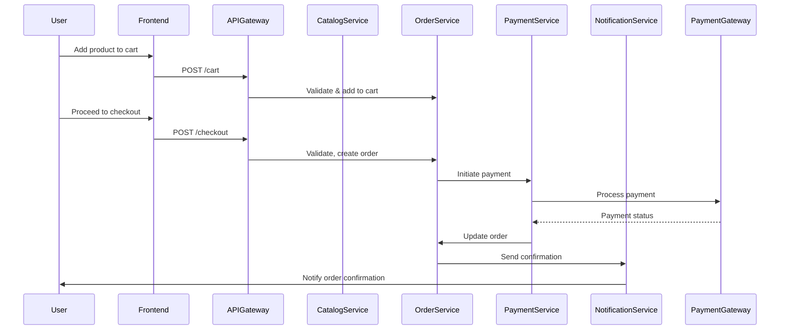
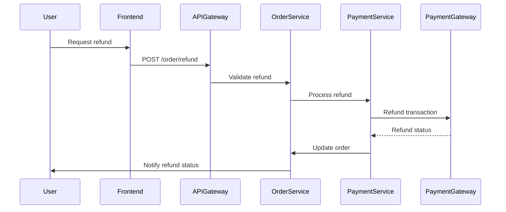

# Online Shopping Platform: Low-Level Design (LLD)

## 1. Component Specifications

### 1.1 Frontend (Web SPA)
- **Technology:** React or Angular, HTML5, CSS3, TypeScript
- **Key Features:**
  - Responsive UI (WCAG 2.1 AA compliant)
  - Client-side input validation
  - Authentication (JWT/session)
  - API integration via HTTPS (TLS 1.3)
  - Error handling (fallback UI, user-friendly messages)

### 1.2 API Gateway
- **Technology:** NGINX/Kong/Express Gateway
- **Functions:**
  - TLS termination
  - Rate limiting, IP whitelisting
  - Request/response validation
  - Centralized logging
  - Routing to microservices

### 1.3 Microservices

#### 1.3.1 User Service
- **Endpoints:**
  - POST /register, /login, /logout
  - GET/PUT /profile/{id}
  - RBAC enforcement (admin, seller, buyer)
- **Security:**
  - Passwords: bcrypt
  - JWT tokens
  - Audit logging
- **Data:**
  - User, Role, Profile tables

#### 1.3.2 Catalog Service
- **Endpoints:**
  - GET /products, /categories
  - POST/PUT/DELETE /products (seller)
  - Search, filter APIs
- **Data:**
  - Product, Category tables
  - Search index (Elasticsearch optional)

#### 1.3.3 Order Service
- **Endpoints:**
  - POST /cart, /checkout
  - GET /orders, /order/{id}
  - Refund API
- **Logic:**
  - Cart management, order status, refunds
- **Data:**
  - Cart, Order tables

#### 1.3.4 Payment Service
- **Integration:** Stripe/PayPal/Other PCI DSS-compliant gateways
- **Endpoints:**
  - POST /pay
  - Webhook for payment status
- **Security:**
  - PCI DSS, tokenization
  - Retry logic
- **Data:**
  - Payment table

#### 1.3.5 Notification Service
- **Channels:** Email (SMTP), SMS (provider API), In-app (WebSocket/polling)
- **Endpoints:**
  - POST /notify
  - GET /notifications/{user_id}
- **Data:**
  - Notification table

#### 1.3.6 Review Service
- **Endpoints:**
  - POST/GET /reviews
- **Logic:**
  - Moderation, rating aggregation
- **Data:**
  - Review table

#### 1.3.7 Recommendation/Wishlist (Optional)
- **Endpoints:**
  - GET /recommendations, /wishlist
  - POST/DELETE /wishlist
- **Logic:**
  - Personalization, collaborative filtering
- **Data:**
  - Wishlist table

#### 1.3.8 Admin/Seller Dashboard Service
- **Endpoints:**
  - GET /dashboard/analytics
- **Functions:**
  - Role-based access, management tools

### 1.4 Database
- **Type:** Relational (PostgreSQL/MySQL)
- **Encryption:** AES-256 at rest
- **Schema:** As per ERD/domain model
- **Backups:** Automated, encrypted

### 1.5 Object Storage
- **For:** Product images, invoices
- **Security:** Signed URLs, access policies

### 1.6 Monitoring & Logging
- **Stack:** ELK/Prometheus/Grafana
- **SIEM:** Security event monitoring
- **Audit:** All sensitive actions

## 2. Data Flows

### 2.1 User Registration & Login
1. User submits registration/login form (Frontend)
2. API Gateway routes to User Service
3. User Service validates, hashes password, stores user
4. JWT issued (login)
5. Audit log entry created

### 2.2 Product Search & Cart
1. User queries products (Catalog Service)
2. Adds to cart (Order Service)
3. Cart state stored per user

### 2.3 Checkout & Payment
1. User checks out cart (Order Service)
2. Payment initiated (Payment Service)
3. Payment gateway interaction
4. On success, order confirmed
5. Notification sent (Notification Service)

### 2.4 Order Tracking & Review
1. User queries order status (Order Service)
2. User submits review (Review Service)

## 3. Sequence Diagrams

### 3.1 Order Placement

### 3.2 Refund Flow

## 4. Implementation Details

### 4.1 Security
- Input validation (API & frontend)
- Output filtering (API)
- AES-256 at rest, TLS 1.3 in transit
- RBAC/ABAC enforced in all services
- Secrets in Vault/KMS
- Audit logs for all sensitive events
- Compliance with PCI DSS (payments)

### 4.2 Error Handling
- Retry (payment, integration)
- Circuit breaker (external APIs)
- Centralized error logging
- Graceful fallback UI

### 4.3 Accessibility
- All UI WCAG 2.1 AA
- ARIA labels, keyboard navigation

### 4.4 Extensibility
- Optional modules (recommendations, wishlist) as plug-ins
- API versioning
- Modular microservice deployment

### 4.5 DevOps & CI/CD
- Automated testing (unit/integration)
- Static code analysis
- Containerization (Docker/K8s)
- Infrastructure as Code (Terraform/CloudFormation)
- Secure pipeline (secrets scanning, SAST)

## 5. Compliance
- PCI DSS (payments)
- GDPR (data retention, consent)
- Audit trails, reporting
- Accessibility (WCAG 2.1 AA)

## 6. References
- See HLD: `HLD/WesTest4_HLD.md` for requirements traceability and domain model.
