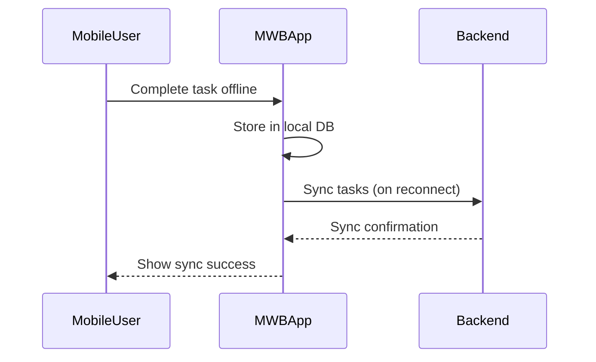
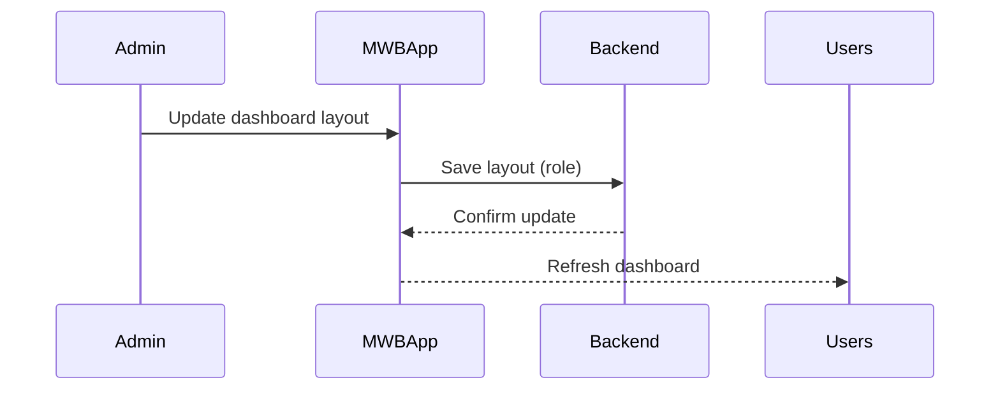
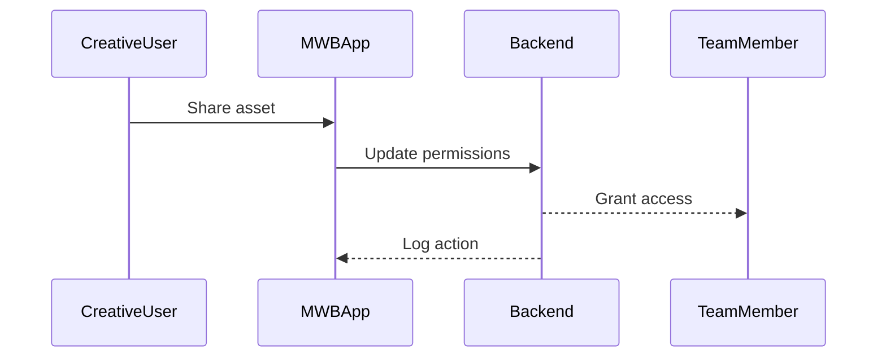

# Low-Level Design (LLD): Mobile Work Bench (MWB) Enhancement for Customer Retention

## 1. Introduction

This LLD document details the implementation of the MWB Enhancement for Customer Retention, based on the HLD/Product Requirements Document. It covers component specifications, data flows, sequence diagrams, and implementation details for the redesign of MWB’s workflows, mobile parity, role-based customization, and analytics integration.

---

## 2. System Architecture Overview

### 2.1. Architectural Components
- **Frontend (Web & Mobile)**: React (Web), React Native (iOS/Android)
- **Backend Services**: Node.js (RESTful APIs)
- **Database**: PostgreSQL (cloud-hosted)
- **Authentication**: OAuth2 (existing provider)
- **Push Notifications**: Firebase Cloud Messaging (Android), APNs (iOS)
- **Analytics**: Segment/Amplitude integration
- **File Storage**: AWS S3 (for creative assets)

### 2.2. Deployment Model
- Cloud-native, containerized via Docker
- CI/CD pipeline with GitHub Actions
- Encrypted data in transit (TLS 1.2+) and at rest (AES-256)

---

## 3. Component Specifications

### 3.1. Role-Based Dashboard Customization
- **Frontend**: Dynamic dashboard renderer based on user role (admin, standard, creative, mobile)
- **Backend**: API endpoints for saving/loading dashboard layouts per role
- **Data Model**: `dashboard_layouts` table keyed by role
- **Security**: RBAC enforced at API and UI levels

### 3.2. Mobile Feature Parity & Offline Mode
- **Frontend**: React Native with Redux Offline or SQLite for local task storage
- **Sync Engine**: Background job to sync tasks when connectivity is restored
- **Conflict Resolution**: Client-side merge with user prompts on conflicts
- **Push Notifications**: Real-time via FCM/APNs

### 3.3. Centralized User Management
- **Frontend**: Admin dashboard for managing users and permissions
- **Backend**: Secure endpoints for CRUD operations on users/roles
- **Notification**: WebSocket or push to notify users of changes

### 3.4. Real-Time Analytics & Error Handling
- **Analytics**: Event tracking for all core actions, sent to analytics backend
- **Error Messages**: Standardized API error codes; UI displays actionable messages

### 3.5. Creative Asset Sharing
- **Frontend**: In-app asset picker and share modal
- **Backend**: Permissioned asset endpoints; audit logging
- **Storage**: S3 object keys with ACL per user/team

---

## 4. Data Flows

### 4.1. User Login & Role Assignment
1. User authenticates via OAuth2.
2. Backend fetches user role and dashboard layout.
3. UI renders role-specific dashboard.

### 4.2. Offline Task Completion & Sync
1. Mobile user completes tasks offline (stored locally).
2. On connectivity, sync engine POSTs unsynced tasks.
3. Backend validates, merges, and confirms sync.

### 4.3. Push Notification Flow
1. Backend triggers notification event (urgent task/compliance alert).
2. Notification service (FCM/APNs) sends to device.
3. User receives and acts on notification.

### 4.4. Asset Sharing
1. Creative user selects asset and shares with team member.
2. Backend updates permissions, logs action.
3. Team member receives access and notification.

---

## 5. Sequence Diagrams

### 5.1. Offline Task Sync

### 5.2. Role-Based Dashboard Update

### 5.3. Asset Sharing

---

## 6. Implementation Details

### 6.1. Technologies
- **Frontend**: React, React Native, Redux
- **Backend**: Node.js, Express
- **Database**: PostgreSQL, Sequelize ORM
- **Notifications**: Firebase/APNs SDKs
- **Analytics**: Segment/Amplitude SDKs
- **Storage**: AWS SDK

### 6.2. Security
- Encrypted API traffic (TLS)
- Role-based authorization middleware
- Audit logging for sensitive actions
- Secure storage of assets (S3, signed URLs)

### 6.3. Accessibility
- Use ARIA labels, high-contrast themes
- Keyboard navigation and screen reader support
- Mobile accessibility testing (WCAG 2.1 AA)

### 6.4. Reliability & Scalability
- Horizontal scaling for backend services
- Health checks and auto-restart (Docker/K8s)
- Retry logic for sync/notification failures

### 6.5. Error Handling
- Standardized error responses (API & UI)
- User-friendly, actionable error messages

---

## 7. Compliance & Constraints
- Uses existing authentication provider (OAuth2)
- No changes to DB schema without migration scripts
- Mobile enhancements limited to iOS/Android
- Data encrypted in transit/at rest
- Meets WCAG 2.1 AA accessibility

---

## 8. Acceptance Criteria Traceability
| HLD Acceptance Criteria | LLD Implementation Reference |
|------------------------|------------------------------|
| AC1: Dashboard customization | 3.1, 5.2 |
| AC2: Offline task completion | 3.2, 4.2, 5.1 |
| AC3: User management | 3.3 |
| AC4: Push notifications | 3.2, 4.3 |
| AC5: Error clarity | 3.4, 6.5 |
| AC6: Workflow customization | 3.1 |
| AC7: Asset sharing | 3.5, 4.4, 5.3 |
| AC8: Crash recovery | 3.2 |
| AC9: Export analytics | 3.4 |
| AC10: Accessibility | 6.3 |

---

## 9. Open Issues & Risks
- Mobile app store approval delays (mitigated by early submission)
- Data sync conflicts (handled by robust client/server logic)
- User resistance (addressed via tutorials and opt-in previews)
- Integration limitations (fallback to supported providers)

---

## 10. Appendix
- API endpoint specifications
- Data model diagrams
- Test case outlines
- Migration plan template (if schema changes required)

---

*End of LLD Document*
