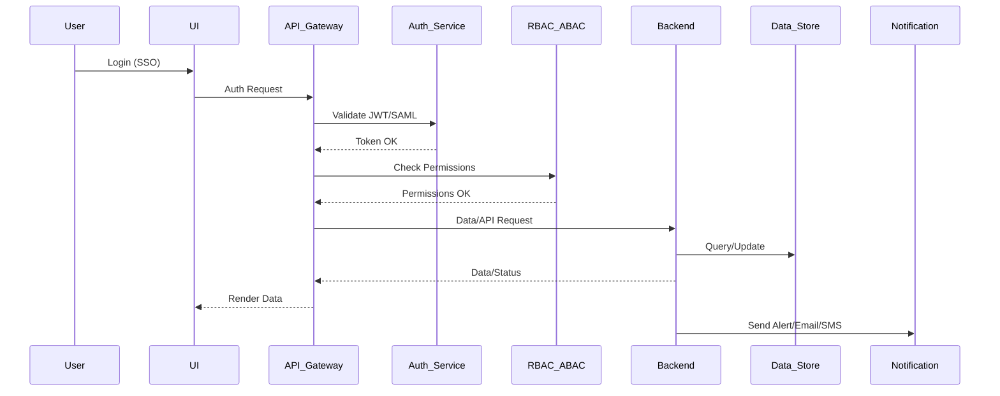

# Low-Level Design (LLD): AI Portfolio Management Dashboard - Portfolio Branch

## Component Specifications

### 1. Dashboard UI
- **Framework:** React (with WCAG 2.1 AA compliance)
- **Features:**
  - Real-time data widgets (AI spend, usage, alerts)
  - Drill-down analytics per PortfolioCompany
  - Export (PDF/Excel)
  - Customizable layout, role-based views
- **Data Flow:**
  - Consumes REST APIs via API Gateway
  - Receives RBAC/ABAC-enforced data views

### 2. Integration Manager
- **Functions:**
  - Configure AWS/Azure/GCP integrations
  - Monitor sync status, last sync, errors
- **APIs:**
  - CRUD for Integration entities
  - Secure credential management (vault integration)
- **Data Flow:**
  - Triggers Integration Service jobs
  - Receives status updates via backend events

### 3. Report Generator
- **Features:**
  - Schedule/generate PDF/Excel reports
  - Select company, time range, data type
- **APIs:**
  - Report creation, fetch, download
- **Data Flow:**
  - Invokes Reporting Service
  - Stores generated reports in DB

### 4. Alert Engine
- **Features:**
  - Budget threshold and data freshness alerts
  - Notification via Email/SMS
- **APIs:**
  - Alert rule CRUD, alert history
- **Data Flow:**
  - Listens to backend events, triggers notifications

### 5. User & Role Management
- **Features:**
  - RBAC/ABAC enforcement
  - SSO integration (JWT/SAML)
  - Lockout and recovery
- **APIs:**
  - User, Role CRUD, assignments
- **Data Flow:**
  - Centralized session and permission checks

### 6. Audit Logging
- **Features:**
  - Track all user actions, access attempts
  - Export logs for compliance
- **APIs:**
  - Log query, export
- **Data Flow:**
  - Writes logs on every action, stores in AuditLog

### 7. Recommendation Engine
- **Features:**
  - Analyze AI spend/usage
  - Suggest cost-saving actions
- **APIs:**
  - Recommendation query, export
- **Data Flow:**
  - Runs scheduled jobs, writes recommendations

## Backend Services

### A. Integration Service
- **Language:** Node.js/Python/.NET (containerized)
- **Responsibilities:**
  - Securely connect to AWS/Azure/GCP
  - Ingest AI spend/usage data
  - Handle retries, circuit breakers
- **Security:**
  - Use secrets vault for credentials
  - TLS 1.3 for all outbound connections

### B. Reporting Service
- **Responsibilities:**
  - Aggregate and format data for export
  - Schedule/trigger report jobs
- **Implementation:**
  - Stateless, scalable worker pool

### C. Alerting Service
- **Responsibilities:**
  - Monitor thresholds, trigger alerts
  - Integrate with Email/SMS gateways
- **Error Handling:**
  - Log all failures, retry with backoff

### D. Recommendation Engine
- **Responsibilities:**
  - Analyze AI usage/spend patterns
  - Generate recommendations
- **Implementation:**
  - Batch jobs, ML model integration (future scope)

### E. RBAC/ABAC Service
- **Responsibilities:**
  - Centralized enforcement of access policies
  - Integrate with SSO provider

## Data Store
- **Relational DB:**
  - Store Users, Companies, Integrations, Reports, Alerts, Roles, AuditLog, Recommendations
- **Data Lake:**
  - Store AI usage data (raw, aggregated)
- **Security:**
  - AES-256 encryption at rest
  - Regular backups

## Security & Compliance
- **Input Validation:** All APIs and UI endpoints
- **Output Filtering:** All API responses
- **Encryption:** AES-256 at rest, TLS 1.3 in transit
- **Secrets Management:** Centralized vault (Azure Key Vault/AWS Secrets Manager)
- **RBAC/ABAC:** Policy-driven, enforced at all layers
- **Audit Logging:** All actions, anomalies, access attempts
- **Data Retention:** Configurable by admin, automated purging
- **Consent Management:** Workflow for new integrations
- **Data Lineage:** Track all ingested/reported data

## Data Flows & Sequence Diagrams

### Example: Data Ingestion (AWS/Azure/GCP)
1. Integration Service schedules API call (cron/job queue)
2. Securely retrieves credentials from vault
3. Calls cloud provider API for usage/spend data
4. Validates, transforms, stores in Data Lake/Relational DB
5. Triggers downstream: Alert Engine, Recommendation Engine
6. Logs actions in AuditLog

### Example: User Login & Authorization
1. User accesses UI, redirected to SSO provider
2. On success, receives JWT/SAML token
3. API Gateway validates, starts session
4. RBAC/ABAC Service checks permissions
5. UI renders allowed data/components
6. All actions logged

### Example: Alert Notification
1. Backend detects threshold breach (budget/data freshness)
2. Alert Engine creates Alert entity
3. Notification Service sends Email/SMS
4. User acknowledges alert in UI
5. AuditLog updated

## Implementation Details
- **Frontend:** React with accessibility testing (WCAG 2.1 AA)
- **API Gateway:** OpenAPI/Swagger docs, JWT/SAML auth
- **Backend:** Microservices (Node.js/Python/.NET), Dockerized, orchestrated (K8s/ECS)
- **CI/CD:** Automated testing, SAST/DAST, IaC for infrastructure
- **Monitoring:** Centralized logging, anomaly detection, uptime alerts
- **Documentation:** API docs, runbooks, compliance guides

## Out-of-Scope/Constraints
- No direct billing or payment integrations
- No support for non-cloud AI providers
- No custom AI/ML model training in MVP

---

# Sequence Diagram (Mermaid Syntax)

---

# Validation Checklist
- [x] All HLD requirements mapped to LLD components
- [x] Security and compliance controls detailed
- [x] Data flows, sequence diagrams, and error handling included
- [x] Implementation details (tech stack, deployment, monitoring)
- [x] Out-of-scope/constraints respected
