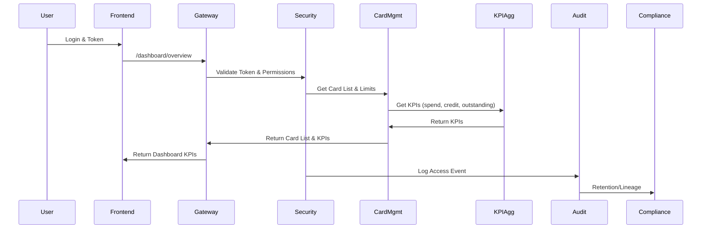
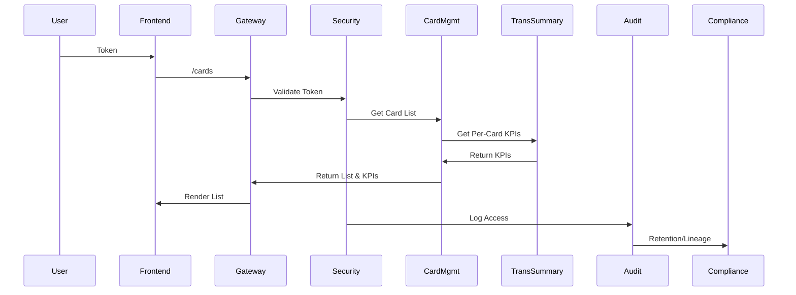
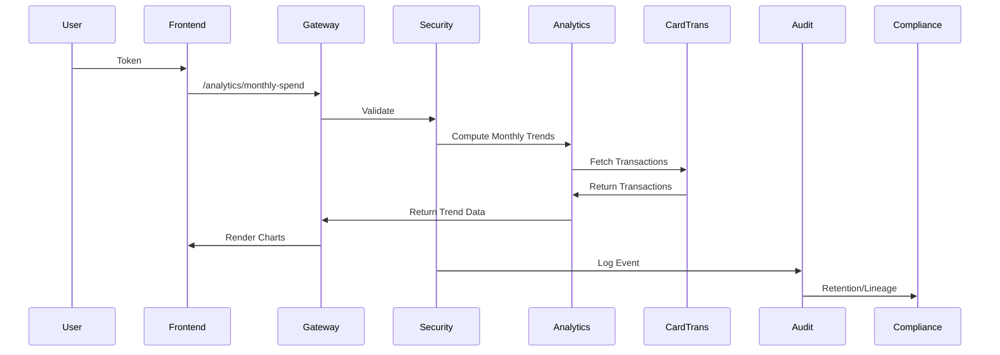
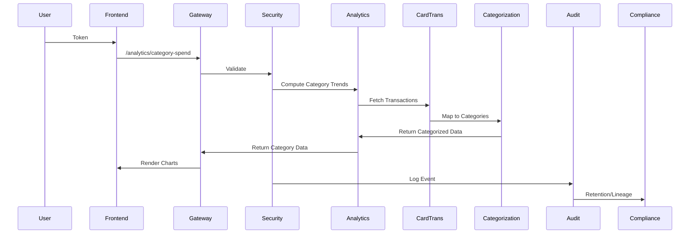

# Low-Level Design (LLD) for Credit Card Analysis Dashboard

---

## 1. Component Specifications

### 1.1. Web/App Frontend
- **Frameworks**: ReactJS (Web), Flutter (Mobile)
- **UI Elements**:
  - KPI Cards: Monthly spend, total credit limit, available credit, outstanding amount
  - Card List: Masked card identifiers, issuer, limit, status
  - Responsive Layout: CSS Grid/Flex for desktop/tablet/mobile
- **API Integration**:
  - `/dashboard/overview` for consolidated view
  - `/cards` for card list
  - `/analytics/monthly-spend`, `/analytics/card-spend`, `/analytics/category-spend` for analytics
- **Error Handling**:
  - Fallback UI for missing KPIs
  - Loading spinners, error banners for partial data

### 1.2. API Gateway / Backend-for-Frontend (BFF)
- **Endpoints**:
  - `/dashboard/overview`, `/cards`, `/cards/{id}/summary`, `/analytics/monthly-spend`, `/analytics/card-spend`, `/analytics/category-spend`
- **Security**:
  - JWT validation, RBAC/ABAC enforcement
  - TLS 1.3 for all traffic
- **Rate Limiting**:
  - Per-user quotas, circuit breakers
- **Input Validation**:
  - Date ranges, card IDs, category filters

### 1.3. Card Management Service
- **Responsibilities**:
  - Fetch card metadata from Card Data Store
  - Mask card identifiers, merge with summary data
- **API Contracts**:
  - `/cards` returns masked card list
  - `/cards/{id}/summary` returns per-card KPIs
- **Error Handling**:
  - Circuit breaker between Gateway and Service
  - Partial data fallback

### 1.4. KPI Aggregation & Transaction Summary Service
- **Responsibilities**:
  - Compute monthly spend, total credit limit, available credit, outstanding amount
  - Aggregate per-card metrics, drill-down support
- **API Contracts**:
  - `/dashboard/overview` returns consolidated KPIs
  - `/analytics/monthly-spend`, `/analytics/card-spend` for trend analytics
- **Data Sources**:
  - Card Data Store, Transactional Data Store
- **Error Handling**:
  - Retry logic, timeout fallback, logging

### 1.5. Analytics Service - Monthly, Card-wise & Category Trends
- **Responsibilities**:
  - Aggregate monthly spend, card-wise trends, category-wise spend
  - Support time-window queries, drill-downs
- **API Contracts**:
  - `/analytics/monthly-spend`, `/analytics/card-spend`, `/analytics/category-spend`
- **Data Sources**:
  - Transactional Data Store, Analytics Data Store
  - Categorization Engine for category mapping
- **Error Handling**:
  - Graceful degradation, fallback to cached data

### 1.6. Categorization Engine
- **Responsibilities**:
  - Map transactions to categories (Food & Dining, Fuel, Shopping, etc.)
  - Rule-based classification (MCC, merchant, description)
- **Data Handling**:
  - Store categorized transactions in Analytics Data Store
  - Provide lineage for compliance

### 1.7. Security & Compliance Layer
- **Responsibilities**:
  - AuthN/AuthZ, encryption, compliance enforcement
  - Audit logging, consent checks, data retention
- **Implementation**:
  - TLS 1.3, AES-256 at rest
  - RBAC/ABAC policies
  - Secrets in Configuration & Secrets Store

### 1.8. Audit Logging Service
- **Responsibilities**:
  - Log dashboard and analytics access events
  - Store logs in tamper-evident storage

### 1.9. Configuration & Secrets Store
- **Responsibilities**:
  - Manage configs, secrets, rotate keys
  - Restrict access via least-privilege tokens

### 1.10. Data Stores
- **Card Data Store**: Card metadata, credit limits, masked IDs
- **Transactional Data Store**: Transactions, balances, used for KPI calculations
- **Analytics Data Store**: Aggregated KPIs, monthly/card/category trends

### 1.11. Compliance & Data Retention Service
- **Responsibilities**:
  - Enforce retention policies, consent checks, data lineage
  - Support compliance reporting

---

## 2. Data Flows & Sequence Diagrams

### 2.1. Dashboard Overview (Sequence)

### 2.2. Card List & Summary (Sequence)

### 2.3. Analytics - Monthly & Card-wise Trends (Sequence)

### 2.4. Analytics - Category Spend (Sequence)

---

## 3. Implementation Details

### 3.1. API Gateway/BFF
- Node.js/Express or Java/Spring Boot
- JWT middleware, RBAC/ABAC
- Caching for frequent queries
- Circuit breaker library (e.g., Hystrix)

### 3.2. Card Management & Transaction Summary Services
- Microservices in Python/Flask or Java/Spring Boot
- ORM for Card Data Store (Postgres, MySQL)
- REST APIs for card list, summary
- Masking logic for card identifiers

### 3.3. KPI Aggregation & Analytics Services
- Python/Pandas or Java/Spark for aggregation
- Scheduled batch jobs for monthly trends
- Real-time endpoints for dashboard KPIs
- Integration with Analytics Data Store (Snowflake, BigQuery, etc.)

### 3.4. Categorization Engine
- Rule-based mapping (MCC, merchant, description)
- Periodic quality checks, manual correction workflows
- Category configuration in YAML/JSON

### 3.5. Security & Compliance Layer
- TLS everywhere, AES-256 for storage
- RBAC/ABAC policies configurable
- Audit logging via ELK/Splunk
- Consent management via Compliance Service

### 3.6. Audit Logging
- Tamper-evident log storage (WORM, S3 with object lock)
- Log format: JSON with user, resource, operation, timestamp, filters

### 3.7. Frontend
- Responsive design: CSS Grid/Flex, media queries
- Chart rendering: D3.js, Chart.js, or Flutter charts
- Error handling: Fallback UI, error boundaries

### 3.8. Compliance & Data Retention
- Retention policies in Compliance Service
- Data lineage via metadata in Analytics Store
- Scheduled deletion/anonymization jobs

---

## 4. Security, Compliance & Error Handling

- **Encryption**: TLS 1.3, AES-256 at rest
- **Input Validation**: API Gateway, Frontend, Services
- **Output Filtering**: Masked card data, aggregated KPIs
- **RBAC/ABAC**: User, Admin, Support roles
- **Audit Logging**: All access to dashboard and analytics
- **Secrets Management**: Config & Secrets Store
- **Compliance**: Retention, consent, lineage, reporting
- **Resiliency**: Circuit breakers, retries, timeouts, fallback UI
- **Graceful Degradation**: Partial data display, error messages

---

## 5. Compliance Checklist

- Data Retention: Policy-based, scheduled jobs
- Privacy: Masked card IDs, minimal PII
- Consent: Enforced for analytics
- Audit: Tamper-evident logs, compliance reporting
- Lineage: Metadata in analytics

---

## 6. Risks & Mitigations

- **Heavy Load**: Caching, scaling, rate limiting
- **Misalignment of KPIs**: Standardized rules, validation tests
- **Performance**: OLAP store, index tuning, monitoring
- **Category Misclassification**: Rule refinement, manual correction
- **Compliance Variations**: Config-driven ABAC, region/jurisdiction attributes

---

## 7. References
- HLD documents: QE-3893_HLD.md, QE-3894_HLD.md, QE-3895_HLD.md, QE-3896_HLD.md
- API contracts, compliance policies, architecture diagrams
